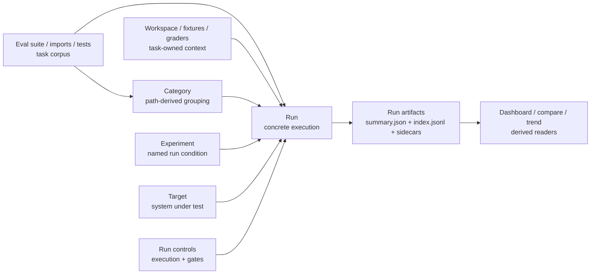

# AgentV

Test AI targets on real repo tasks and measure what actually works.

## Why?

- **Local-first** — runs on your machine, no cloud accounts or API keys for eval infrastructure
- **Repo-backed workspaces** — reuse real repos, setup scripts, and existing harnesses instead of rebuilding synthetic tasks
- **Portable artifacts** — results, traces, and reports are saved in a durable format other tools can consume
- **Version-controlled** — evals, judges, and results all live in Git
- **Hybrid graders** — deterministic code checks + LLM-based subjective scoring
- **CI/CD native** — exit codes, JSONL output, threshold flags for pipeline gating
- **Any target** — run against agents, model providers, gateways, replay targets, CLI wrappers, transcript providers, and future app or service wrappers

## Core Concepts

- **Eval suite / imports / tests** are the task corpus: the prompts, cases, datasets, and imported benchmarks you want to evaluate.
- **Category** is derived from where the eval lives, such as folder path and file name. Use paths to organize the corpus instead of repeating category labels in every eval.
- **Workspace / fixtures / graders** are task-owned context: repos, setup scripts, files, fixtures, isolation, deterministic checks, and LLM grading prompts.
- **Target** is the system under test: an agent, provider, gateway, replay target, CLI wrapper, transcript provider, or future app/service wrapper. Each eval selects one `target`, either by name from `targets.yaml` or with an eval-local target object.
- **Experiment** is the run/result grouping label being measured over that corpus, such as `backend-with-skills` or `backend-without-skills`.
- **Run controls** configure repeats, timeouts, budgets, thresholds, and completion hooks with fields such as `repeat`, `timeout_seconds`, `budget_usd`, `threshold`, and `on_run_complete`.
- **Run** is one concrete execution of an experiment against a resolved target that writes portable artifacts for readers such as Dashboard, compare, and trend.



## Quick start

**1. Install and initialize:**
```bash
npm install -g agentv
agentv init
```

**2. Configure targets** in `.agentv/targets.yaml` — point to the system under test, such as an agent, provider, gateway, replay source, or CLI wrapper.

**3. Create an eval** in `evals/`:
```yaml
description: Code generation quality
experiment: backend-with-skills
target: copilot-sdk
repeat:
  count: 3
  strategy: pass_any
  early_exit: false
timeout_seconds: 600
threshold: 0.8
budget_usd: 5

workspace:
  isolation: per_case

tests:
  - id: fizzbuzz
    input: Write FizzBuzz in Python
    assertions:
      - type: contains
        value: "fizz"
      - Implements correct FizzBuzz logic for multiples of 3, 5, and 15
      - type: code-grader
        command: ["python3", "./validators/check_syntax.py"]
      - type: llm-grader
        prompt: ./graders/correctness.md
```

The target can be an eval-local object when this eval needs target settings of its own:

```yaml
description: Code generation quality with GPT-5 target settings
experiment: backend-with-skills-gpt5
target:
  extends: codex-gpt5
  model: gpt-5.1
  reasoning_effort: high
repeat:
  count: 2
  strategy: pass_any
timeout_seconds: 900
threshold: 0.85

tests:
  - id: fizzbuzz
    input: Write FizzBuzz in Python
```

`target: codex-gpt5` resolves the named target from `.agentv/targets.yaml` or `targets.yaml` and uses its default provider, model, hooks, and provider settings. The object form above starts from `codex-gpt5`, then applies the eval-local fields for this eval. If `extends` is omitted, the object defines the full target inline and must include enough provider configuration to run. AgentV records the resolved target information in run artifacts so results can be audited and replayed.

**4. Run it:**
```bash
agentv eval evals/my-eval.yaml
```

**5. Compare two runs** (pass two `index.jsonl` manifests — e.g. before and after a change):
```bash
agentv compare .agentv/results/backend-without-skills/<timestamp>/copilot-sdk--claude-sonnet-4.6/index.jsonl .agentv/results/backend-with-skills/<timestamp>/copilot-sdk--claude-sonnet-4.6/index.jsonl
```

## Results

Each run writes a timestamped invocation directory under `.agentv/results/<experiment>/<timestamp>/`. In this example, `experiment: backend-with-skills` names the condition being measured and `target: copilot-sdk` selects the system under test from `targets.yaml`. The flat `index.jsonl` manifest is the portable surface used by scripts, CI, and `agentv compare`; per-case sidecars include the resolved eval and target configuration used for the run.

```bash
agentv eval evals/my-eval.yaml
cat .agentv/results/backend-with-skills/<timestamp>/copilot-sdk--claude-sonnet-4.6/index.jsonl
```

Run bundle layout:

```
.agentv/results/
└── backend-with-skills/              # <experiment> — comparison/run grouping
    └── 2026-06-30T08-30-00-000Z/     # <timestamp> — one run
        └── copilot-sdk--claude-sonnet-4.6/ # <target> — resolved system under test
            ├── index.jsonl           # flat per-test results (scripts/CI, `agentv compare`)
            ├── summary.json          # run rollup: pass rate, counts, cost
            └── fizzbuzz--a1b2c3d4/   # <result_dir> for one test case
                ├── summary.json      # per-test rollup across runs
                ├── test/             # generated test bundle: frozen inputs for reproducibility
                │   ├── EVAL.yaml     #   resolved eval spec
                │   ├── targets.yaml  #   resolved target config
                │   └── graders/      #   grader files used
                └── run-1/            # one attempt (run-N for repeats/trials)
                    ├── result.json   # compact attempt manifest
                    ├── grading.json  # per-assertion grading detail
                    ├── metrics.json  # tool calls, transcript stats, behavior metrics
                    ├── timing.json   # duration, token usage, cost
                    ├── transcript.jsonl       # parsed agent transcript
                    ├── transcript-raw.jsonl   # raw agent output (debugging)
                    └── outputs/      # captured stdout and grader outputs
```

## TypeScript SDK

Use `evaluate()` when your application owns the run:

```typescript
import { evaluate } from '@agentv/sdk';

const { results, summary } = await evaluate({
  experiment: 'backend-with-skills',
  task: async (input) => runMyAppTarget(input),
  threshold: 0.8,
  tests: [
    {
      id: 'fizzbuzz',
      input: 'Write FizzBuzz in Python',
      assertions: [
        { type: 'contains', value: 'fizz' },
        'Implements correct FizzBuzz logic for multiples of 3, 5, and 15',
        { type: 'code-grader', command: ['python3', './validators/check_syntax.py'] },
        { type: 'llm-grader', prompt: './graders/correctness.md' },
      ],
    },
  ],
});

console.log(`${summary.passed}/${summary.total} passed`);
```

Use `defineEval()` when you want AgentV to run the TypeScript eval file:

```typescript
import { defineEval } from '@agentv/sdk';

export default defineEval({
  description: 'Code generation quality',
  experiment: 'backend-with-skills',
  target: {
    extends: 'copilot-sdk',
    model: 'claude-sonnet-4.6',
  },
  repeat: {
    count: 3,
    strategy: 'pass_any',
    earlyExit: false,
  },
  timeoutSeconds: 600,
  threshold: 0.8,
  budgetUsd: 5,
  workspace: {
    isolation: 'per_case',
  },
  tests: [
    {
      id: 'fizzbuzz',
      input: 'Write FizzBuzz in Python',
      assertions: [
        { type: 'contains', value: 'fizz' },
        'Implements correct FizzBuzz logic for multiples of 3, 5, and 15',
        { type: 'code-grader', command: ['python3', './validators/check_syntax.py'] },
        { type: 'llm-grader', prompt: './graders/correctness.md' },
      ],
    },
  ],
});
```

## Documentation

Full docs at [agentv.dev/docs](https://agentv.dev/docs/getting-started/introduction/).

- [Eval files](https://agentv.dev/docs/evaluation/eval-files/) — format and structure
- [Custom graders](https://agentv.dev/docs/graders/custom-graders/) — code graders in any language
- [Rubrics](https://agentv.dev/docs/evaluation/rubrics/) — structured criteria scoring
- [Targets](https://agentv.dev/docs/targets/configuration/) — configure agents and providers
- [Compare results](https://agentv.dev/docs/tools/compare/) — A/B testing and regression detection
- [Ecosystem](https://agentv.dev/docs/reference/comparison/) — how AgentV fits with Agent Control and Langfuse

## Development

```bash
git clone https://github.com/EntityProcess/agentv.git
cd agentv
bun install && bun run build
bun test
```

See [AGENTS.md](AGENTS.md) for development guidelines.

## Docker Dashboard Deployment

To simulate a one-command production deployment of AgentV Dashboard with the
AgentV examples project and a remote results repository:

```bash
AGENTV_RESULTS_REPO=EntityProcess/agentv-evalresults \
  scripts/setup-dashboard-deployment.sh
```

The script clones AgentV examples into `~/agentv-dashboard`, clones the results
repo, writes the Dashboard project registry under the `$AGENTV_HOME` config
pair, builds the Docker image, and starts Dashboard at `http://localhost:3117`.

## License

MIT
