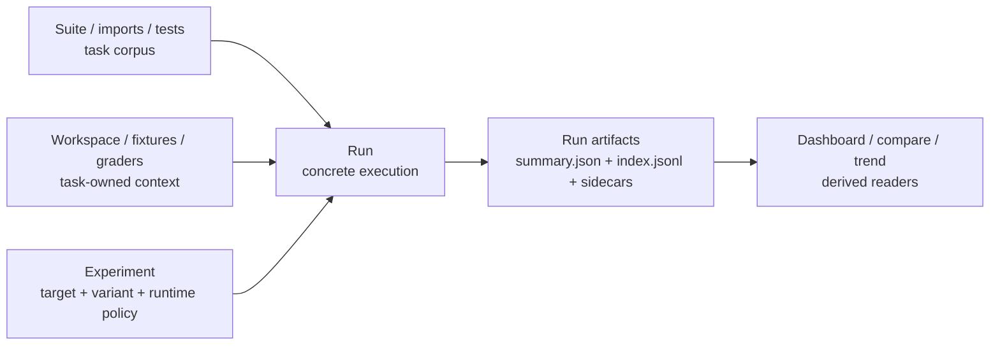

# AgentV

**Evaluate AI targets against real repos from the terminal. No server. No signup.**

```bash
npm install -g agentv
agentv init
agentv eval evals/example.yaml
```

That's it. Results in seconds, not minutes.

## What it does

AgentV runs evaluation cases against configured targets and scores them with deterministic code graders + customizable LLM graders. Everything lives in Git — YAML eval files, markdown judge prompts, JSONL results.

```yaml
# evals/math.yaml
description: Math problem solving
tests:
  - id: addition
    input: What is 15 + 27?
    expected_output: "42"
    assertions:
      - type: contains
        value: "42"
```

```bash
agentv eval evals/math.yaml
```

## Why AgentV?

- **Local-first** — runs on your machine, no cloud accounts or API keys for eval infrastructure
- **Repo-backed workspaces** — reuse real repos, setup scripts, and existing harnesses instead of rebuilding synthetic tasks
- **Portable artifacts** — results, traces, and reports are saved in a durable format other tools can consume
- **Version-controlled** — evals, judges, and results all live in Git
- **Hybrid graders** — deterministic code checks + LLM-based subjective scoring
- **CI/CD native** — exit codes, JSONL output, threshold flags for pipeline gating
- **Any target** — run against agents, model providers, gateways, replay targets, CLI wrappers, transcript providers, and future app or service wrappers

## Core Concepts

- **Suite / imports / tests** are the task corpus: the prompts, cases, datasets, and imported benchmarks you want to evaluate.
- **Workspace / fixtures / graders** are task-owned context: repos, setup scripts, files, fixtures, deterministic checks, and LLM grading prompts.
- **Target** is the system under test: an agent, model/provider, gateway, replay target, CLI wrapper, transcript provider, or future app/service wrapper.
- **Experiment** names comparison intent: target/model, variant, repeats, gates, timeout/runtime policy, and result grouping.
- **Run** is one concrete execution that writes portable artifacts for readers such as Dashboard, compare, and trend.



## Quick start

**1. Install and initialize:**
```bash
npm install -g agentv
agentv init
```

**2. Configure targets** in `.agentv/targets.yaml` — point to the system under test, such as an agent, provider, gateway, replay source, or CLI wrapper.

**3. Create an eval** in `evals/`:
```yaml
description: Code generation quality

experiment:
  target: copilot
  threshold: 0.8

tests:
  - id: fizzbuzz
    input: Write FizzBuzz in Python
    assertions:
      - type: contains
        value: "fizz"
      - type: rubrics
        criteria:
          - Implements correct FizzBuzz logic for multiples of 3, 5, and 15
      - type: code-grader
        command: ["python3", "./validators/check_syntax.py"]
      - type: llm-grader
        prompt: ./graders/correctness.md
```

**4. Run it:**
```bash
agentv eval evals/my-eval.yaml
```

**5. Compare two runs** (pass two `index.jsonl` manifests — e.g. before and after a change):
```bash
agentv compare .agentv/results/<experiment>/<before-timestamp>/default/index.jsonl .agentv/results/<experiment>/<after-timestamp>/default/index.jsonl
```

## Results

Each run writes a timestamped bundle under `.agentv/results/<experiment>/<timestamp>/<run-id>/`. The flat `index.jsonl` manifest is the portable surface used by scripts, CI, and `agentv compare`:

```bash
agentv eval evals/my-eval.yaml --output ./run   # writes ./run/default/index.jsonl
cat ./run/default/index.jsonl                    # JSONL results for scripts/CI
```

Run bundle layout:

```
.agentv/results/
└── my-eval/                          # <experiment> — comparison/run grouping
    └── 2026-06-30T08-30-00-000Z/     # <timestamp> — one run
        └── default/                  # <run-id>
            ├── index.jsonl           # flat per-test results (scripts/CI, `agentv compare`)
            ├── summary.json          # run rollup: pass rate, counts, cost
            └── fizzbuzz--a1b2c3d4/   # <case-allocation>
                ├── summary.json      # per-test rollup across runs
                ├── task/             # frozen inputs, for reproducibility
                │   ├── EVAL.yaml     #   resolved eval spec
                │   ├── targets.yaml  #   resolved target config
                │   └── graders/      #   grader files used
                └── run-1/            # one attempt (run-N for repeats/trials)
                    ├── result.json   # compact attempt manifest
                    ├── grading.json  # per-assertion grading detail
                    ├── metrics.json  # tool calls, transcript stats, behavior metrics
                    ├── timing.json   # duration, token usage, cost
                    ├── transcript.jsonl       # parsed agent transcript
                    ├── transcript-raw.jsonl   # raw agent output (debugging)
                    └── outputs/      # captured stdout and grader outputs
```

## TypeScript SDK

Use `evaluate()` when your application owns the run:

```typescript
import { evaluate } from '@agentv/sdk';

const { results, summary } = await evaluate({
  target: { name: 'copilot', provider: 'copilot' },
  threshold: 0.8,
  tests: [
    {
      id: 'fizzbuzz',
      input: 'Write FizzBuzz in Python',
      assertions: [
        { type: 'contains', value: 'fizz' },
        {
          type: 'rubrics',
          criteria: ['Implements correct FizzBuzz logic for multiples of 3, 5, and 15'],
        },
        { type: 'code-grader', command: ['python3', './validators/check_syntax.py'] },
        { type: 'llm-grader', prompt: './graders/correctness.md' },
      ],
    },
  ],
});

console.log(`${summary.passed}/${summary.total} passed`);
```

Use `defineEval()` when you want AgentV to run the TypeScript eval file:

```typescript
import { defineEval } from '@agentv/sdk';

export default defineEval({
  description: 'Code generation quality',
  experiment: {
    target: 'copilot',
    threshold: 0.8,
  },
  tests: [
    {
      id: 'fizzbuzz',
      input: 'Write FizzBuzz in Python',
      assertions: [
        { type: 'contains', value: 'fizz' },
        {
          type: 'rubrics',
          criteria: ['Implements correct FizzBuzz logic for multiples of 3, 5, and 15'],
        },
        { type: 'code-grader', command: ['python3', './validators/check_syntax.py'] },
        { type: 'llm-grader', prompt: './graders/correctness.md' },
      ],
    },
  ],
});
```

## Documentation

Full docs at [agentv.dev/docs](https://agentv.dev/docs/getting-started/introduction/).

- [Eval files](https://agentv.dev/docs/evaluation/eval-files/) — format and structure
- [Custom graders](https://agentv.dev/docs/graders/custom-graders/) — code graders in any language
- [Rubrics](https://agentv.dev/docs/evaluation/rubrics/) — structured criteria scoring
- [Targets](https://agentv.dev/docs/targets/configuration/) — configure agents and providers
- [Compare results](https://agentv.dev/docs/tools/compare/) — A/B testing and regression detection
- [Ecosystem](https://agentv.dev/docs/reference/comparison/) — how AgentV fits with Agent Control and Langfuse

## Development

```bash
git clone https://github.com/EntityProcess/agentv.git
cd agentv
bun install && bun run build
bun test
```

See [AGENTS.md](AGENTS.md) for development guidelines.

## Docker Dashboard Deployment

To simulate a one-command production deployment of AgentV Dashboard with the
AgentV examples project and a remote results repository:

```bash
AGENTV_RESULTS_REPO=EntityProcess/agentv-evalresults \
  scripts/setup-dashboard-deployment.sh
```

The script clones AgentV examples into `~/agentv-dashboard`, clones the results
repo, writes the Dashboard project registry under the `$AGENTV_HOME` config
pair, builds the Docker image, and starts Dashboard at `http://localhost:3117`.

## License

MIT
