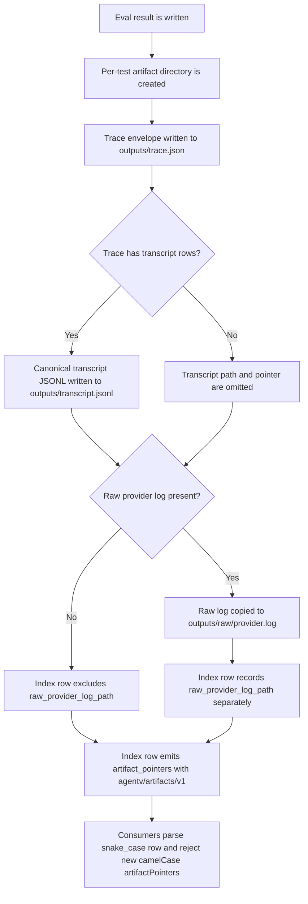
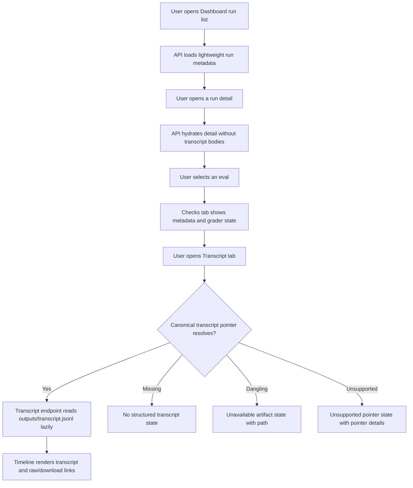
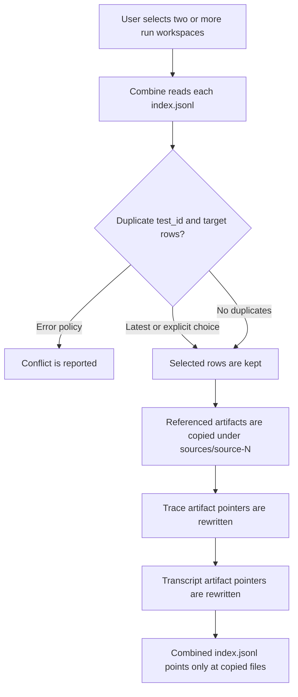
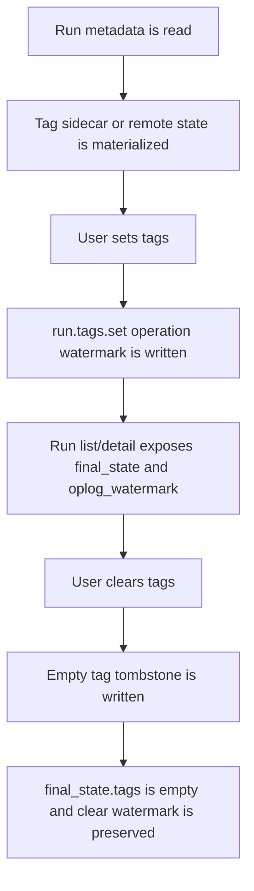
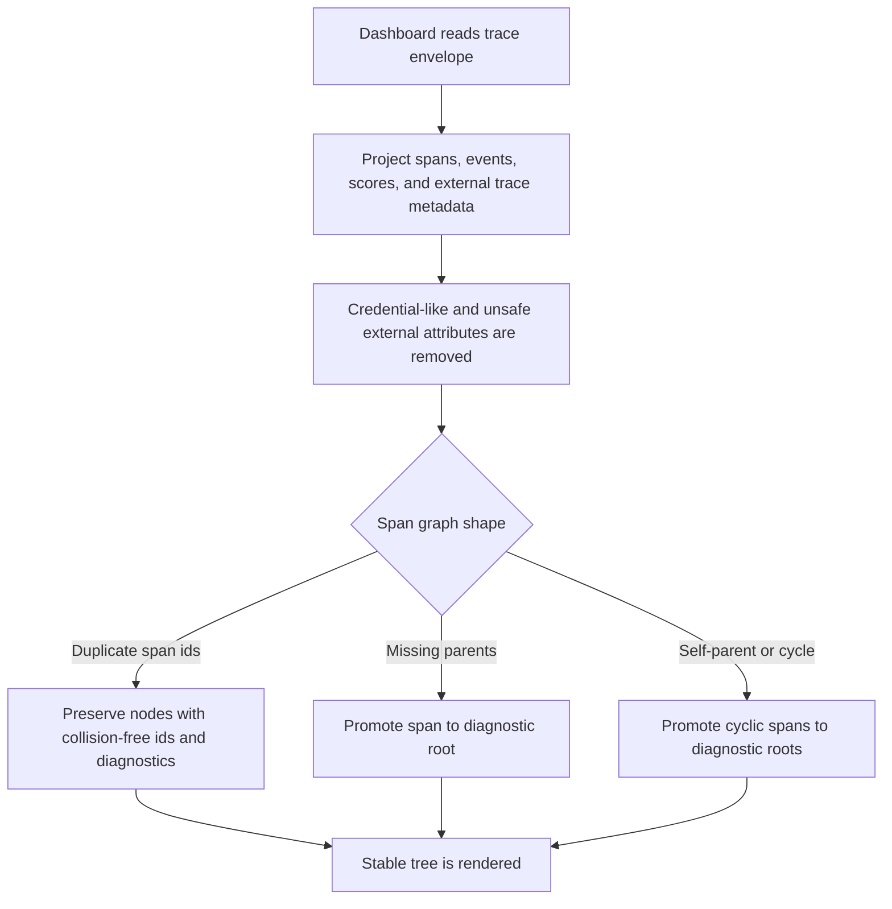
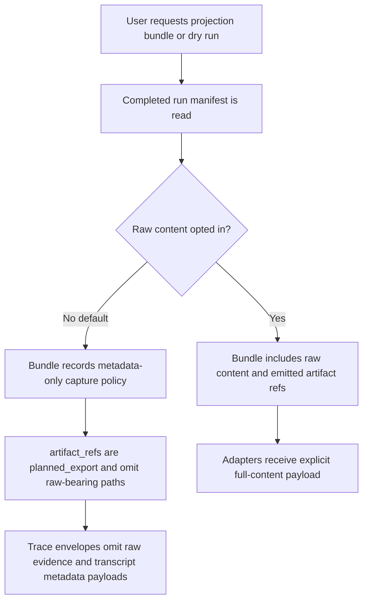

# Dogfood Report - dogfood-integration-av-vwa-16-10

> Diff-scoped CLI and Dashboard QA of `dogfood-integration-av-vwa-16-10` vs `origin/main`. Generated by `/ce-dogfood-beta` on 2026-06-21.

## Diff Summary

- Adds canonical AgentV artifact refs and pointer shapes for result rows, trace sidecars, transcript projections, raw provider logs, and projection bundles.
- Writes provider-neutral transcript artifacts at `outputs/transcript.jsonl` while keeping raw provider logs separate at `outputs/raw/provider.log`.
- Adds results combine/export/projection behavior that preserves or rewrites artifact pointers and keeps default exports metadata-oriented.
- Adds oplog-shaped run tag state, tag clear tombstones, and Dashboard/API fields for final run state and watermarks.
- Updates Dashboard API and UI so run lists/details stay metadata-oriented while the Transcript tab lazily loads canonical transcript content and handles missing/dangling/unsupported states.
- Adds a Dashboard trace read model that preserves problematic span graphs with diagnostics and sanitizes external trace or credential-like attributes.

## Personas

Source: `STRATEGY.md` "Who it's for".

- **AI platform engineers and agent builders** - evaluate real agent workflows, compare targets, gate changes, and inspect portable run artifacts from the same workspace their teams already use.

## Flows Tested

### Flow A - Canonical Result Artifact Emission

### Flow B - Dashboard Metadata and Lazy Transcript Loading

### Flow C - Combine Run Artifact Pointer Rewriting

### Flow D - Tags and Oplog Watermarks

### Flow E - Trace Read Model Hardening

### Flow F - Projection Bundle Export

## Test Matrix & Results

| # | Flow | Journey / Scenario | Status | Issue | Fix | Commit |
|---|------|--------------------|--------|-------|-----|--------|
| 1 | A | Artifact writer emits `outputs/transcript.jsonl`, canonical `artifact_pointers.transcript.ref=agentv/artifacts/v1`, and canonical trace pointer refs. | Pass | Verified by artifact-writer regression tests. | - | - |
| 2 | A | Raw provider log is copied to `outputs/raw/provider.log`, remains separate from canonical transcript rows, and parsed result rows do not treat it as a fresh source log. | Pass | Verified by artifact-writer and orchestrator tests. | - | - |
| 3 | A | New invalid camelCase `artifactPointers` rows are rejected while historical result-row aliases still normalize at the boundary. | Pass | Verified by parser/shared results tests. | - | - |
| 4 | C | Combining runs copies pointed trace/transcript files and rewrites pointer paths/keys to `sources/source-N/...`. | Pass | Verified by combine tests. | - | - |
| 5 | D | Local tag set and tag clear/tombstone operations preserve `final_state` and a fresh `oplog_watermark`. | Pass | Verified by tests and live API set/clear/readback against the fixture server. | - | - |
| 6 | B | Run list, run detail, compare, and index API routes stay metadata-oriented and do not read transcript bodies. | Pass | Verified by serve tests and live API detail payload without transcript body content. | - | - |
| 7 | B | Transcript endpoint returns lazy `ok`, `missing`, `dangling`, and pointer-shaped transcript states from canonical transcript pointers. | Pass | Verified by serve tests, live API calls, and browser Transcript tab states. | - | - |
| 8 | E | Trace read model handles duplicate spans, missing parents, self-parent/cycles, and sanitizes external/credential-like attributes. | Pass | Verified by Dashboard trace read-model tests. | - | - |
| 9 | F | Projection bundle dry-run/default export marks planned refs correctly and excludes raw-bearing payloads by default. | Fixed | Live dry run crashed when a hydrated grader score omitted `assertions`. | Added missing-array fallbacks in result index and trace envelope score serialization, plus regression coverage. | b25b0475 |
| 10 | B | Browser UAT: Dashboard run list/detail remains usable, Transcript tab lazy-loads canonical content, and console errors are absent. | Pass | Agent-browser verified run list/detail, canonical/missing/dangling/unsupported Transcript tab states, lazy request logs, and no page errors. | - | - |

## What Was Fixed

### Projection bundle dry run crashed on grader scores without assertions - `b25b0475`

- **Symptom:** `agentv results export <run> --projection-bundle --dry-run` crashed with `undefined is not an object (evaluating 'score.assertions.map')` when a hydrated grading artifact had a grader score without an `assertions` array.
- **Root cause:** `packages/core/src/evaluation/run-artifacts.ts` and `packages/core/src/evaluation/trace-envelope.ts` assumed every `GraderResult` carried `assertions`, but historical or hand-authored grading artifacts can omit that optional array.
- **Fix:** Normalize missing score assertions to an empty array in index-row score serialization and trace-envelope score evidence serialization.
- **Regression test:** `apps/cli/test/commands/results/export.test.ts` now builds a projection bundle from a grader score that omits `assertions`.

## Console Errors

None observed through `agent-browser errors` after canonical, missing, dangling, and unsupported Transcript tab checks. `agent-browser console` was also empty on the canonical transcript path.

Expected test-suite stderr included git fallback warnings for intentionally invalid remote fixtures; the suite passed.

## Evidence

- Diff analyzed with `git diff --name-only origin/main...HEAD` and focused code reads across result writing, combine/export, serve, Dashboard detail/API, and trace read model paths.
- Built core with `bun --filter @agentv/core build`.
- Built Dashboard with `bun run build` from `apps/dashboard/`; Vite emitted only the existing large-chunk warning.
- Ran focused regression suite after the fix: `333 pass`, `0 fail`, `1372 expect() calls`, across 10 files.
- Live Dashboard/results server started from source against a local fixture project on port 3217.
- Live API checks covered run list/detail, transcript `ok`/`missing`/`dangling`/`unsupported`, tag set/clear/readback, and projection dry run.
- Browser UAT used `agent-browser` with a local fixture project. Screenshots were captured outside the public repo as `transcript-tab.png` and `transcript-unsupported.png`.

## Human Verifications

Not applicable. The proof used local fixtures and CLI/Dashboard APIs only; no OAuth, email, payment, SMS, or external provider leg was required.

## Decisions for a Human

None.

## Learnings

- Projection/export code must tolerate historical or hand-authored grader score records that omit optional arrays. Treat missing optional evidence as empty evidence rather than crashing export.
- The lazy transcript boundary is doing useful work: list/detail payloads remain small and metadata-oriented, while transcript body content is fetched only after the user opens the Transcript tab.
- Raw provider logs stay safe as separate evidence under `outputs/raw/provider.log`; they are not canonical transcripts and should not be reinterpreted as source logs on parsed result rows.

## Final Status

Pass after fix. The integrated results/artifacts/transcript stack is ready for review from this dogfood pass.

Functional failure fixed locally: `b25b0475`.

Human-decision blockers: none.
