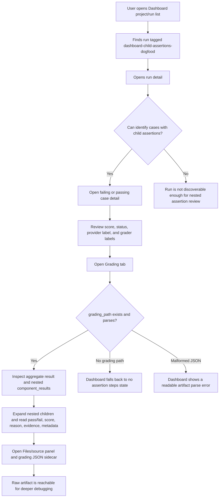
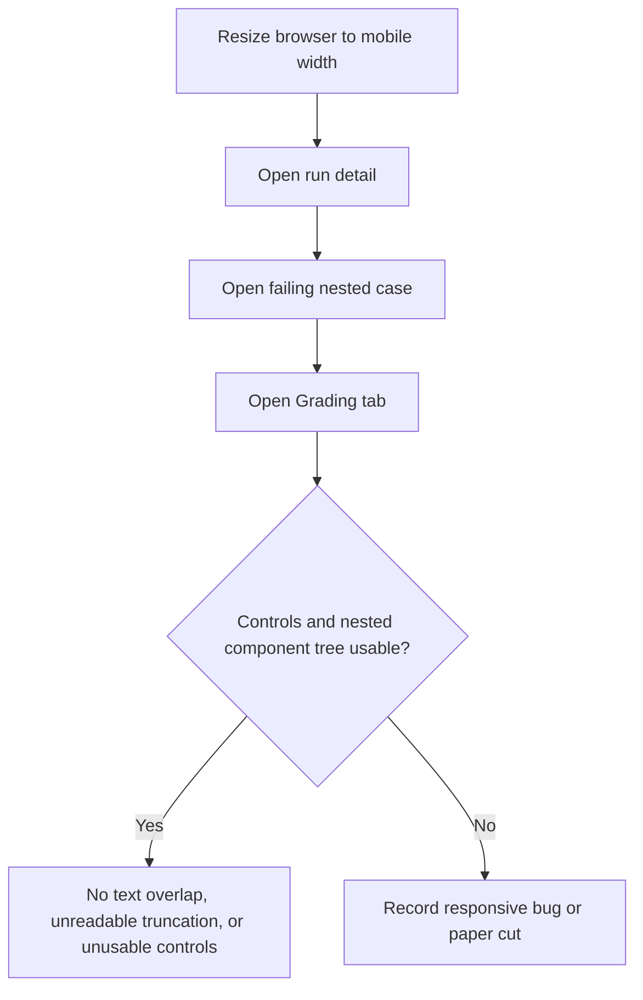

# Dogfood Report — av-cs91-dashboard-child-assertions-dogfood

> Diff-scoped browser QA of `av-cs91-dashboard-child-assertions-dogfood` vs the trunk. Generated by `/ce-dogfood` on 2026-07-07.

## Diff Summary

- Branch changes are grader-facing: `llm-rubric`/agent-rubric parsing and evaluation now produce nested `component_results` and richer grader metadata.
- The Dashboard itself was not changed in this branch, so this dogfood checks whether the existing local Dashboard can make the new nested grading artifacts inspectable.
- UAT uses a private synthetic run bundle at `.agentv/results/2026-07-07T12-00-00-000Z-dashboard-child-assertions/` with passing, failing, empty, and malformed grading cases.
- The important user-visible journey is run list -> run detail -> case detail -> Grading/Files tabs, with desktop and mobile checks.

## Personas

Source: `STRATEGY.md` "Who it's for".

- **AI platform engineer / agent builder** — evaluates real agent workflows, compares targets, gates changes, and needs to inspect why a grader passed or failed without digging through raw JSON first.

## Flows Tested

## Test Matrix & Results

| # | Flow | Journey / Scenario | Status | Issue | Fix | Commit |
|---|------|--------------------|--------|-------|-----|--------|
| 1 | Run discovery | Project/run list -> run detail: identify the `dashboard-child-assertions-dogfood` run and see it contains mixed pass/fail child assertion cases. | Pass | Run list shows display name, experiment tag, target, 2 passed, 2 failures, 4 total, and 50% pass rate. Run name link opens detail. | - | - |
| 2 | Case status | Run detail -> failed and passing case: find score, status, target/provider label, and grader labels without opening raw JSON first. | Pass | Run detail shows category breakdown, pass/fail filters, target filter, grader filter, target labels, score, and per-grader columns. | - | - |
| 3 | Nested grading | Case detail -> Grading tab: nested `component_results` render with labels, scores, pass/fail, reasons, evidence, named scores, and metadata. | Pass | Failing and passing case details show aggregate result, named scores, grader/provider metadata, recursive component rows, child pass/fail, scores, reasons, and assertion values. | - | - |
| 4 | Artifact access | Grading tab and Files/source panel: open grading sidecar/raw JSON and related artifacts from the selected case. | Pass | `Open grading JSON` switches to Files and selects `grading.json`; related `metrics.json`, `result.json`, `summary.json`, `timing.json`, and answer artifact are reachable. | - | - |
| 5 | Empty/error states | Cases with no grading path and malformed `grading.json` show useful empty/error states. | Pass | No-grading case shows `No assertion steps recorded.` Malformed grading case shows `Unexpected end of JSON input` and still exposes raw artifact access. | - | - |
| 6 | Responsive layout | Desktop and mobile widths: run list, case table, Grading tab, expanded child tree, and artifact links remain usable with no text overlap. | Pass | Desktop `1440x1000` and mobile `390x844` checks showed readable controls, scrollable content, no visible overlap, and usable nested component rows. | - | - |

## What Was Fixed

None. No code changes were needed.

## Paper Cuts (by persona)

- **AI platform engineer / agent builder** — The run-list checkbox cell is easy to hit when trying to open the run. The run name itself is a link and works, so this is a minor navigation paper cut, not a blocker.

## Console Errors

None observed from `agent-browser errors`.

## Human Verifications

Not applicable. This dogfood has no OAuth, email, payment, or SMS leg.

## Decisions for a Human

None.

## Learnings

- A private synthetic bundle is enough for Dashboard observability UAT when the goal is UI/data inspection and no live provider output should be published. Keep the bundle under ignored `.agentv/results/` and publish only private screenshots/API captures to `agentv-private`.
- The Dashboard gives materially better nested-grading inspection than raw Promptfoo JSON for this case: a user sees run-level counts, target/provider labels, grader columns, aggregate score, named scores, component tree, child assertion failure reasons, and raw sidecar links in one route.

## Final Status

Ready from this dogfood pass. No code fixes were needed.

Validation and evidence:

- `bun install` to hydrate this fresh worktree.
- `bun --filter @agentv/core build`
- `bun --filter @agentv/sdk build`
- `bun --filter @agentv/dashboard build` (passed with the existing Vite large chunk warning)
- `bun --filter @agentv/dashboard test` (162 pass, 0 fail)
- `agent-browser` desktop and mobile browser UAT on `http://localhost:3117`
- `agent-browser errors` reported no page errors.
- `bun apps/cli/src/cli.ts results validate .agentv/results/2026-07-07T12-00-00-000Z-dashboard-child-assertions` intentionally exits non-zero because the malformed-artifact scenario contains invalid `grading.json`; the remaining warnings are from the synthetic run ID suffix and intentionally empty scores on the no-assertion/malformed cases.

Private evidence:

- Branch: `agentv-private:evidence/av-cs91-dashboard-child-assertions-dogfood`
- Commit: `e95aea7`
- Contents: desktop/mobile screenshots plus `run-api/runs.json` and `run-api/run-detail.json`.
