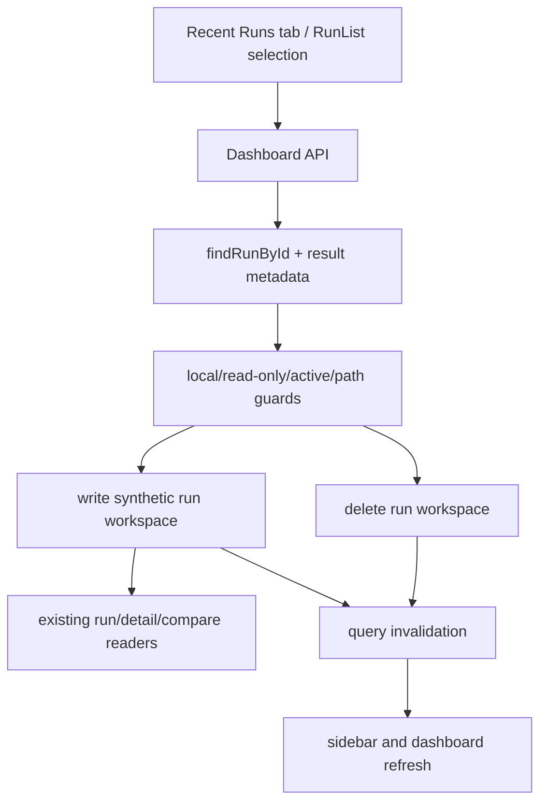

# feat: Add dashboard run delete and combine actions

## Summary

Add first-class Dashboard run management for local run workspaces: users can delete a run and combine selected runs into a new synthetic run from the Recent Runs tab. The backend owns filesystem safety and read-only/remote guards; the frontend owns confirmation, selection, and cache refresh across run list, sidebar, analytics, targets, and experiment views.

---

## Problem Frame

The Dashboard already treats evaluation runs as durable project artifacts and supports mutable sidecars for tags, but users cannot curate noisy runs or turn related partial runs into a single run artifact. This makes repeated experimentation harder to scan and forces manual filesystem edits outside the Dashboard.

The request names the sidebar and/or Recent Runs tab. The first implementation should use the Recent Runs tab as the primary surface because combining is naturally a multi-select workflow; the sidebar should update through existing query invalidation after mutations rather than adding a second, cramped management surface in the same pass.

---

## Requirements

**Run deletion**

- R1. Users can delete a local run workspace from the Dashboard after an explicit confirmation.
- R2. Deletion is unavailable for read-only dashboards, remote runs, and active runs still tracked as starting or running.
- R3. The server validates that the resolved run path is a local run workspace before deleting anything from disk.
- R4. After deletion, run list, sidebar, run detail, experiments, analytics, targets, and remote status-derived views no longer show stale data.

**Run combination**

- R5. Users can select two or more local, finished runs in the Recent Runs tab and combine them into one new local run workspace.
- R6. The combined run writes a normal AgentV run artifact so existing detail, suite/category drill-down, analytics, targets, and experiment aggregation paths can consume it without special cases.
- R7. The combined run preserves source provenance in metadata and carries a deterministic, user-visible display name or generated name.
- R8. The combined run preserves useful mutable metadata by writing a union of selected run tags when any source run has tags.
- R9. Combining rejects remote runs, missing runs, duplicate selections, active runs, and malformed payloads with clear JSON errors.

**Wire/API conventions**

- R10. New JSON request and response bodies use `snake_case` keys at the HTTP boundary and camelCase only inside TypeScript internals.
- R11. Project-scoped and unscoped Dashboard routes expose equivalent delete/combine behavior.
- R12. The implementation remains Dashboard/results-server functionality, not a new core evaluator primitive.

---

## Key Technical Decisions

- **Recent Runs tab is the primary UI:** Combining needs multi-select, batch actions, and disabled-state explanations. Adding that to `RunList` fits the current table shape; doing it in the sidebar would make the sidebar less scannable and duplicate management controls.
- **Delete removes the local run workspace directory:** Runs are persisted as workspaces under `.agentv/results/runs`, and sidecars such as `tags.json` live beside `index.jsonl`. Deleting the workspace keeps artifacts consistent without inventing tombstones or hidden-state filters.
- **Combine creates a synthetic local run workspace:** The combined output should be a normal run directory with an `index.jsonl` assembled from source records plus metadata in `benchmark.json`. That lets existing readers, compare aggregation, detail pages, suite/category pages, and targets work through composition.
- **Remote runs are read-only for v1:** Remote cached runs may represent public synced data and should not be deleted locally through this action or mixed into synthetic local runs until the product defines remote provenance and sync semantics.
- **Server-side guards are authoritative:** The UI should hide or disable unsafe actions, but the Hono handlers must enforce read-only mode, remote rejection, active-run rejection, local path containment, minimum selection counts, and duplicate run IDs.

---

## High-Level Technical Design

The implementation should keep all run mutation behavior inside the results server and API client layer. Existing readers should not learn a new "combined run" mode beyond optional metadata they can display.

---

## Scope Boundaries

- In scope: local run deletion, local finished-run combination, project-scoped and unscoped API/UI support, read-only/remote/active guards, targeted API and dashboard tests.
- Out of scope: deleting remote source data, syncing deletion to result repositories, undo/restore, long-running background combine jobs, sidebar multi-select, or changing evaluator/runtime behavior.

### Deferred to Follow-Up Work

- Add a compact sidebar context menu only if users still need single-run management there after the Recent Runs workflow lands.
- Define remote result management semantics separately, including whether local cache deletion, remote deletion, and result-repo commits are distinct actions.

---

## Implementation Units

### U1. Results API run mutation primitives

- **Goal:** Add safe server-side handlers for deleting one local run and combining multiple local runs into a synthetic local run workspace.
- **Requirements:** R1, R2, R3, R5, R6, R7, R8, R9, R10, R11, R12
- **Dependencies:** None
- **Files:**
  - `apps/cli/src/commands/results/serve.ts`
  - `apps/cli/src/commands/results/run-tags.ts`
  - `apps/cli/test/commands/results/serve.test.ts`
- **Approach:** Add unscoped and project-scoped routes such as `DELETE /api/runs/:filename` and `POST /api/runs/combine`, plus project equivalents under `/api/projects/:projectId`. Reuse `findRunById`, `listMergedResultFiles`, `loadManifestResultsForMeta`, `readRunTags`, and existing read-only route gates. Resolve the run directory from the manifest path and verify it is a local run workspace before removal. For combine, validate `run_ids` and optional `display_name`, load each source run, concatenate JSONL-compatible records into a new run directory, write metadata that records `combined_from_run_ids`, and write unioned tags when present.
- **Patterns to follow:** Existing tags handlers in `apps/cli/src/commands/results/serve.ts`; run workspace metadata handling in `deriveResumeMeta`; tag sidecar normalization in `apps/cli/src/commands/results/run-tags.ts`; pagination and merged-run tests in `apps/cli/test/commands/results/serve.test.ts`.
- **Test scenarios:**
  - Deleting an existing local run removes its workspace and returns `{ ok: true }`.
  - Deleting a missing run returns 404 without touching other run workspaces.
  - Deleting a remote run returns a 400-level error and leaves cached artifacts unchanged.
  - Deleting in read-only mode returns 403 and leaves the local workspace unchanged.
  - Deleting an active run returns 409 and leaves partial artifacts intact.
  - Combining two local finished runs writes a new run workspace whose detail endpoint returns records from both sources.
  - Combining carries a generated display name when no name is supplied and honors a valid supplied `display_name`.
  - Combining writes unioned tags when source runs have overlapping tags.
  - Combining rejects fewer than two IDs, duplicate IDs, missing IDs, remote runs, active runs, and invalid JSON.
  - Project-scoped delete and combine operate only inside the selected project.
- **Verification:** API tests prove mutations affect disk artifacts, reject unsafe cases, and return snake_case JSON.

### U2. Dashboard API client and type contracts

- **Goal:** Expose typed client helpers and response shapes for run deletion and combination.
- **Requirements:** R4, R10, R11
- **Dependencies:** U1
- **Files:**
  - `apps/dashboard/src/lib/api.ts`
  - `apps/dashboard/src/lib/types.ts`
- **Approach:** Add wire types for delete and combine responses using snake_case fields. Add `deleteRunApi(runId, projectId?)` and `combineRunsApi({ runIds, displayName }, projectId?)` helpers that call the scoped or unscoped endpoint. Keep query key invalidation responsibility with callers so mutations can refresh only the visible surfaces they affect.
- **Patterns to follow:** `saveRunTagsApi`, `deleteRunTagsApi`, and project-scoped API base helpers in `apps/dashboard/src/lib/api.ts`.
- **Test scenarios:**
  - Type-level shape stays aligned with snake_case wire responses and camelCase local parameters.
  - Error responses surface the server message rather than a generic fetch failure where the API helper already parses JSON errors.
- **Verification:** Typecheck passes and call sites use the helpers without ad hoc fetch logic.

### U3. Recent Runs management UI

- **Goal:** Add delete and combine controls to the Recent Runs table with selection, confirmation, disabled states, and cache refresh.
- **Requirements:** R1, R2, R4, R5, R7, R8, R9, R11
- **Dependencies:** U1, U2
- **Files:**
  - `apps/dashboard/src/components/RunList.tsx`
  - `apps/dashboard/src/routes/index.tsx`
  - `apps/dashboard/src/routes/projects/$projectId.tsx`
  - Dashboard component tests if this repo already has a colocated pattern for them; otherwise cover through focused API tests and manual UAT.
- **Approach:** Extend `RunList` with optional management props: read-only state, delete callback, combine callback, and project scope. Add stable checkbox dimensions, a toolbar that appears when selections exist, and icon/button controls with clear labels. Disable selection/actions for remote and active runs. Use confirmation for delete and combine, including selected run count and target display name. After mutation, invalidate `runs`, infinite run pages, current run detail when applicable, `experiments`, `compare`, `targets`, all-project runs, and project-scoped equivalents.
- **Patterns to follow:** Existing `RunList` table styling, `AnalyticsTab` tag mutation invalidation, source filtering in root and project home routes, and read-only handling in `RunEvalModal`/analytics.
- **Test scenarios:**
  - A local finished run shows a selectable row and delete action when dashboard is writable.
  - Remote, active, and read-only rows cannot be selected for mutation.
  - Delete confirmation calls the API once and refreshes relevant query keys on success.
  - Combine remains disabled until at least two eligible runs are selected.
  - Combine success clears selection and navigates or surfaces the new run ID without leaving stale selected IDs.
  - API errors render inline or toast-style feedback without clearing selection prematurely.
- **Verification:** Manual UAT covers deleting a disposable local run and combining two disposable local runs from both root and project Recent Runs tabs.

### U4. Run provenance display and regression coverage

- **Goal:** Make combined runs understandable without requiring special-case readers.
- **Requirements:** R6, R7, R8, R12
- **Dependencies:** U1, U2, U3
- **Files:**
  - `apps/dashboard/src/components/RunDetail.tsx`
  - `apps/dashboard/src/routes/runs/$runId.tsx`
  - `apps/dashboard/src/routes/projects/$projectId_/runs/$runId.tsx`
  - `apps/cli/test/commands/results/serve.test.ts`
- **Approach:** If combine metadata is included in run detail or exposed through existing metadata, show a small provenance note on combined run detail pages. Keep analytics and target views unaware of the synthetic nature. If exposing metadata requires broad response changes, defer visible provenance and rely on display name plus tags for v1.
- **Patterns to follow:** Existing run detail source/status/resume metadata display and route-level project-scoped detail pages.
- **Test scenarios:**
  - Combined run detail loads through the same route as normal runs.
  - Suite/category/eval drill-downs work for records sourced from different runs.
  - Analytics per-run view includes the combined run as one selectable run.
  - Targets and experiments update from the synthetic run without double-counting deleted source runs after refresh.
- **Verification:** Manual UAT verifies the combined artifact opens, drills down, and appears in analytics/targets like any other run.

---

## Risks & Dependencies

- **Destructive filesystem action:** Deletion must be server-guarded and confirmed in the UI. Path containment checks are mandatory before any recursive removal.
- **Result format assumptions:** Combine should use the same JSONL records existing loaders already parse. Avoid rewriting fields or normalizing beyond what the current artifact writer expects.
- **Stale query data:** Run list, sidebar, and analytics use different query keys. Missing invalidations could leave deleted or pre-combine runs visible until the polling interval catches up.
- **Remote sync ambiguity:** Remote management semantics are not defined, so v1 should reject remote runs rather than partially deleting local cache or mutating synced artifacts.

---

## Sources & Research

- `apps/cli/src/commands/results/serve.ts` already centralizes run listing, detail loading, comparison aggregation, tags mutation, read-only guards, and project-scoped route wiring.
- `apps/cli/src/commands/results/run-tags.ts` provides the local mutable sidecar pattern to follow for tag preservation.
- `apps/dashboard/src/components/RunList.tsx` is the table users already use for Recent Runs and is the right primary surface for multi-select combine.
- `apps/dashboard/src/components/Sidebar.tsx` consumes the same run query data, so cache invalidation is enough for sidebar refresh in v1.
- `apps/dashboard/src/components/AnalyticsTab.tsx` shows the existing mutation pattern for local-only run metadata and query invalidation after tag changes.
