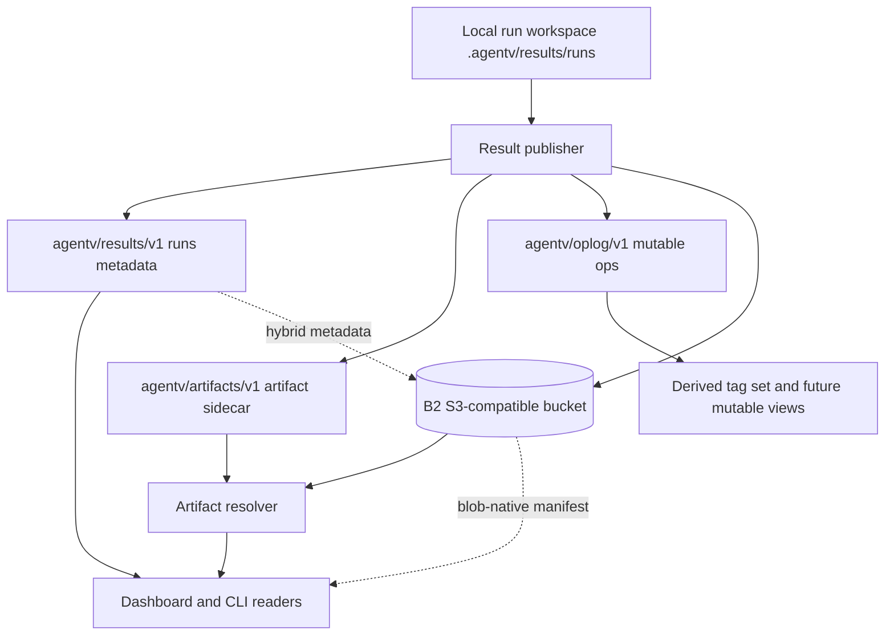

# feat: Specify git-native results storage, retention, and oplog

## Summary

Bead `av-quf` should turn the current git-backed results implementation into a
documented storage contract with three backend modes, a single results branch,
one artifact sidecar namespace, retention and compaction rules, a compact
publication export, an append-only mutable-operation log, and an S3-compatible
object-storage tier.

The canonical AgentV run artifacts stay `summary.json`, `index.jsonl`, per-test
grading/timing files, `outputs/trace.json`, and derived transcript artifacts.
GitHub and Backblaze B2 are storage/publication targets over those artifacts.
Dashboard and Hugging Face are viewers or publication surfaces. Phoenix is only
a link-out viewer when safe `external_trace` metadata points at independently
emitted spans; it is not an AgentV artifact projection or storage backend.

---

## Problem Frame

`packages/core/src/evaluation/results-repo.ts` already implements the first git-native
slice: `agentv/results/v1` is the default results branch, `runs/**` is listed with
`git ls-tree`, `summary.json` blobs are read with `git cat-file --batch`, and the
branch root is a deterministic orphan genesis. Current mutable tags live under
`metadata/runs/**`, and heavy transcript sidecars are still written inside each run
workspace by `packages/core/src/evaluation/run-artifacts.ts`.

The next implementation beads need a precise shared contract before they split work.
The contract must avoid branch proliferation, keep AgentV artifacts canonical, and
define how git, object storage, retention, publication, and mutable operations compose
without creating another hosted results platform inside AgentV.

---

## Scope Boundaries

### In Scope

- Define storage backend modes and per-mode listing/index strategies.
- Pin the git-native ref and path layout for `agentv/results/v1`,
  `agentv/artifacts/v1`, and `agentv/oplog/v1`.
- Define retention, compaction, and migration rules for run metadata and heavy artifacts.
- Define compact publication export as a derived artifact over `summary.json` and
  `index.jsonl`, with no required `eval.txt`.
- Define the mutable operation log and add-wins tag set semantics.
- Define the Backblaze B2 S3-compatible object tier and secret-loading boundary.
- Name concrete files, functions, and tests for dependent implementation beads.

### Out of Scope

- Implementing storage backends, S3, oplog, retention, or export code in this bead.
- Adding GitHub issues or tracker runtime state.
- Creating windowed branches, per-run branches, or a hosted Dashboard replacement.
- Making Phoenix canonical, making Phoenix an AgentV artifact projection target, or making Hugging Face, B2, or GitHub the canonical results model.

### Deferred to Follow-Up Work

- Path sharding under `runs/` or artifact prefixes. Only add it after a benchmark with
  realistic run counts proves `git ls-tree` or object-store listing is too slow.
- PR-based publishing for human-reviewed result repositories. Machine-generated eval
  results should keep direct append commits until a concrete workflow needs review gates.
- A generic non-B2 object-store provider matrix. Start with S3-compatible configuration
  narrow enough to support B2 and avoid provider-specific APIs.

---

## Requirements

### Storage Modes

- R1. The default mode remains git-native and must work with the current explicit
  `repo_path` or `repo_url` results configuration.
- R2. Hybrid mode must keep the run index and metadata in git while moving selected
  heavy artifact payloads to object storage.
- R3. Blob-native mode must store run index, metadata, artifacts, and oplog in object
  storage without requiring a git checkout, git object database, or git remote.
- R4. Each mode must define its listing/index strategy: git tree listing for git-backed
  modes and bucket manifest plus `ListObjectsV2` fallback for blob-native mode.

### Git Layout And Sync

- R5. The primary results ref is `agentv/results/v1`.
- R6. Heavy artifact sidecars use the single artifact ref or namespace
  `agentv/artifacts/v1`, with path prefixes such as `transcripts/`, `raw-logs/`,
  and `screenshots/`.
- R7. Mutable operations use the single oplog ref or namespace `agentv/oplog/v1`.
- R8. The git-native branch must keep deterministic orphan genesis and must not create
  windowed branches or per-run branches.
- R9. Path sharding is not part of v1 unless measurement at realistic scale proves it is
  needed.

### Retention And Publication

- R10. Retention must distinguish logical pruning from history compaction in git-backed
  modes.
- R11. Hybrid and blob-native modes must support object lifecycle policy alignment for
  artifact payloads without deleting index metadata prematurely.
- R12. Transcript migration must support transcripts under
  `agentv/artifacts/v1` while preserving existing logical artifact references.
- R13. Publication export must be compact and derived from `summary.json` plus
  `index.jsonl`; it must not require an authored or generated `eval.txt`.

### Mutable Operations

- R14. Mutable run/result operations must be append-only per actor first.
- R15. Tag mutation semantics start as an add-wins tag set, not direct mutation of
  immutable run artifacts.
- R16. Oplog storage location must be defined for all three modes.

### Object Storage

- R17. The object-storage tier targets Backblaze B2 through its S3-compatible API.
- R18. The implementation must use a standard S3 SDK/client, not B2-native APIs.
- R19. Credentials must come from environment or config populated by the BWS CLI, and
  resolved secret values must not be written into AgentV artifacts, config examples, or
  committed docs.

---

## Key Technical Decisions

- KTD1. Backend mode is a storage concern, not a product model. Use `git-native`,
  `hybrid`, and `blob-native` as storage modes while keeping `summary.json` and
  `index.jsonl` as the artifact contract that readers consume.
- KTD2. Do not overload the existing `results.mode: github` field. Add
  `results.storage_mode` with values `git-native`, `hybrid`, and `blob-native`, and
  normalize missing `storage_mode` to `git-native`. Put object-store settings under
  `results.object_store`.
- KTD3. The git tree remains the index for git-backed modes. `listGitRuns()` should
  continue to list `runs/**/summary.json` from `agentv/results/v1`; no separate
  branch-local `index/runs.jsonl` is introduced.
- KTD4. Use one artifact sidecar namespace named `artifacts`. Do not introduce
  `artifact-blobs`, `blobs`, or per-artifact refs. Prefix by artifact class, for example
  `transcripts/<run-path>/...`, `raw-logs/<run-path>/...`, and
  `screenshots/<run-path>/...`.
- KTD5. Use sibling Git refs for results, artifacts, and oplog. Git refs are stored
  path-like, so `agentv/results/v1` cannot coexist with child refs such as
  `agentv/results/v1/artifacts` or `agentv/results/v1/oplog`.
- KTD6. Hybrid mode keeps git as the metadata and index authority, while object storage
  stores selected heavy payload bytes. Git contains stable artifact locator records with
  checksums, sizes, and logical paths so readers can verify fetched payloads.
- KTD7. Blob-native mode mirrors the same logical namespaces in the bucket, but does not
  emulate git refs. It owns bucket manifests and per-prefix object listings.
- KTD8. Mutable operations are derived overlays. Existing `metadata/runs/**/tags.json`
  is a compatibility read/write surface until oplog materialization replaces direct
  overlay writes.
- KTD9. Publication export is a projection. It should read completed run bundles and
  emit a compact publishable directory without becoming a new source of truth.
- KTD10. Backblaze B2 is addressed only through S3-compatible endpoints and Signature V4.
  The object client should be a standard S3 client configured with endpoint, region,
  bucket, and credentials.

---

## High-Level Technical Design

### Storage Topology



### Mode Matrix

| Mode | Canonical index/listing | Artifact payloads | Mutable ops | Git dependency |
| --- | --- | --- | --- | --- |
| `git-native` | `git ls-tree -r agentv/results/v1 -- runs/` plus `git cat-file --batch` for `summary.json` | `agentv/artifacts/v1` stores payload bytes | `agentv/oplog/v1` | Required |
| `hybrid` | Same primary git ref as `git-native` | Object storage stores selected payload bytes; git stores locators under the artifact namespace | `agentv/oplog/v1` | Required for index/oplog |
| `blob-native` | Bucket manifest under the results namespace, with `ListObjectsV2` fallback by prefix | Object storage stores all payloads | Bucket oplog prefix | None |

### Logical Namespace Shape

```text
agentv/results/v1
  runs/<experiment>/<timestamp>/summary.json
  runs/<experiment>/<timestamp>/index.jsonl
  runs/<experiment>/<timestamp>/<test-artifacts except moved heavy payloads>
  metadata/runs/<experiment>/<timestamp>/materialized-tags.json

agentv/artifacts/v1
  transcripts/<experiment>/<timestamp>/<test-key>/transcript.jsonl
  raw-logs/<experiment>/<timestamp>/<test-key>/<source>.jsonl
  screenshots/<experiment>/<timestamp>/<test-key>/<name>.png

agentv/oplog/v1
  actors/<actor-id>/<sequence-or-time>-<nonce>.json
```

For blob-native mode, these are bucket prefixes rather than git refs. The prefix shape
should stay recognizable so readers can share resolver logic across modes.

---

## Section Specs

### 1. Storage Backend Abstraction And Modes

**Decision:** Add a narrow storage abstraction around listing, publishing,
materializing artifacts, resolving artifact bytes, syncing, applying retention, and
reading oplog entries. Keep existing git helpers as the first adapter rather than
rewriting all results code at once.

**File-level plan:**

- `packages/core/src/evaluation/results-repo.ts`
  - Keep `DEFAULT_RESULTS_BRANCH`, deterministic genesis, `listGitRuns()`,
    `materializeGitRun()`, and `directPushResults()` as the git adapter's core.
  - Extract or wrap adapter-facing functions instead of renaming them in the first
    implementation slice.
- `packages/core/src/evaluation/loaders/config-loader.ts`
  - Extend `ResultsConfig` and `parseResultsConfig()` with `storage_mode` and
    `object_store`.
  - Preserve current `repo_url`, `repo_path`, `branch`, `remote`, `path`, and
    `sync` behavior for `git-native`.
- `packages/core/src/projects.ts`
  - Add matching project-registry YAML and internal fields if Dashboard project
    bindings can configure hybrid/blob-native storage.
- New core files, names to finalize during implementation:
  - `packages/core/src/evaluation/results-storage.ts` for shared interfaces.
  - `packages/core/src/evaluation/results-git-storage.ts` for the git adapter if
    extraction from `results-repo.ts` becomes large.
  - `packages/core/src/evaluation/results-object-storage.ts` for S3-compatible
    primitives.
- `apps/cli/src/commands/results/remote.ts`
  - Route `listMergedResultFiles()`, `getRemoteResultsStatus()`,
    `ensureRemoteRunAvailable()`, and `maybeAutoExportRunArtifacts()` through the
    normalized adapter.
- `apps/cli/src/commands/results/serve.ts`
  - Route remote run listing, file reads, and tag mutations through storage-resolved
    metadata rather than assuming a git materialized path exists.

**Per-mode listing/index strategy:**

- `git-native`: list `runs/**/summary.json` with `git ls-tree`; batch-read
  benchmark blobs with `git cat-file --batch`; materialize run details lazily with
  `materializeGitRun()`.
- `hybrid`: list from the same git ref and read the same `summary.json` blobs.
  Artifact locators in `index.jsonl` or sidecar manifests decide whether bytes come
  from git artifacts or object storage.
- `blob-native`: read a compact run manifest from bucket storage first. If the
  manifest is missing or stale, fall back to `ListObjectsV2` over
  `runs/**/summary.json`-equivalent objects, rebuild the manifest, and continue.
  Use continuation tokens because S3 listing returns a bounded page per request.

**Test plan:**

- `packages/core/test/evaluation/results-storage.test.ts`
  - Normalizes missing storage mode to `git-native`.
  - Rejects incompatible config combinations, such as `blob-native` with `repo_path`
    as a hard dependency.
  - Proves the adapter interface can list runs in all modes from fixtures.
- `packages/core/test/evaluation/results-repo.test.ts`
  - Existing git-native tests must keep passing.
  - Add coverage that `git-native` listing remains one `runs/**/summary.json`
    tree scan, not a committed index file.
- `apps/cli/test/commands/results/serve.test.ts`
  - Dashboard `/api/runs` response shape stays stable across adapter-backed sources.

**Acceptance:**

- A dependent implementation bead can add a new storage adapter without changing
  Dashboard components.
- Existing `results.repo_path` and `results.repo_url` configs still publish and list
  runs as `git-native`.
- Blob-native mode has no code path that shells out to `git`.

### 2. Git-Native Layout

**Decision:** Keep one primary results branch, one artifact sidecar ref, and one oplog
ref. Do not add windowed or per-run branches. Do not shard paths before measurement.

**File-level plan:**

- `packages/core/src/evaluation/results-repo.ts`
  - Keep `DEFAULT_RESULTS_BRANCH = 'agentv/results/v1'`.
  - Add constants for the artifact and oplog refs:
    `agentv/artifacts/v1` and `agentv/oplog/v1`.
  - Add a shared test assertion that all three refs pass `git check-ref-format`
    and no ref is a prefix parent or child of another.
  - Extend safe-path staging to include only owned top-level paths on each ref.
  - Keep `createResultsGenesisCommit()` and `createOrphanResultsBranch()` behavior
    for any new git storage refs so independent clients converge on the same root.
  - Keep `commitResultsRunWithTemporaryIndex()` for primary run commits.
  - Add artifact-ref and oplog-ref commit helpers only if sharing the temporary-index
    machinery remains simple.
- `apps/cli/src/commands/results/remote.ts`
  - Keep `getResultsStorageRef()` returning the primary ref for run listing.
  - Add resolver access to artifact and oplog refs without changing remote run IDs.
- `packages/core/test/evaluation/results-repo.test.ts`
  - Add deterministic genesis tests for the artifact and oplog refs if they are
    created by separate helper functions.
  - Add tests that two clients publishing to `agentv/artifacts/v1` converge
    rather than minting divergent orphan roots.

**Layout rules:**

- Primary ref `agentv/results/v1`:
  - Owns `runs/**` and lightweight materialized metadata.
  - Lists runs only through `runs/**/summary.json`.
- Artifact ref `agentv/artifacts/v1`:
  - Owns payload classes under `transcripts/`, `raw-logs/`, and `screenshots/`.
  - May store payload bytes in `git-native`.
  - May store locator manifests in `hybrid`.
- Oplog ref `agentv/oplog/v1`:
  - Owns append-only operation records under `actors/**`.
  - Is never used for immutable run payloads.

**Test plan:**

- Unit test constants and normalized default branch.
- Integration test with a temporary repo that publishes:
  - one run to `agentv/results/v1`;
  - one transcript payload to `agentv/artifacts/v1`;
  - one tag operation to `agentv/oplog/v1`.
- Assert all three refs can coexist in one temporary repo because none is a
  path-prefix of another.
- Assert the source checkout branch does not switch.
- Assert no `agentv/results/v1/<window>` or `agentv/results/run/<id>` refs are created.

**Acceptance:**

- `git for-each-ref refs/heads/agentv/results` shows only the v1 primary ref and the
  two named sidecar refs for completed-result storage.
- Run listing performance is measured against realistic data before any path sharding
  proposal is accepted.

### 3. Retention, Compaction, And Transcript Migration

**Decision:** Retention removes live references first; compaction is an explicit
maintenance action because git history and object-store versioning can keep old bytes
after logical deletion.

**File-level plan:**

- New core file, likely `packages/core/src/evaluation/results-retention.ts`
  - Evaluate retention policy against normalized run metadata.
  - Produce a deletion plan for primary run paths, artifact sidecar paths, oplog
    materializations, and object-store payloads.
  - Keep policy evaluation pure so git and bucket adapters can execute it.
- `packages/core/src/evaluation/results-repo.ts`
  - Add git deletion commits for `runs/**`, `metadata/runs/**`, and artifact-ref
    prefixes.
  - Add optional compaction helpers only after logical pruning exists.
- `packages/core/src/evaluation/run-artifacts.ts`
  - Preserve logical `transcript_path` values while supporting external artifact
    locators.
  - Add optional artifact locator metadata in `index.jsonl` rather than replacing the
    existing path fields.
- `apps/cli/src/commands/results/remote.ts`
  - Teach `ensureRemoteRunAvailable()` and future artifact resolvers to fetch a
    transcript from `agentv/artifacts/v1` when the run-local path is a logical
    reference.
- `apps/cli/src/commands/results/serve.ts`
  - Keep file API responses stable for transcript JSONL, whether bytes are local,
    materialized from git, or streamed from object storage.

**Git/hybrid retention rules:**

- Logical prune commit:
  - Removes selected `runs/<experiment>/<timestamp>/**` from `agentv/results/v1`.
  - Removes selected artifact paths from `agentv/artifacts/v1` or replaces
    hybrid locator records with tombstones.
  - Appends retention operations to oplog when mutable state is affected.
- Compaction:
  - Explicitly rewrites or re-roots storage refs after a backup/export checkpoint.
  - Never runs automatically during `agentv eval`.
  - Requires remote coordination because old commits and blobs can disappear after
    garbage collection.

**Bucket lifecycle rules:**

- Hybrid:
  - Keep object payloads at least as long as primary git metadata points to them.
  - Use object lifecycle for expired payload classes after the git retention plan
    removes or tombstones their locators.
- Blob-native:
  - Bucket lifecycle can expire artifact payload prefixes independently only when the
    bucket manifest and oplog policy mark them expired.
  - Keep index manifests longer than payloads when publication or audit needs summary
    history without large transcripts.

**Transcript migration:**

- Existing runs may have `transcript_path` pointing at
  `<result_dir>/outputs/transcript.jsonl`.
- Migration copies transcript bytes to
  `agentv/artifacts/v1:transcripts/<experiment>/<timestamp>/<test-key>/transcript.jsonl`
  or the matching object-store key.
- `index.jsonl` keeps `transcript_path` as the logical path and gains optional locator
  metadata with `backend`, `ref` or bucket namespace, `path`, `sha256`, and
  `size_bytes`.
- Readers resolve the logical path through locator metadata first and fall back to the
  run-local file for historical bundles.

**Test plan:**

- `packages/core/test/evaluation/results-retention.test.ts`
  - Selects old runs by timestamp and keeps protected latest runs.
  - Plans transcript sidecar deletion only after primary metadata no longer points to it.
  - Produces separate plans for git-native, hybrid, and blob-native modes.
- `packages/core/test/evaluation/run-artifacts.test.ts`
  - Verifies optional artifact locator fields are snake_case and do not break
    `parseJsonlResults()`.
- `apps/cli/test/commands/results/serve.test.ts`
  - Serves a transcript from sidecar/object locator with the same raw/download
    behavior as a run-local transcript.

**Acceptance:**

- Retention can remove old live runs without breaking listing for retained runs.
- A transcript migrated under `agentv/artifacts/v1` remains viewable through
  the existing Dashboard file API.
- Compaction cannot run implicitly as a side effect of publish, sync, or Dashboard
  polling.

### 4. Compact Derived Publication Export

**Decision:** Publication output is a derived export over the canonical run bundle.
It does not require an `eval.txt` artifact, and it does not become the source of truth
for rerun, comparison, grading, or adapter ingestion.

**File-level plan:**

- `apps/cli/src/commands/results/export.ts`
  - Keep the current run-workspace export path aligned with
    `writeArtifactsFromResults()`.
  - Add or route to a publication export mode only if the CLI surface stays narrow.
- New CLI/core files if a separate command reads cleaner:
  - `apps/cli/src/commands/results/publication.ts`
  - `packages/core/src/evaluation/results-publication.ts`
- `packages/core/src/evaluation/run-artifacts.ts`
  - Remains the source for `summary.json`, `index.jsonl`, and per-test artifact
    schemas.
- `apps/web/src/content/docs/docs/tools/results.mdx`
  - Document that publication export reads completed run artifacts and does not
    require `eval.txt`.

**Publication contract:**

- Inputs:
  - completed run workspace;
  - `index.jsonl` manifest;
  - `summary.json`;
  - optional sidecar-resolved artifact references for selected public payloads.
- Outputs:
  - compact `summary.json` and `index.jsonl` or a derived `publication.json`;
  - optional static assets for selected summaries;
  - no required `eval.txt`.
- Privacy:
  - Default export excludes raw prompts, tool args/results, transcripts, screenshots,
    and raw logs unless the user opts into a payload class.

**Test plan:**

- `apps/cli/test/commands/results/export.test.ts`
  - Publication export succeeds with only `summary.json` and `index.jsonl`.
  - Publication export fails clearly when the manifest is not an AgentV result row.
  - Payload opt-in includes only selected sidecar files.
- `apps/cli/test/commands/results/report.test.ts`
  - Existing single-run HTML report remains unaffected.

**Acceptance:**

- A publication artifact can be generated from a run bundle that has no `eval.txt`.
- The exported publication states or embeds enough summary data for readers without
  replacing the canonical run bundle.
- External viewers consume publication output as a projection, not as an AgentV run
  workspace.

### 5. Mutable Run/Result Operations Via Append-Only Oplog

**Decision:** Implement mutable operations as per-actor append-only operation records.
Tags are the first materialized view and use add-wins set semantics.

**File-level plan:**

- `apps/cli/src/commands/results/remote-metadata.ts`
  - Preserve current `metadata/runs/**/tags.json` behavior as a compatibility layer.
  - Add read/write paths that append oplog operations before or instead of writing
    materialized overlays.
- New core file, likely `packages/core/src/evaluation/results-oplog.ts`
  - Define operation wire records with snake_case fields.
  - Define actor id, sequence/nonce, operation id, target run id, operation kind,
    payload, created timestamp, and optional causal metadata.
  - Implement add-wins tag projection.
- `packages/core/src/evaluation/results-repo.ts`
  - Add git append helpers for `agentv/oplog/v1`.
- `apps/cli/src/commands/results/serve.ts`
  - Route tag set, clear, and read endpoints through oplog projection for remote
    runs once the adapter is available.
- `apps/dashboard/src/lib/run-list-actions.ts` and tag-related component tests
  - Keep UI semantics stable: tags remain free-form chips with existing limits.

**Operation shape:**

```yaml
schema_version: agentv.oplog.v1
op_id: actor-a/2026-06-21T10-00-00-000Z-01hx
actor_id: actor-a
created_at: "2026-06-21T10:00:00.000Z"
target:
  run_id: with-skills::2026-06-17T10-00-00-000Z
kind: tag_add
payload:
  tag: release-candidate
```

For tag projection, removals record `tag_remove` with the tag value. Concurrent add
and remove resolves to present when the add operation is not causally observed by the
remove. That is the add-wins rule and prevents a stale clear from deleting another
actor's later tag addition.

**Where oplog lives by mode:**

- `git-native`: `agentv/oplog/v1` git ref, under
  `actors/<actor-id>/<sequence-or-time>-<nonce>.json`.
- `hybrid`: same git oplog ref, because git remains the metadata authority.
- `blob-native`: object-store prefix
  `oplog/actors/<actor-id>/<sequence-or-time>-<nonce>.json`, with a bucket manifest
  for efficient projection rebuilds.

**Test plan:**

- `packages/core/test/evaluation/results-oplog.test.ts`
  - Projects add-wins tags from add/remove operations.
  - Handles duplicate op ids idempotently.
  - Keeps operations from different actors without content conflicts.
  - Rejects non-snake_case or malformed operation records.
- `apps/cli/test/commands/results/remote-metadata.test.ts`
  - Existing overlay tests keep passing.
  - New oplog-backed tag write produces the same returned `RemoteRunTagState`.
- `apps/cli/test/commands/results/serve.test.ts`
  - Tag API returns effective tags after concurrent actor operations.

**Acceptance:**

- A remote tag edit appends an operation and does not rewrite immutable run artifacts.
- Concurrent tag adds from two actors both appear in the materialized tag set.
- Blob-native tag edits work without git.

### 6. Object-Storage Tier: Backblaze B2 Through S3-Compatible API

**Decision:** Use Backblaze B2 only through the S3-compatible API with a standard S3
client. The B2 Native API is out of scope for this storage tier.

**File-level plan:**

- `packages/core/package.json`
  - Add `@aws-sdk/client-s3` as a direct dependency if object storage code lands in
    core. Do not rely on transitive dependencies from provider packages.
- `packages/core/src/evaluation/results-object-storage.ts`
  - Create the S3-compatible client from endpoint, region, bucket, prefix, and
    environment-provided credentials.
  - Implement `put`, `get`, `head`, `delete`, multipart threshold decisions, and
    paginated listing.
  - Use `ListObjectsV2` continuation tokens for listing.
- `packages/core/src/evaluation/loaders/config-loader.ts`
  - Parse object-store config with snake_case fields:

```yaml
results:
  storage_mode: hybrid
  repo_path: .
  object_store:
    provider: s3-compatible
    endpoint: ${AGENTV_RESULTS_S3_ENDPOINT}
    region: ${AGENTV_RESULTS_S3_REGION}
    bucket: ${AGENTV_RESULTS_S3_BUCKET}
    prefix: agentv/results/v1
```

- `packages/core/src/evaluation/hooks.ts`
  - Reuse existing `before_session` secret-loading support where possible. A project
    can run BWS before AgentV commands and inject `AGENTV_RESULTS_S3_*` variables.
- `apps/web/src/content/docs/docs/tools/dashboard.mdx` and
  `apps/web/src/content/docs/docs/tools/results.mdx`
  - Document that BWS is a local/CI secret source and resolved values must not be
    committed.

**B2 specifics:**

- Endpoint format is `https://s3.<region>.backblazeb2.com`.
- Authentication uses S3 Signature V4.
- Application key id maps to S3 access key id; application key maps to S3 secret key.
- Configure standard S3 endpoint override, region, and credentials. Do not call B2
  Native API endpoints.

**BWS secret boundary:**

- Recommended local/CI flow:
  - BWS authenticates with `BWS_ACCESS_TOKEN`.
  - BWS injects or exports the S3 endpoint, region, bucket, access key id, and secret
    access key into environment variables before AgentV runs.
  - AgentV config interpolates variable names or reads environment variables directly.
- Never persist resolved BWS values into `summary.json`, `index.jsonl`, oplog records,
  Dashboard responses, docs examples, or project registry files.

**Test plan:**

- `packages/core/test/evaluation/results-object-storage.test.ts`
  - Uses a fake S3 client or local test double to verify `PutObject`, `GetObject`,
    `HeadObject`, `DeleteObject`, and paginated `ListObjectsV2` behavior.
  - Verifies credentials are read from env and are not serialized into manifests.
  - Verifies B2 endpoint config is passed as an S3 endpoint override.
- `packages/core/test/evaluation/loaders/config-loader.test.ts`
  - Parses object-store config and rejects missing bucket/endpoint for hybrid or
    blob-native modes.
- `apps/cli/test/commands/results/serve.test.ts`
  - Streams a sidecar artifact from object storage through the existing file API.

**Acceptance:**

- Hybrid mode can write a transcript payload to B2 through the S3-compatible client
  while listing the run from git.
- Blob-native mode can list runs from bucket metadata without invoking git.
- No code imports a B2-native SDK or calls B2-native API-specific operations.
- No test fixture or docs example contains resolved secret values.

---

## Implementation Units

### U1. Results Storage Config And Adapter Boundary

- **Goal:** Add the storage-mode config and adapter interface that later units can use.
- **Requirements:** R1, R2, R3, R4, R19
- **Dependencies:** None
- **Files:** `packages/core/src/evaluation/loaders/config-loader.ts`,
  `packages/core/src/projects.ts`, `packages/core/src/evaluation/results-storage.ts`,
  `packages/core/test/evaluation/loaders/config-loader.test.ts`,
  `packages/core/test/projects.test.ts`,
  `packages/core/test/evaluation/results-storage.test.ts`
- **Approach:** Introduce storage mode without overloading `results.mode: github`.
  Normalize missing `storage_mode` to `git-native`, keep current git fields valid, and
  define adapter methods for listing, publishing, materializing, artifact reads,
  oplog reads, and retention.
- **Patterns to follow:** `normalizeResultsConfig()` in
  `packages/core/src/evaluation/results-repo.ts`; `fromYaml()` and `toYaml()` in
  `packages/core/src/projects.ts`; snake_case boundary rules in `.agents/conventions.md`.
- **Test scenarios:**
  - Given current `repo_path: .` config with no storage mode, normalization returns
    `git-native`.
  - Given `storage_mode: hybrid`, parser requires valid git configuration and
    `object_store`.
  - Given `storage_mode: blob-native`, parser accepts `object_store` without
    `repo_path` or `repo_url`.
  - Given `blob-native` config with no object store, parser rejects it with a clear
    warning.
  - Given project registry results config with object-store fields, YAML load/save
    preserves snake_case on disk and camelCase internally.
  - Given legacy `mode: github`, git-native config still works and does not imply
    GitHub-only storage.
- **Verification:** Existing git-native publish/list tests still compile against the
  normalized config, and new mode tests do not require real network access.

### U2. Git Refs, Sidecar Constants, And Artifact Locator Support

- **Goal:** Pin the three git refs and add resolver support for sidecar artifacts.
- **Requirements:** R5, R6, R7, R8, R9, R12
- **Dependencies:** U1
- **Files:** `packages/core/src/evaluation/results-repo.ts`,
  `packages/core/src/evaluation/run-artifacts.ts`,
  `apps/cli/src/commands/results/remote.ts`,
  `apps/cli/src/commands/results/serve.ts`,
  `packages/core/test/evaluation/results-repo.test.ts`,
  `packages/core/test/evaluation/run-artifacts.test.ts`,
  `apps/cli/test/commands/results/serve.test.ts`
- **Approach:** Keep `agentv/results/v1` as the listable run ref. Add named constants
  for artifact and oplog refs. Add optional artifact locator metadata while preserving
  existing logical path fields such as `transcript_path`.
- **Patterns to follow:** Current deterministic genesis functions in `results-repo.ts`;
  `buildIndexArtifactEntry()` and `buildResultIndexArtifact()` in `run-artifacts.ts`;
  existing transcript file API tests in `serve.test.ts`.
- **Test scenarios:**
  - Given a run with a sidecar transcript locator, Dashboard raw file endpoint returns
    the same text/plain response as a local transcript file.
  - Given no sidecar locator, historical run-local `transcript_path` still resolves.
  - Given two clients create an artifact ref, the genesis commit is deterministic.
  - Given a publish, no per-run or windowed result refs are created.
- **Verification:** `listGitRuns()` output is unchanged for runs that do not use sidecar
  payloads.

### U3. Retention And Compaction Planner

- **Goal:** Add retention planning that can prune runs and sidecars without implicit
  history compaction.
- **Requirements:** R10, R11, R12
- **Dependencies:** U1, U2
- **Files:** `packages/core/src/evaluation/results-retention.ts`,
  `packages/core/src/evaluation/results-repo.ts`,
  `packages/core/src/evaluation/results-object-storage.ts`,
  `packages/core/test/evaluation/results-retention.test.ts`,
  `packages/core/test/evaluation/results-repo.test.ts`
- **Approach:** Build a pure planner first. Execution adapters take the plan and create
  git deletion commits or bucket deletion batches. Keep compaction as a separate
  explicit operation with stronger confirmation and documentation.
- **Patterns to follow:** Safe path filters in `isSafeResultsRepoPath()` and
  `existingTrackedResultsDirs()`; project sync's blocked status reporting.
- **Test scenarios:**
  - Given runs older than a retention threshold, planner selects primary run paths and
    sidecar paths for deletion.
  - Given a sidecar transcript still referenced by a retained run, planner keeps it.
  - Given object lifecycle policy shorter than metadata retention, planner reports the
    mismatch instead of approving deletion.
  - Given compaction is not requested, no history rewrite operation is emitted.
- **Verification:** Retention execution can be tested against a temporary git repo and a
  fake object store without touching real remotes.

### U4. Publication Export Projection

- **Goal:** Add the compact publication export without requiring `eval.txt`.
- **Requirements:** R13
- **Dependencies:** U1
- **Files:** `apps/cli/src/commands/results/export.ts`,
  `apps/cli/src/commands/results/index.ts`,
  `packages/core/src/evaluation/results-publication.ts`,
  `apps/web/src/content/docs/docs/tools/results.mdx`,
  `apps/cli/test/commands/results/export.test.ts`
- **Approach:** Keep publication export read-only over completed run artifacts. Use
  `parseJsonlResults()` and `summary.json` metadata as inputs. If a new command is
  clearer than another export option, keep it under `agentv results` but document it as
  projection-only.
- **Patterns to follow:** `loadExportSource()` and `deriveOutputDir()` in
  `apps/cli/src/commands/results/export.ts`; `results report` docs for static output
  framing.
- **Test scenarios:**
  - Given a run with `index.jsonl` and `summary.json`, publication export succeeds
    with no `eval.txt`.
  - Given an invalid JSONL input that is not an AgentV result row, publication export
    fails with the existing result-row schema guidance.
  - Given transcript payloads exist, publication export excludes them by default.
  - Given payload opt-in for transcripts, publication export includes only selected
    sidecar-resolved transcript files.
- **Verification:** The generated publication output can be inspected from disk and does
  not modify the source run workspace.

### U5. Oplog And Add-Wins Tag Projection

- **Goal:** Replace direct mutable metadata writes with append-only operations and a tag
  projection.
- **Requirements:** R14, R15, R16
- **Dependencies:** U1, U2
- **Files:** `packages/core/src/evaluation/results-oplog.ts`,
  `packages/core/src/evaluation/results-repo.ts`,
  `apps/cli/src/commands/results/remote-metadata.ts`,
  `apps/cli/src/commands/results/serve.ts`,
  `apps/dashboard/src/lib/run-list-actions.ts`,
  `packages/core/test/evaluation/results-oplog.test.ts`,
  `apps/cli/test/commands/results/remote-metadata.test.ts`,
  `apps/cli/test/commands/results/serve.test.ts`,
  `apps/dashboard/src/lib/run-list-actions.test.ts`
- **Approach:** Append `tag_add` and `tag_remove` operations per actor, materialize the
  effective tag set for read performance, and keep current Dashboard tag UX stable.
- **Patterns to follow:** Current `RemoteRunTagState` shape and `metadata/runs/**`
  overlay path handling in `remote-metadata.ts`.
- **Test scenarios:**
  - Given two actors add different tags concurrently, both tags are visible.
  - Given one actor clears tags while another later adds a tag, the later add wins.
  - Given duplicate operation ids, projection is idempotent.
  - Given malformed operation JSON, projection reports a warning and skips the record.
  - Given blob-native mode, tag operations are stored under bucket oplog prefix and no
    git command runs.
- **Verification:** Dashboard tag endpoints return the same response shape as today.

### U6. S3-Compatible Object Store And B2 Integration

- **Goal:** Add the object-store tier used by hybrid and blob-native modes.
- **Requirements:** R2, R3, R4, R11, R17, R18, R19
- **Dependencies:** U1
- **Files:** `packages/core/package.json`, `bun.lock`,
  `packages/core/src/evaluation/results-object-storage.ts`,
  `packages/core/src/evaluation/loaders/config-loader.ts`,
  `packages/core/test/evaluation/results-object-storage.test.ts`,
  `packages/core/test/evaluation/loaders/config-loader.test.ts`,
  `apps/web/src/content/docs/docs/tools/dashboard.mdx`,
  `apps/web/src/content/docs/docs/tools/results.mdx`
- **Approach:** Add a standard S3 client wrapper with endpoint override support. Keep
  B2-specific knowledge in docs/config examples and endpoint validation, not in a
  B2-native SDK layer.
- **Patterns to follow:** Existing env interpolation in config loader; `hooks.before_session`
  parsing in `packages/core/src/evaluation/hooks.ts`; secret-redaction posture in
  task-bundle tests.
- **Test scenarios:**
  - Given B2-style endpoint, region, bucket, and env credentials, object client is
    configured as S3-compatible.
  - Given a paginated object listing, all pages are read using continuation tokens.
  - Given missing credentials, error message names variables but not values.
  - Given a sidecar upload, the stored locator includes checksum and size but no secret.
  - Given blob-native listing, run manifests load from bucket without git.
- **Verification:** Unit tests use a fake S3 client; no real B2 bucket is needed for CI.

---

## System-Wide Impact

- **Core:** `results-repo.ts` stops being the only remote-results boundary and becomes
  the git adapter or wrapped by one.
- **CLI:** `results export`, auto-publish, and Dashboard server routes need adapter
  routing but should preserve existing user-facing response shapes.
- **Dashboard:** The UI should not learn storage-specific concepts. It consumes the same
  run list, file, and tag API responses.
- **Docs:** Results and Dashboard docs need updated wording because current docs still
  imply only git-backed remote results and mention committed `.agentv/results/**` paths
  in places that now flatten on-branch to `runs/**`.
- **Secrets:** Object-store credentials must stay in environment or local secret-loading
  flows. The implementation must not serialize them into artifacts or Dashboard JSON.

---

## Risks And Mitigations

| Risk | Mitigation |
| --- | --- |
| Storage abstraction balloons beyond current need | Keep interface methods tied to existing results operations: list, publish, materialize/read artifact, sync, retention, oplog. |
| Hybrid locators break old readers | Keep existing logical path fields and add optional locator metadata. Old bundles keep local files; new readers prefer locators. |
| Git compaction surprises collaborators | Make compaction explicit and separate from retention. Document backup and remote coordination requirements before implementation. |
| Blob-native listing becomes expensive | Use a bucket manifest as the fast path and `ListObjectsV2` as a rebuild/fallback path. Add sharding only after measurement. |
| Secrets leak through config or artifacts | Use env interpolation and BWS injection only; tests assert secret values are absent from manifests, docs fixtures, and errors. |
| B2 differences from AWS S3 leak into core | Use standard S3 client operations and endpoint override. Keep B2-specific docs limited to endpoint/credential mapping. |

---

## Acceptance Checklist

- [ ] Spec includes one section each for storage modes, git-native layout,
  retention/compaction, publication export, oplog, and object storage.
- [ ] All refs are pinned exactly: `agentv/results/v1`, `agentv/artifacts/v1`,
  and `agentv/oplog/v1`.
- [ ] Shared ref tests assert the three refs are valid Git refnames and cannot
  prefix-conflict.
- [ ] The artifact sidecar is called `artifacts`, not `artifact-blobs` or `blob`.
- [ ] The plan has no windowed or per-run branches.
- [ ] Path sharding is deferred until realistic measurement proves need.
- [ ] AgentV artifacts remain canonical; Dashboard and Hugging Face are viewers
  or publication surfaces, B2 and GitHub are storage/publication targets, and
  Phoenix is link-out correlation only when safe external trace metadata exists.
- [ ] File/function-level implementation guidance names current result repo, remote,
  serve, export, artifact-writer, and Dashboard surfaces.
- [ ] Test plan covers core, CLI, Dashboard, and docs-facing behavior.
- [ ] Dependent beads `av-dcs`, `av-kxa`, `av-8un`, `av-dsc`, and `av-thr` can pick
  up scoped implementation units without inventing storage decisions.

---

## Sources And Research

- `docs/plans/git-native-results.md` for the current git-tree-as-index contract.
- `docs/plans/results-branch-layout.md` for flattened `runs/` and `metadata/runs/`
  layout.
- `packages/core/src/evaluation/results-repo.ts` for deterministic genesis,
  `directPushResults()`, `listGitRuns()`, and `materializeGitRun()`.
- `packages/core/src/evaluation/run-artifacts.ts` and
  `apps/cli/src/commands/eval/artifact-writer.ts` for `summary.json`,
  `index.jsonl`, `outputs/trace.json`, and transcript sidecars.
- `apps/cli/src/commands/results/remote.ts`,
  `apps/cli/src/commands/results/remote-metadata.ts`,
  `apps/cli/src/commands/results/serve.ts`, and
  `apps/cli/src/commands/results/export.ts` for current CLI/Dashboard remote,
  metadata, serving, and export behavior.
- `docs/adr/0003-keep-opik-export-as-post-run-adapter-over-agentv-result-bundles.md` for the adapter boundary
  that keeps AgentV run bundles canonical.
- Backblaze B2 S3-compatible docs:
  `https://www.backblaze.com/docs/cloud-storage-call-the-s3-compatible-api` and
  `https://www.backblaze.com/apidocs/introduction-to-the-s3-compatible-api`.
- AWS S3 `ListObjectsV2` docs:
  `https://docs.aws.amazon.com/AmazonS3/latest/API/API_ListObjectsV2.html`.
- Bitwarden Secrets Manager CLI docs:
  `https://bitwarden.com/help/secrets-manager-cli/`.
