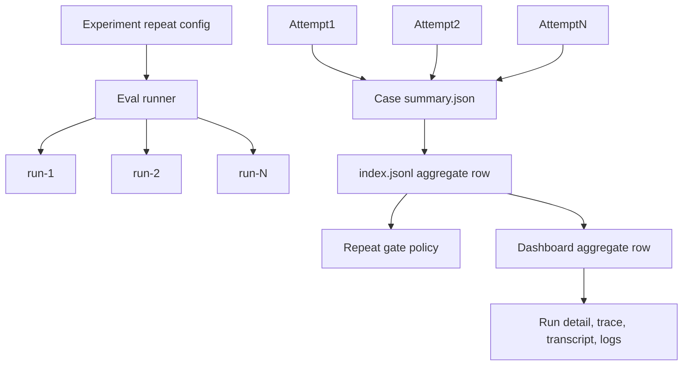

# feat: Add repeat runs and flaky eval handling

## Summary

AgentV should make repeat runs a first-class reliability primitive for stochastic model behavior, flaky verifier or infrastructure outcomes, benchmark reporting, and drift analysis. The default CI path stays simple: one run per case, threshold/pass-fail gating as today. When users opt into repeated runs, AgentV records every child run, reports aggregate reliability statistics, and changes CI behavior only when an explicit repeat-run gate policy is configured.

Tracking:

| Bead | Scope |
| --- | --- |
| `av-i0l` | Parent feature: repeat runs and flaky eval reliability |
| `av-i0l.1` | Schema/config contract and gate policies |
| `av-i0l.2` | Artifact layout and index changes for case runs |
| `av-i0l.3` | Runner execution, retry, and early-exit behavior |
| `av-i0l.4` | Dashboard aggregate/detail UX |
| `av-i0l.5` | Docs and examples |

---

## Problem Frame

AgentV already evaluates real agent workflows, writes portable run bundles, and separates execution errors from quality failures. That is enough for deterministic CI gates, but stochastic model behavior and flaky verifier/test infrastructure need more evidence than one pass/fail row. Users need to know whether a case is reliably passing, occasionally passing, consistently failing, or failing because the verifier or infrastructure is unstable.

Repeat runs exist for five reasons:

- Reliability measurement: estimate how often an agent succeeds under repeated sampling.
- Stochastic model behavior: reveal variance from temperature, nondeterministic tools, timing, workspace state, and provider-side behavior.
- Flaky test mitigation: distinguish a model-quality failure from a verifier, setup, timeout, or provider issue that should be retried or investigated.
- Benchmark reporting: publish run success rate, assertion pass-rate stats when available, score distribution, duration, cost, and stability for a benchmark without hiding individual runs.
- Drift and regression analysis: compare reliability movement across timestamped run bundles, targets, commits, or experiments.

The design must stay inside AgentV's product boundary: repo-native execution, zero-infra local-to-CI defaults, portable artifacts as source of truth, and a small composable core. It must not introduce Phoenix-owned storage, a hosted results database, or hidden benchmark-platform semantics.

---

## Vercel Agent-Eval Comparison

The motivating comparison is Vercel's `agent-eval` behavior as verified against the local `EntityProcess/agent-eval` source:

- It stores all repeated runs and summarizes each case with `totalRuns`, `passedRuns`, `passRate`, and `meanDuration`.
- Vercel's `passRate` is `passedRuns / totalRuns`, so it maps to AgentV `run_success_rate`, not AgentV `pass_rate`.
- Vercel runs hidden `EVAL.ts` or `EVAL.tsx` files through Vitest and configured npm scripts. Each child run is binary: validation all passed means the run status is `passed`; any Vitest or script failure means the run status is `failed`.
- Vercel does not calculate pass rate per assertion or expectation.
- `createEvalSummary` computes run success across repeated runs; it does not use last-run-wins.
- Individual child runs are written as `run-1`, `run-2`, and so on.
- Its CLI pass handling is inconsistent: the single-experiment command path requires `passedRuns === totalRuns`, while the run-all/fingerprint-reuse path can count a case as passing when `passRate !== '0%'`.
- Dashboard and summary display tend to distinguish aggregate run success from all-runs-passed.

AgentV should borrow the useful artifact and reporting shape, not the ambiguous CI semantics. If one run fails and one run passes, AgentV must answer through the selected policy:

| Policy | One fail plus one pass |
| --- | --- |
| No repeat gate policy | Report aggregate stats; preserve the normal single-run gate using `run-1` as the primary run |
| `all_runs_successful` | Fail |
| `any_run_successful` | Pass, and mark the case flaky because runs disagree |
| `run_success_rate_at_least: 0.5` | Pass |
| `run_success_rate_at_least: 0.75` | Fail |
| `mean_score_at_least` | Depends on the mean score and configured threshold |

This avoids hardcoded hidden behavior and makes CI intent reviewable in eval config.

## Pass-Rate Vocabulary

AgentV should align with the Claude Skills schema vocabulary and AgentV's existing assertion terminology. In that schema, `grading.json` `summary.pass_rate` means assertions or expectations passed divided by total assertions or expectations; benchmark run summaries aggregate those per-run assertion pass rates statistically across runs or configurations. The source schema is [Anthropic Skills `schemas.md`](https://github.com/anthropics/skills/blob/main/skills/skill-creator/references/schemas.md).

AgentV should therefore reserve `pass_rate` for assertion or expectation pass rate:

- Per run, `pass_rate` is present only when the verifier/grader has assertion or expectation counts.
- Across repeated runs, `pass_rate` is an optional stats object over those assertion-level rates, for example `mean`, `stddev`, `min`, and `max`.
- If a verifier only produces binary pass/fail, the run can record `passed: true` or `passed: false`; AgentV must not fabricate assertion-level `pass_rate`.

Repeat-run reliability uses a separate metric: `run_success_rate`. It means successful counted runs divided by counted runs. This is the AgentV equivalent of Vercel's run-frequency `passRate`, but with an explicit name that does not conflict with assertion-level `pass_rate`.

Suggested wire shape:

- `run-N/grading.json` summary is the assertion-level pass rate for that run and is omitted when the verifier has no assertion counts.
- Case `summary.json` may include aggregate assertion pass-rate stats when available, but it must not use assertion `pass_rate` to mean binary run success frequency.
- Case `summary.json`, index `runs[]`/`aggregation`, and future explicit repeat fields represent successful counted runs divided by counted runs.
- Binary-only harnesses write `passed: true` or `passed: false` per run and derive only `run_success_rate` across repeated runs.

---

## Public Reference Standards

Before introducing AgentV-specific contract shapes, implementation should check public reference standards and use the lowest common denominator that fits AgentV's repo-native artifact model. This design uses the following standards and divergences:

| Reference | Lowest common denominator to reuse | Intentional AgentV divergence |
| --- | --- | --- |
| Claude Skills schema | Use assertion, expectation, grading, `passed`, `failed`, `total`, and assertion-level `pass_rate` vocabulary for graders that expose assertion counts. | Do not copy the full skill-eval artifact shape. AgentV keeps `.agentv/results/<experiment>/<timestamp>/...` as the portable run bundle and uses `run_success_rate` for repeat-run reliability. |
| Vercel `agent-eval` | Reuse fixture-driven hidden verifier ergonomics, root and case `summary.json`, `index.jsonl` discovery, and durable `run-1`, `run-2` child run directories. | Keep AgentV `grading.json` for grader and LLM-assertion detail. Rename Vercel `passRate` to `run_success_rate` where repeated-run frequency stats are exposed in AgentV-specific artifacts. Do not inherit ambiguous CLI gating semantics. |
| Hugging Face Datasets | Keep dataset, split, record, features, and row-oriented corpus vocabulary for eval inputs and benchmark corpora. Treat an AgentV case as a record-like unit when mapping to external datasets. | Do not require Arrow, the Hub, DatasetDict, or HF storage layout. AgentV cases remain repo files or generated case records inside benchmark/project artifacts. |
| OpenInference | Preserve trace/span/tool-call/model-observability semantics when naming trace metadata and external trace correlation fields. | Do not require OpenTelemetry collection, Phoenix, or OpenInference export as core runtime infrastructure. AgentV stores portable traces/transcripts as artifacts and supports link-out correlation through `external_trace` metadata. |

Public docs and implementation notes must not reference non-public sources. If a private note motivated a decision, translate the public-facing contract back to these public standards or to AgentV-owned local rationale.

---

## Requirements

### Default CI Behavior

- R1. A normal eval with no repeat-run config must keep the current one-run threshold/pass-fail behavior.
- R2. Repeat runs must be opt-in through config or an explicit CLI override.
- R3. Enabling repeat-run reporting must not silently turn a failing primary run into a passing CI result.
- R4. CI gate policy for repeated runs must be explicit when users want repeated runs to affect exit status.

### Repeat-Run Semantics

- R5. AgentV must record every child run's score, status, duration, cost, trace, transcript, logs, grader details, and artifact paths.
- R6. Aggregate summaries must include run counts, `run_success_rate`, optional assertion `pass_rate` stats, mean and median score, and mean and median duration when data exists.
- R7. Aggregate summaries must preserve execution-error counts and failure classifications rather than folding them into a single score.
- R8. Repeat-run execution must support cost and runtime controls: run count, retry attempts, early exit, parallelism, timeout, provider budget, and deterministic seed when a provider supports it.

### Flaky Eval Handling

- R9. AgentV must distinguish model-quality failure, verifier/test flake, infrastructure failure, and timeout where current `execution_status`, `failure_stage`, and `failure_reason_code` allow it.
- R10. Model-quality failures are counted as reliability outcomes and are not retried by default.
- R11. Verifier/test flakes, infrastructure failures, and timeouts may be retried only when configured; they remain visible in run artifacts and aggregate counts.
- R12. Mixed pass/fail runs must be surfaced as flaky instead of shown as a stable pass or stable fail.

### Artifacts And Dashboard

- R13. The artifact layout must align with the case-local result bundle migration to `.agentv/results/<experiment>/<timestamp>/...`.
- R14. `index.jsonl` must remain the lightweight top-level manifest and must not duplicate large per-run payloads.
- R15. Dashboard must show the aggregate case row first and allow drill-down into each `run-N` child run.
- R16. Individual traces, transcripts, raw logs, grader outputs, and files must remain directly inspectable.

### Compatibility

- R17. Historical one-row-per-case artifacts must continue to read.
- R18. New wire fields must use `snake_case`; TypeScript internals may use `camelCase` at boundaries.
- R19. Existing `project` and `benchmark` meanings must stay distinct: projects hold run artifacts; benchmarks are curated eval suites.

---

## Key Technical Decisions

- KTD1. The repeat config attaches to the **experiment** surface, not to `eval.yaml` `execution`, per the experiments-separation decision (epic `av-991`, recorded on `av-991.1`). This aligns with Vercel agent-eval, where `runs`/`earlyExit` are experiment-level. This epic (`av-i0l`) owns the repeat **mechanics** (schema shape, gate policies, run aggregation, flake classification, and the run-N artifact layout); `av-991` owns **placement** (the experiment contract the repeat block lives on). The existing `execution.trials` code path is **hard-removed** (no compatibility alias) because usage is rare; its behavior is replaced by the experiment-level repeat block. Because the experiment surface is delivered by `av-991`, the schema work in `av-i0l.1` depends on that contract landing.
- KTD2. Keep one-run CI as the default. Repeat runs are for reliability evidence unless `repeat.gate` says they are a CI gate.
- KTD3. Store aggregate rows in the top-level `index.jsonl`, not one row per child run. Run details live in case-local `summary.json` and `run-N/` directories so existing aggregate consumers do not inflate case counts.
- KTD4. Single-run and repeat-run cases both use `run-N/` directories. A normal eval writes `run-1/` so the layout stays strict-Vercel and does not fork between default and repeated cases.
- KTD5. Root `benchmark.json` is removed entirely. Root `summary.json` supersedes it for run-level aggregate data and metadata such as `planned_test_count`, `eval_file`, and `experiment_config`. Root `index.jsonl` is the discovery anchor for both local and remote results; case `summary.json` summarizes that case's `run-N` children. Per-run files are `run-N/metrics.json`, `run-N/timing.json`, and AgentV `run-N/grading.json`; no per-run summary or combined result file is written.
- KTD6. `pass_at_k` keeps the existing AgentV/Vercel ergonomics: early exit is enabled unless explicitly disabled. Full reliability sampling requires `early_exit: false` on the experiment and should be recorded because it changes cost and statistics.
- KTD7. Do not inherit Vercel's implicit CI ambiguity. All policies that can make one failed plus one passed run count as passing must be visible in config and artifacts.
- KTD8. Reuse current failure classification fields before adding new enums. Add aggregate classification fields only after mapping from `execution_status`, `failure_stage`, and `failure_reason_code` proves insufficient.
- KTD9. Do not reuse `pass_rate` for run success frequency. AgentV uses `run_success_rate` for repeat-run reliability and reserves `pass_rate` for assertion or expectation pass rate.
- KTD10. Contract design must check public reference standards first: Claude Skills for grading vocabulary, Vercel `agent-eval` for repeated run ergonomics, Hugging Face Datasets for corpus vocabulary, and OpenInference for trace semantics. Divergence must be intentional and documented.

---

## High-Level Technical Design



The runner executes the configured runs, writes run artifacts, computes a case summary, writes one aggregate manifest row, and applies the explicit gate policy. Dashboard reads the same artifacts and presents aggregate-first views without hiding individual runs.

---

## Config Contract

Preferred v1 shape:

```yaml
repeat:
  count: 3
  strategy: pass_at_k
  cost_limit_usd: 5
  seed: 1234
  max_parallel_runs: 1
  timeout_ms: 300000
  early_exit: never
  retry:
    max_attempts: 1
    on:
      - verifier_error
      - infrastructure_error
      - timeout
  gate:
    policy: run_success_rate_at_least
    threshold: 0.8
```

Field notes:

- `count` is the planned reliability sample count. Missing repeat config or `count: 1` means normal single-run behavior.
- `strategy` starts with the existing AgentV aggregation strategies: `pass_at_k`, `mean`, and `confidence_interval`.
- `max_attempts` belongs to retry handling, not reliability sampling. For example, `count: 3` with `retry.max_attempts: 1` may write retry outputs, but only the three counted runs feed reliability stats.
- `early_exit` should be represented by the experiment-level boolean in the native experiments branch. Future gate-aware modes such as `never`, `on_gate_satisfied`, and `on_gate_failed` remain non-goals until gate policies are implemented.
- `seed` is best effort. Providers that support deterministic seeds receive a per-run seed derived from the base seed and run number; providers that do not support seeds record `seed_unsupported`.
- `cost_limit_usd` composes with existing run-level budget controls and stops new runs when the repeat budget is exhausted.

Migration from `execution.trials` (hard removal, no alias):

`execution.trials` is removed from `eval.yaml` outright; the repeat block lives on the experiment instead. Existing semantics map as follows so any prerelease evals can be ported by hand:

- `trials.count` maps to `repeat.count`.
- `trials.cost_limit_usd` maps to `repeat.cost_limit_usd`.
- `trials.costLimitUsd` is accepted only as `repeat.costLimitUsd` for prerelease parity; new YAML should use `cost_limit_usd`.
- `trials.strategy: pass_at_k` maps to `repeat.strategy: pass_at_k`.
- `trials.strategy: mean` maps to `repeat.strategy: mean`.
- `trials.strategy: confidence_interval` maps to `repeat.strategy: confidence_interval`.
- Existing gate-policy ideas remain future work; do not overload `strategy` to imply CI policy.

---

## Artifact Layout

This design assumes the in-flight artifact layout migration moves local run bundles to:

```text
.agentv/results/<experiment>/<timestamp>/
```

### Single-Run Case

Single-run cases still use `run-1/`:

```text
.agentv/results/<experiment>/<timestamp>/index.jsonl
.agentv/results/<experiment>/<timestamp>/summary.json
.agentv/results/<experiment>/<timestamp>/<case-id>/summary.json
.agentv/results/<experiment>/<timestamp>/<case-id>/task/EVAL.yaml
.agentv/results/<experiment>/<timestamp>/<case-id>/task/targets.yaml
.agentv/results/<experiment>/<timestamp>/<case-id>/run-1/metrics.json
.agentv/results/<experiment>/<timestamp>/<case-id>/run-1/timing.json
.agentv/results/<experiment>/<timestamp>/<case-id>/run-1/grading.json
.agentv/results/<experiment>/<timestamp>/<case-id>/run-1/transcript.json
.agentv/results/<experiment>/<timestamp>/<case-id>/run-1/transcript-raw.jsonl
.agentv/results/<experiment>/<timestamp>/<case-id>/run-1/outputs/answer.md
```

Rationale: strict-Vercel layout gives the same discovery and rendering path for
normal and repeated cases. Root `summary.json` carries run metadata and
aggregates, while case `summary.json` carries the case aggregate.

### Repeat-Run Case

Repeat-run cases use `run-N/` directories:

```text
.agentv/results/<experiment>/<timestamp>/<case-id>/summary.json
.agentv/results/<experiment>/<timestamp>/<case-id>/run-1/metrics.json
.agentv/results/<experiment>/<timestamp>/<case-id>/run-1/timing.json
.agentv/results/<experiment>/<timestamp>/<case-id>/run-1/grading.json
.agentv/results/<experiment>/<timestamp>/<case-id>/run-1/transcript.json
.agentv/results/<experiment>/<timestamp>/<case-id>/run-1/transcript-raw.jsonl
.agentv/results/<experiment>/<timestamp>/<case-id>/run-1/outputs/answer.md
.agentv/results/<experiment>/<timestamp>/<case-id>/run-2/metrics.json
.agentv/results/<experiment>/<timestamp>/<case-id>/run-2/timing.json
.agentv/results/<experiment>/<timestamp>/<case-id>/run-2/grading.json
.agentv/results/<experiment>/<timestamp>/<case-id>/run-2/transcript.json
.agentv/results/<experiment>/<timestamp>/<case-id>/run-2/transcript-raw.jsonl
.agentv/results/<experiment>/<timestamp>/<case-id>/run-2/outputs/answer.md
```

`<case-id>` should reuse the sanitized test id produced by the artifact writer. Suite remains logical metadata in `index.jsonl` and Dashboard filters; it must not add another physical namespace under the run root. If multiple suites emit the same sanitized test id in one run, the writer may append a short opaque suffix to `artifact_dir` to avoid overwrites; Dashboard must still display the manifest `test_id`, not the suffixed folder name. Child run directories are one-indexed because users naturally inspect `run-1`, `run-2`, and this matches the Vercel comparison.

---

## Aggregation Semantics

Each repeat case aggregate should expose:

| Field | Meaning |
| --- | --- |
| `planned_runs` | Configured repeat sample count |
| `total_runs` | Physical `run-N` directories written |
| `counted_runs` | Runs included in the reliability denominator |
| `passed_runs` | Counted runs with pass outcome at the active per-run threshold |
| `failed_runs` | Counted runs that reached grading and failed threshold |
| `execution_error_runs` | Runs that did not produce a quality outcome |
| `run_success_rate` | `passed_runs / counted_runs`, or `0` when no counted runs exist |
| `pass_rate` | Optional assertion/expectation pass-rate stats object, such as `mean`, `stddev`, `min`, and `max`; absent when assertion counts are unavailable |
| `mean_score` | Mean score over counted runs with numeric score |
| `median_score` | Median score over counted runs with numeric score |
| `mean_duration_ms` | Mean run duration when present |
| `median_duration_ms` | Median run duration when present |
| `flake_classification` | Best-effort aggregate classification |
| `gate_policy` | Configured gate policy, if any |
| `gate_passed` | Repeat gate outcome, if a repeat gate policy exists |

Threshold behavior:

- Per-run pass/fail uses the existing threshold resolution: CLI threshold, eval YAML threshold, then default threshold.
- `all_runs_successful`, `any_run_successful`, and `run_success_rate_at_least` operate on per-run pass booleans.
- `mean_pass_rate_at_least` operates on assertion-level `pass_rate.mean` and is available only when assertion or expectation counts exist.
- `mean_score_at_least` operates on `mean_score` and should be included in v1 only if the implementation can reuse existing numeric score semantics without widening grader contracts.
- Execution errors do not silently become quality failures. They are counted in `execution_error_runs` and affect gates according to the selected policy.

Run summary reporting should add target and suite aggregate reliability stats
where they can be computed from case summaries. It should not add a new
database, revive `benchmark.json`, or flatten runs into extra top-level
tests.

---

## Gating Semantics

Recommended v1 policy set:

| Policy | Gate rule |
| --- | --- |
| `all_runs_successful` | Every counted run passes and no blocking execution errors remain |
| `any_run_successful` | At least one counted run passes |
| `run_success_rate_at_least` | `run_success_rate >= threshold` |
| `mean_pass_rate_at_least` | `pass_rate.mean >= threshold`, only when assertion/expectation pass-rate stats exist |
| `mean_score_at_least` | `mean_score >= threshold`, only if numeric score aggregation stays straightforward |

Deferred policies:

- `min_passed_runs`: useful for "2 of 3" readability, but v1 can express this through `run_success_rate_at_least` when `runs` is fixed.
- Confidence-interval gates: useful for benchmark-grade statistics, but they need more careful UX and sample-size guidance.
- Per-failure-class gates: useful later, but v1 should first prove the classification model.

No repeat gate policy:

- AgentV records repeat statistics.
- CLI exit behavior preserves normal single-run semantics by using `run-1` as the primary run.
- Dashboard labels aggregate stats as report data, not the CI gate.

This is the key guardrail against inheriting Vercel's ambiguous "one fail plus one pass" behavior.

---

## Flaky-Test Classification

Run classification should be derived from current AgentV fields first:

| Classification | Current signal | Retry default | Reliability count |
| --- | --- | --- | --- |
| `stable_pass` | All counted runs pass | Not applicable | Counted |
| `stable_model_failure` | Counted runs reach grading and fail threshold consistently | No | Counted |
| `stochastic_model_failure` | Counted runs mix pass and quality failure | No | Counted and marked flaky |
| `verifier_flake` | `execution_status: execution_error` with `failure_stage: evaluator` or evaluator-specific failure reason | Configurable | Excluded from quality denominator when retried; visible in error counts |
| `infrastructure_failure` | `failure_stage: setup`, `repo_setup`, or teardown failure reason | Configurable | Excluded from quality denominator when retried; visible in error counts |
| `timeout` | Timeout reason code from provider, agent, setup, or evaluator | Configurable | Excluded from quality denominator when retried; visible in error counts |
| `mixed_error` | Multiple failure classes in runs | Configurable | Visible and treated conservatively |

Retry rules:

- Quality failures are counted, not retried, unless the user separately reruns the eval.
- Verifier errors can be retried because they may reflect grader/test instability.
- Infrastructure and timeout errors can be retried when the user accepts extra cost and runtime.
- Every retry run must remain in artifacts. If a run is excluded from `counted_runs`, `summary.json` must say why.

---

## Dashboard UX

Dashboard should present repeat-run cases aggregate-first:

- Run table row shows aggregate status, `run_success_rate`, passed/total counted runs, execution-error count, assertion `pass_rate` stats when available, mean score, median score, mean duration, and flake classification.
- Row detail opens the case `summary.json` first.
- Run drill-down lists `run-1`, `run-2`, and so on with score, status, duration, cost, failure reason, and retry/exclusion reason.
- Selecting a child run opens the same Checks, Transcript, Source, Files, and Feedback affordances as a normal single-run result.
- Dashboard must not hide individual traces, transcripts, raw provider logs, or grader output behind the aggregate.
- Historical pre-migration single-run rows render as they do today, even when case `summary.json` is absent.

For trend and compare views, repeat aggregates should be the default unit. Child-run views can be added as a filter later, but they must not silently change case-level counts.

---

## Artifact Indexing And Search

`index.jsonl` should keep one row per case/target aggregate. New repeat fields are optional and snake_case:

```json
{
  "test_id": "case-1",
  "target": "codex",
  "score": 0.83,
  "execution_status": "quality_failure",
  "artifact_dir": "case-1",
  "summary_path": "case-1/summary.json",
  "runs": [
    { "run": 1, "run_path": "run-1", "score": 0.25, "verdict": "fail" },
    { "run": 2, "run_path": "run-2", "score": 1, "verdict": "pass" },
    { "run": 3, "run_path": "run-3", "score": 1, "verdict": "pass" }
  ],
  "planned_runs": 3,
  "total_runs": 3,
  "counted_runs": 3,
  "passed_runs": 2,
  "failed_runs": 1,
  "execution_error_runs": 0,
  "run_success_rate": 0.667,
  "pass_rate": {
    "mean": 0.82,
    "stddev": 0.12,
    "min": 0.67,
    "max": 1
  },
  "mean_score": 0.83,
  "median_score": 0.9,
  "mean_duration_ms": 122000,
  "median_duration_ms": 119000,
  "flake_classification": "stochastic_model_failure",
  "repeat_gate": {
    "policy": "all_runs_successful",
    "passed": false
  },
  "runs": [
    {
      "run": 1,
      "run_path": "run-1",
      "score": 0.9,
      "execution_status": "ok",
      "duration_ms": 118000
    }
  ]
}
```

The `runs` array is a compact index, not a copy of grader details or traces. If high run counts make rows too large, write `runs_path: "<case-id>/runs.jsonl"` and keep only summary counts in the top-level row.

Search behavior:

- Default run search indexes aggregate rows.
- Child-run search should read `summary.json` or `runs.jsonl` only when the user asks for run-level detail.
- `artifact_pointers` remain reserved for detached large payload bytes. Normal `run-N` sidecars should be exposed through explicit path fields.

---

## Cost And Runtime Controls

Repeat runs can multiply provider spend. V1 should ship with conservative controls:

- `repeat.count` and retry `max_attempts` must be bounded by validation.
- `max_parallel_runs` limits per-case concurrent runs; it composes with existing eval workers and provider-specific concurrency guidance.
- Agent-provider targets should keep the existing "limit concurrency to 3 targets" operational guidance.
- `repeat.cost_limit_usd` stops scheduling new runs when exceeded and records `budget_exceeded`.
- `timeout_ms` applies per run; existing top-level agent timeout remains the default if no repeat timeout is set.
- `early_exit` must be recorded in `summary.json` when it differs from the default.
- Cache should be disabled or scoped by run when repeat runs measure stochastic behavior. Existing code already disables cache for repeated runs; keep that principle.
- Provider seed support is best effort and must be recorded per run so deterministic and stochastic runs are distinguishable.

---

## Implementation Units

### U1. Schema And Gate Policy Contract

**Goal:** Define the repeat-run input contract and explicit gate policies.

**Requirements:** R1, R2, R3, R4, R8, R18.

**Bead:** `av-i0l.1`.

**Files:** `packages/core/src/evaluation/types.ts`, `packages/core/src/evaluation/experiment.ts`, `packages/core/src/evaluation/validation/experiment-file.schema.ts`, `packages/core/scripts/generate-eval-schema.ts`, `packages/core/test/evaluation/experiment.test.ts`, `packages/core/test/evaluation/validation/eval-schema-sync.test.ts`.

**Approach:** Add the repeat block as a narrow schema on the **experiment** surface (delivered by `av-991`) and normalize it into internal camelCase. **Hard-remove** `execution.trials` from `eval.yaml` as prerelease cleanup (no legacy alias); port any existing usage by hand using the mapping above.

**Test Scenarios:**

- Valid `repeat.count: 3` parses into internal repeat config with no gate policy.
- Invalid `repeat.count`, `threshold`, `max_parallel_runs`, and retry values are rejected or warned consistently with existing config parsing.
- `all_runs_successful`, `any_run_successful`, `run_success_rate_at_least`, and `mean_pass_rate_at_least` validate; `mean_score_at_least` validates only if included in v1.
- Legacy eval-level `trials` input fails; the compatibility path is explicit hand migration to experiment `repeat`.
- Generated experiment schema stays in sync.

**Verification:** Schema tests pass and docs/examples can reference the accepted YAML shape.

### U2. Case-Local Run Artifacts

**Goal:** Persist repeat runs under case-local `run-N/` directories and write aggregate `summary.json`.

**Requirements:** R5, R6, R7, R13, R14, R16, R17, R18.

**Bead:** `av-i0l.2`.

**Files:** `packages/core/src/evaluation/run-artifacts.ts`, `packages/core/src/evaluation/result-row-schema.ts`, `apps/cli/src/commands/eval/artifact-writer.ts`, `apps/cli/src/commands/eval/result-layout.ts`, `apps/cli/test/commands/eval/artifact-writer.test.ts`, `apps/cli/test/commands/eval/aggregate.test.ts`, `apps/cli/test/commands/results/validate.test.ts`.

**Approach:** Extend the artifact writer to understand aggregate results with child runs. Single-run and repeat-run cases both write case-local `summary.json` plus `run-N/` children, and index rows carry only lightweight paths and repeat fields. Avoid putting full run payloads in `index.jsonl`.

**Test Scenarios:**

- Single-run output writes `run-1/` sidecars and remains readable by existing manifest hydration.
- Repeat-run output writes `summary.json` and `run-1/`, `run-2/` sidecars with correct relative paths.
- `index.jsonl` has one aggregate row per case/target and compact run references.
- Historical rows without repeat fields parse successfully.
- Validation reports missing run sidecars when a repeat summary points to absent `run-N` artifacts.

**Verification:** Artifact tests prove both direct single-run and repeat-run layouts under the new `.agentv/results/<experiment>/<timestamp>/` root.

### U3. Runner Execution And Retry Semantics

**Goal:** Execute repeated runs, classify outcomes, apply retries, compute aggregates, and apply explicit gate policies.

**Requirements:** R5, R6, R7, R8, R9, R10, R11, R12.

**Bead:** `av-i0l.3`.

**Files:** `packages/core/src/evaluation/orchestrator.ts`, `packages/core/src/evaluation/runs.ts`, `apps/cli/src/commands/eval/run-eval.ts`, `apps/cli/src/commands/eval/statistics.ts`, `packages/core/test/evaluation/orchestrator.test.ts`, `packages/core/test/evaluation/runs.test.ts`, `apps/cli/test/commands/eval/threshold.test.ts`.

**Approach:** Refactor the current repeated-run path so child runs remain first-class instead of collapsing to the best run. Compute summary statistics, mark retry-excluded runs, and route exit code through the configured repeat gate.

**Test Scenarios:**

- No repeat config runs exactly once and preserves current CLI summary and exit behavior.
- Repeat config with no gate records multiple runs but gates on `run-1`.
- `all_runs_successful` fails one fail plus one pass.
- `any_run_successful` passes one fail plus one pass and marks the case flaky.
- `run_success_rate_at_least` passes and fails at the configured threshold.
- `mean_pass_rate_at_least` uses assertion/expectation pass-rate stats and is unavailable when binary-only verifiers do not produce assertion counts.
- Verifier errors retry when configured and remain visible in summary.
- Quality failures do not retry by default.
- Budget and timeout stops are recorded without losing completed run artifacts.

**Verification:** Unit tests cover policy outcomes and at least one CLI-level test proves exit-code behavior for mixed runs.

### U4. Dashboard Aggregate And Run Views

**Goal:** Render repeat-run aggregates first and expose individual run artifacts.

**Requirements:** R15, R16, R17, R18.

**Bead:** `av-i0l.4`.

**Files:** `apps/cli/src/commands/results/manifest.ts`, `apps/cli/src/commands/results/serve.ts`, `apps/dashboard/src/lib/types.ts`, `apps/dashboard/src/lib/result-summary.ts`, `apps/dashboard/src/lib/result-table.ts`, `apps/dashboard/src/components/ResultTable.tsx`, `apps/dashboard/src/components/EvalDetail.tsx`, `apps/dashboard/src/components/RunDetail.tsx`, `apps/dashboard/src/lib/result-table.test.ts`, `apps/dashboard/src/lib/result-summary.test.ts`.

**Approach:** Add optional repeat aggregate and run metadata to Dashboard API types. Update row building so aggregate rows display reliability fields while run drill-down reuses existing detail components.

**Test Scenarios:**

- A repeat aggregate row displays `run_success_rate`, passed/total counted runs, assertion `pass_rate` stats when available, mean score, and flake classification.
- Opening an aggregate row shows the run list and selecting `run-2` loads that run's Checks, Transcript, Source, and Files.
- Execution-error runs are visible and do not disappear from aggregate counts.
- Historical single-run rows render unchanged.

**Verification:** Dashboard unit tests cover read-model behavior; browser UAT should be required when implementation changes visible Dashboard UI.

### U5. Docs And Examples

**Goal:** Teach repeat runs as an opt-in reliability workflow, not as the default CI path.

**Requirements:** R1, R2, R3, R4, R8, R19.

**Bead:** `av-i0l.5`.

**Files:** `apps/web/src/content/docs/docs/evaluation/eval-files.mdx`, `apps/web/src/content/docs/docs/tools/results.mdx`, `apps/web/src/content/docs/docs/tools/dashboard.mdx`, `examples/`.

**Approach:** Add docs that show normal one-run CI, report-only repeat runs, explicit repeat-run gates, cost controls, and Dashboard drill-down. Include the "one fail plus one pass" policy table so CI semantics are clear.

**Test Scenarios:**

- Docs examples validate against the generated eval schema.
- Example repeat-run artifacts can be produced with dry-run or a mock provider without live provider spend.
- Documentation states that individual run artifacts remain inspectable.

**Verification:** Docs link checks and example schema validation pass.

---

## Risks And Mitigations

| Risk | Mitigation |
| --- | --- |
| Hidden CI behavior diverges across commands | Route every repeat-run gate through one policy evaluator and test CLI command paths against the same cases |
| Repeated runs inflate run counts in trend/compare views | Keep one aggregate row per case/target in top-level `index.jsonl` |
| Early exit biases reliability reports | Keep pass-at-k early exit compatible by default, require `early_exit: false` for full sampling, and label incomplete samples |
| Existing `trials` behavior conflicts with the new contract | Hard-remove eval-level `execution.trials`; preserve its strategies and cost cap only through experiment `repeat` |
| Run artifacts make rows too large | Keep only compact run references in `index.jsonl`; move large detail to case-local sidecars |
| Artifact-layout migration lands concurrently | Depend on shared layout helpers and do not edit the `artifact-results-layout` branch from this worktree |

---

## Sources And Local Patterns

- `STRATEGY.md` and `ROADMAP.md` - repo-native, zero-infra, portable artifact boundary.
- `.agents/product-boundary.md` - keep core primitives small and artifacts canonical.
- `.agents/workflow.md` and `docs/runbooks/beads-worktree-recovery.md` - Beads and worktree handling.
- `packages/core/src/evaluation/orchestrator.ts` - current repeat-run execution and aggregate behavior.
- `packages/core/src/evaluation/runs.ts` - pass-at-k, mean, and confidence-interval aggregation helpers.
- `packages/core/src/evaluation/run-artifacts.ts` - canonical artifact writer and `index.jsonl` row shape.
- `apps/cli/src/commands/eval/run-eval.ts` and `apps/cli/src/commands/eval/statistics.ts` - CLI execution, summary, threshold, and exit behavior.
- `apps/cli/src/commands/results/manifest.ts` and `apps/cli/src/commands/results/serve.ts` - run manifest hydration and Dashboard API surface.
- `apps/dashboard/src/lib/result-summary.ts`, `apps/dashboard/src/lib/result-table.ts`, and `apps/dashboard/src/components/EvalDetail.tsx` - current aggregate and detail rendering.
- User-provided Vercel `agent-eval` comparison verified against local `EntityProcess/agent-eval` source - useful artifact model with ambiguous CI semantics to avoid.
- [Anthropic Skills `schemas.md`](https://github.com/anthropics/skills/blob/main/skills/skill-creator/references/schemas.md) - `pass_rate` vocabulary for assertion/expectation grading summaries and statistical run summaries.
- [Vercel `agent-eval`](https://github.com/vercel-labs/agent-eval) - public reference for fixture-driven agent evals, repeated runs, result bundles, local dashboard, and transcript inspection.
- [Hugging Face Datasets main classes](https://huggingface.co/docs/datasets/package_reference/main_classes) - dataset, split, features, and row/value vocabulary.
- [OpenInference specification](https://arize-ai.github.io/openinference/spec/) and [semantic conventions](https://arize-ai.github.io/openinference/spec/semantic_conventions.html) - trace, span, tool-call, and model-observability vocabulary.
