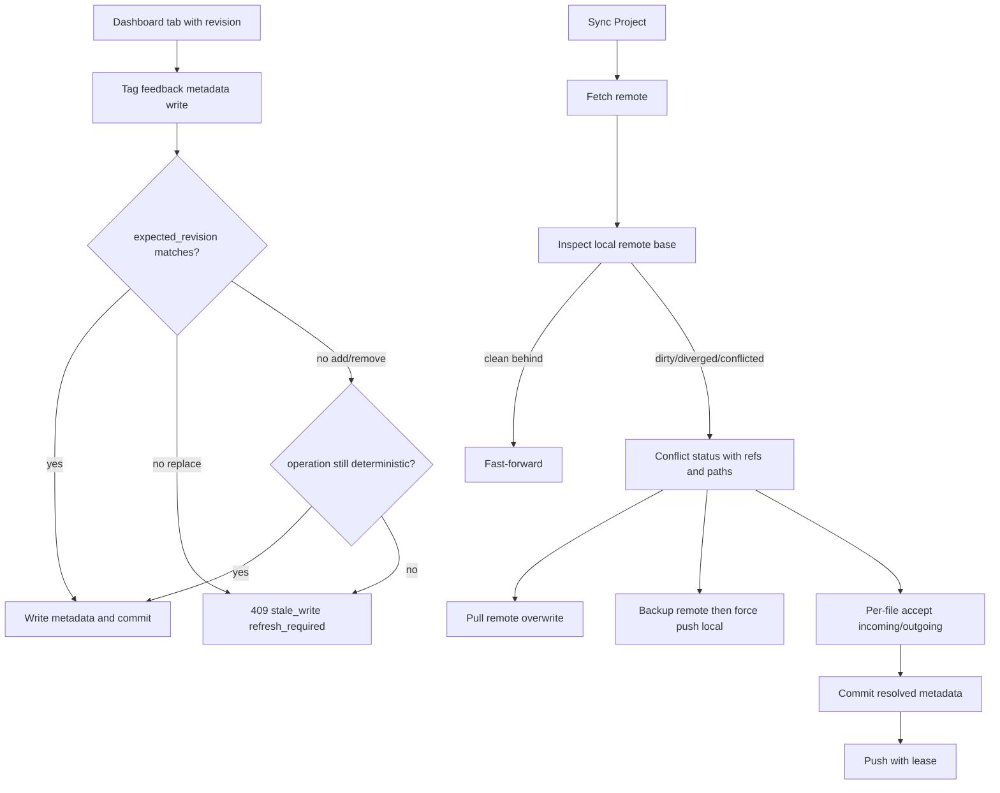

# feat: Remote result metadata conflict resolution UX

## Summary

Design a conflict-resolution workflow for Git-backed result metadata writes from Dashboard, hosted Dashboard, and API clients. The v1 scope keeps mutable metadata simple: colocated `tags.json` in the timestamped result folder, no local `.agentv/results/metadata` folder, and no `tag-events.jsonl`.

This is a design artifact only. It does not migrate artifact layout or implement broad UI.

---

## Problem Frame

AgentV result artifacts are Git-backed and often edited by a browser session that has stale state. Tags, feedback, and other result metadata can be written by a hosted Dashboard/server directly to the configured results branch while another local clone, server, or browser tab still believes an older revision is current.

The current sync surface can report dirty, conflicted, ahead, behind, and diverged states, and it blocks on unresolved Git conflicts. It does not yet give users a guided way to choose between pulling remote state, backing up and force-pushing local state, or accepting incoming/outgoing changes per file. It also does not give tag and feedback writes a durable stale-page contract.

The product boundary stays repo-native: the Git-backed result branch remains the source of truth, the Dashboard is the zero-infra inspection and resolution surface, and Phoenix or other external systems are not involved.

---

## Source Inputs

- User request: remote conflict-resolution UX for result metadata/tag/feedback sync.
- Current remote sync decision: `docs/plans/2026-06-10-remote-results-cli-contract.md`.
- Git-backed results contract: `docs/plans/git-native-results.md`.
- Current sync/status implementation: `packages/core/src/evaluation/results-repo.ts`.
- Current Dashboard API routes: `apps/cli/src/commands/results/serve.ts`.
- Current tag sidecar helpers: `apps/cli/src/commands/results/run-tags.ts`.
- Existing remote metadata overlay helper, used as compatibility context only: `apps/cli/src/commands/results/remote-metadata.ts`.

---

## Requirements

### Conflict Choices

- R1. When sync detects conflicts or diverged remote metadata, users can choose pull remote and overwrite local metadata, force push local metadata to remote, or resolve selected files individually.
- R2. Force-push local metadata must first create a timestamped backup branch/ref of the remote branch and surface that backup ref after creation.
- R3. Pull-remote-overwrite must show which local metadata files or commits will be discarded and must not touch non-result paths.
- R4. Per-file resolution must support accepting incoming or outgoing content for each selected conflicted file.

### Conflict Status Contract

- R5. The backend status contract exposes dirty paths, conflicted paths, incoming/outgoing refs, incoming/outgoing commits, and a base ref/commit when Git can compute one.
- R6. Conflict file detail includes enough blob/revision identity for the UI to render diffs and for later resolution requests to verify that the file did not change under the user's cursor.
- R7. API fields use snake_case at the process boundary and camelCase only inside TypeScript.

### Dashboard UX

- R8. The Dashboard conflict view shows conflicted files in a tree, expands file nodes to inline diffs, and uses accessible background color coding for incoming versus outgoing changes.
- R9. Each file row has accept incoming and accept outgoing actions, with selected and unresolved states visible before the user applies resolution.
- R10. Global pull and force-push actions require confirmation copy that names data loss, backup behavior, and the target branch/ref.
- R11. Disabled, loading, success, warning, and error states make the sync operation's current state explicit without telling users to manually edit the results checkout first.

### Stale Browser Writes

- R12. Tag, feedback, and metadata writes use optimistic concurrency through a commit/revision/etag check.
- R13. Stale replacement writes are rejected with a refresh-required response unless the operation is an explicit add/remove that can be safely merged.
- R14. Safe add/remove tag operations may be merged server-side when the current file revision changed but the requested operation remains deterministic.

### Metadata Shape

- R15. V1 stores local run tags as `.agentv/results/<experiment>/<timestamp>/tags.json` beside `index.jsonl`; the published results branch stores immutable run bundles under `runs/<experiment>/<timestamp>/`.
- R16. V1 must not add a local metadata folder or `tag-events.jsonl`.
- R17. Existing `metadata/runs/**/tags.json` overlays, if present, are compatibility input only; the conflict UX should not depend on that layout as the target model.
- R18. Feedback writes use the same conflict and optimistic concurrency contract as tags, even if their physical file remains `feedback.json` until a later per-run feedback storage cleanup.

---

## Key Technical Decisions

- KTD1. Treat conflicts as a first-class Dashboard/API workflow, not a CLI command family. This preserves the existing decision that manual remote sync is Dashboard/API-owned while advanced users can still use Git directly.
- KTD2. Use a narrow safe-path allowlist for mutable result metadata. V1 local paths are `.agentv/results/<experiment>/<timestamp>/tags.json`; published result-branch paths are `runs/**/tags.json`, `runs/**/feedback.json` when introduced, and the current compatibility `feedback.json`. Broad run-bundle rewrites remain out of scope for conflict resolution.
- KTD3. Make force push a backup-and-lease operation. The backend creates a remote backup ref from the current remote commit, then force-pushes with a lease against that same commit so a second writer cannot be overwritten silently.
- KTD4. Use optimistic concurrency for browser writes. `expected_revision` in JSON and `If-Match` headers both map to the same file or metadata etag check.
- KTD5. Prefer operation endpoints for mergeable edits. A `run.tags.add` or `run.tags.remove` request can merge safely; a full `tags` replacement must reject stale state unless the etag still matches.
- KTD6. Keep per-file resolution file-based. Do not introduce a raw operation log, event stream, CRDT, or merge service for v1.
- KTD7. Keep branch-protection failures visible. If the remote rejects backup branch creation, force push, or direct branch updates, the API returns a blocked status with the remote error and no fallback that bypasses protection.

---

## High-Level Technical Design



The same conflict engine should serve unscoped and project-scoped Dashboard routes. Storage-branch worktree mode and checked-out results repo mode can differ internally, but they must return the same wire contract.

---

## Backend Contract

### Status Response

Extend `GET /api/remote/status` and `GET /api/projects/:projectId/remote/status` without removing existing fields.

```json
{
  "configured": true,
  "available": true,
  "sync_status": "conflicted",
  "branch": "agentv/results/v1",
  "upstream": "origin/agentv/results/v1",
  "incoming_ref": "refs/remotes/origin/agentv/results/v1",
  "outgoing_ref": "refs/heads/agentv/results/v1",
  "base_ref": "merge-base:refs/heads/agentv/results/v1...refs/remotes/origin/agentv/results/v1",
  "incoming_commit": "remote_sha",
  "outgoing_commit": "local_sha",
  "base_commit": "base_sha",
  "ahead": 1,
  "behind": 1,
  "dirty_paths": ["runs/demo/2026-06-23T10-00-00-000Z/tags.json"],
  "conflicted_paths": ["runs/demo/2026-06-23T10-00-00-000Z/tags.json"],
  "conflicts": [
    {
      "path": "runs/demo/2026-06-23T10-00-00-000Z/tags.json",
      "status": "both_modified",
      "incoming_revision": "remote_blob_or_worktree_etag",
      "outgoing_revision": "local_blob_or_worktree_etag",
      "base_revision": "base_blob_or_null",
      "safe_path": true
    }
  ],
  "blocked": true,
  "block_reason": "Result metadata conflicts require resolution"
}
```

`conflicts` can be omitted from normal clean status responses. When status is `dirty`, `diverged`, or `conflicted`, the backend should include `conflicts` for safe mutable metadata paths and should separately expose any unsafe paths that block automated resolution.

### Diff Response

Add a lazy diff route so status polling stays cheap:

- `GET /api/remote/conflicts`
- `GET /api/projects/:projectId/remote/conflicts`

Response fields:

- `schema_version: "agentv.remote_conflicts.v1"`.
- `incoming_ref`, `outgoing_ref`, `base_ref`, `incoming_commit`, `outgoing_commit`, `base_commit`.
- `files[]` with `path`, `status`, `safe_path`, `incoming_revision`, `outgoing_revision`, `base_revision`.
- `files[].diff` as hunks with `kind: "incoming" | "outgoing" | "context" | "conflict_marker"` and line numbers where available.
- `generated_at` and `status_revision` so the UI can detect when a later status refresh invalidates an open diff.

### Resolution Endpoint

Add a single action endpoint:

- `POST /api/remote/resolve`
- `POST /api/projects/:projectId/remote/resolve`

Request shape:

```json
{
  "action": "pull_remote_overwrite",
  "expected_incoming_commit": "remote_sha",
  "expected_outgoing_commit": "local_sha"
}
```

```json
{
  "action": "force_push_local",
  "expected_incoming_commit": "remote_sha",
  "expected_outgoing_commit": "local_sha",
  "confirm_backup": true
}
```

```json
{
  "action": "resolve_files",
  "expected_incoming_commit": "remote_sha",
  "expected_outgoing_commit": "local_sha",
  "files": [
    {
      "path": "runs/demo/2026-06-23T10-00-00-000Z/tags.json",
      "resolution": "incoming",
      "expected_incoming_revision": "remote_blob_or_worktree_etag",
      "expected_outgoing_revision": "local_blob_or_worktree_etag"
    }
  ]
}
```

Successful responses include `sync_status`, `pull_performed`, `push_performed`, `commit_created`, `resolved_paths`, `backup_ref` when created, `backup_commit` when created, and the refreshed status contract.

Stale resolution requests return `409` with:

- `error: "stale_conflict_state"`.
- `refresh_required: true`.
- Current `incoming_commit`, `outgoing_commit`, and `conflicted_paths`.

---

## Force-Push Backup Mechanics

The backend must fetch before force push and resolve the current remote target commit. It then creates a remote backup branch/ref before overwriting the target branch.

Backup naming:

```text
refs/heads/agentv/backups/<target_branch_slug>/<timestamp_utc>-<remote_short_sha>
```

Example:

```text
refs/heads/agentv/backups/agentv-results-v1/20260623T104512Z-a1b2c3d
```

Rules:

- `target_branch_slug` is derived from the source target branch, with `/` replaced by `-` and all other unsafe characters replaced by `-`.
- `timestamp_utc` uses UTC `YYYYMMDDTHHMMSSZ`.
- `remote_short_sha` is the remote commit being backed up.
- If the backup ref already exists, append a short random suffix and retry once.
- If backup creation fails, the force-push action aborts before changing the target branch.
- The final overwrite uses a lease tied to `expected_incoming_commit`.
- The response and Dashboard success state surface `backup_ref` and `backup_commit`.

Branch protection handling is explicit: protected branches may reject backup refs, force pushes, or both. The API should surface the provider/Git error and leave the branch untouched after a failed backup or failed lease.

---

## Pull-Remote-Overwrite Semantics

Pull remote overwrite is a destructive local/cache action, not a merge. It discards local dirty metadata or local-only result metadata commits and makes the local results checkout/ref match the remote target.

Safeguards:

- Fetch remote immediately before the overwrite.
- Require `expected_incoming_commit` so the user does not pull an unseen remote commit.
- Only operate when all dirty/conflicted paths are safe mutable metadata paths.
- If local commits would be abandoned, create a local recovery ref before moving the local ref and surface it in the response.
- Never switch or reset the user's source repository branch; operate only in the configured results repo or storage-branch worktree machinery.
- Show confirmation copy that lists the number of files and commits being discarded.

Suggested confirmation copy:

> Pull remote and overwrite local metadata? This discards unsynced local result metadata for N files and replaces it with branch `<branch>` at `<incoming_commit>`. This does not change source code.

---

## Per-File Resolution Mechanics

Per-file resolution starts from the current conflict state and applies choices only to safe mutable metadata files.

Accepted incoming:

- Use the blob/content from `incoming_ref` for the file.
- If incoming deleted the file, remove it locally.
- Mark the path resolved.

Accepted outgoing:

- Keep the local/outgoing blob/content for the file.
- If outgoing deleted the file, remove it locally.
- Mark the path resolved.

Commit behavior:

- If all conflicted paths are resolved and there are staged metadata changes, create a commit such as `chore(results): resolve result metadata conflicts`.
- If only a subset is resolved, keep the remaining conflict status and do not push automatically.
- If push is needed after a resolution commit, use the normal push path when it is fast-forwardable; if the remote changed again, reject with `stale_conflict_state` rather than escalating silently to force push.

Conflict statuses to model in the UI:

- `both_modified`.
- `added_by_incoming`.
- `added_by_outgoing`.
- `deleted_by_incoming`.
- `deleted_by_outgoing`.
- `unsafe_path`.
- `binary_or_unreadable`.

For JSON metadata, the diff should still be file-based in v1. A future JSON-aware editor can be added after the file workflow is stable.

---

## Dashboard UX

### Entry Points

- The existing project/run source toolbar can keep showing `Clean`, `Dirty`, `Ahead`, `Behind`, `Conflicted`, and `Unavailable`.
- When status is `conflicted` or `diverged`, the primary action becomes `Resolve Conflicts`.
- When status is `dirty` and remote has changed in a way that touches the same safe path, the action also opens the conflict view.
- Global `Sync Project` remains for clean, behind, ahead, and simple dirty cases.

### Conflict View

Layout:

- Header with branch, incoming commit, outgoing commit, and base commit when available.
- Three primary actions: `Pull Remote`, `Force Push Local`, and `Apply File Resolutions`.
- Tree view grouped by path segments under `runs/`.
- File nodes show status, safe/unsafe indicator, and selected resolution.
- Expanding a node renders an inline diff.

Diff colors:

- Incoming remote changes use one background color and a left label `Incoming`.
- Outgoing local changes use a different background color and a left label `Outgoing`.
- Conflict marker lines, if present, use a warning background.
- Do not rely on color alone; include text labels and icons.

File actions:

- `Accept incoming` selects the remote version.
- `Accept outgoing` selects the local version.
- `Reset choice` clears a selection.
- Unsafe paths disable both accept buttons and link to manual recovery guidance.

States:

- Loading: tree skeleton and disabled action buttons while diffs load.
- Disabled: `Apply File Resolutions` disabled until at least one selected safe file exists.
- Partial: show `N of M conflicts selected`; allow applying selected paths only if the backend supports partial resolution.
- Error: show the backend `block_reason` or stale-state message and keep the latest refresh action visible.
- Success: show resolved paths and, for force push, the backup branch/ref.

Force-push confirmation copy:

> Force push local metadata to `<branch>`? AgentV will first back up the current remote branch to `<backup_ref_preview>`, then overwrite `<branch>` with local result metadata. Use this only when local metadata is the source of truth.

Pull confirmation copy:

> Pull remote metadata and overwrite local changes? Unsynced local result metadata for the listed files will be discarded. Source code and immutable run artifacts are not changed.

---

## Optimistic Concurrency For Tags And Feedback

Read responses for runs and metadata write targets should include a revision token:

- `metadata_revision` on run list/detail rows for the effective mutable metadata state.
- Per-file `revision` for `tags.json` and feedback files where available.
- An HTTP `ETag` for dedicated metadata read endpoints if added.

Write requests accept either:

- `If-Match: "<revision>"`.
- JSON `expected_revision`.

Replacement writes:

- Existing `PUT /api/runs/:filename/tags` replacement semantics should require a matching revision once the field is available.
- On mismatch, return `409` with `error: "stale_write"`, `refresh_required: true`, `current_revision`, and current tags/feedback payload.

Mergeable operations:

- Add a v1 operation endpoint for explicit tag add/remove, or extend the existing endpoint with `operation: "add" | "remove"` rather than overloading array replacement.
- If the page is stale, recompute the operation against current tags and commit only if validation still passes.
- Return `merged: true`, `base_revision`, and `current_revision` when a stale add/remove was safely merged.

Feedback:

- Current feedback replacement should reject stale writes.
- If feedback later becomes per-run/per-test operation-shaped, append/update operations can opt into the same safe merge rule.

---

## Interaction With Metadata Files

V1 target paths:

- `.agentv/results/<experiment>/<timestamp>/tags.json` is the canonical local tag sidecar.
- `runs/<experiment>/<timestamp>/tags.json` is the canonical published result-branch tag sidecar when mutable metadata is colocated with published run bundles.
- `feedback.json` remains compatibility storage for current Dashboard feedback until a separate cleanup moves feedback to a run-local file.
- Future result metadata files may join the same safe-path allowlist only if they are small, JSON-readable, and scoped to result metadata.

Compatibility:

- Existing `metadata/runs/**/tags.json` files can be read as legacy or implementation-detail metadata during a transition, but new conflict-resolution writes should target colocated `tags.json`.
- The conflict resolver should report legacy overlay conflicts if present, but it should not introduce a new local metadata folder.
- No `tag-events.jsonl` or raw event stream is introduced in this feature.

---

## Git Safety And Auditability

Safety constraints:

- Never push directly to `main`.
- Never reset the source repository worktree to resolve result metadata.
- Never operate on paths outside the safe mutable metadata allowlist.
- Never force push without a successful backup ref and a force-with-lease check.
- Treat branch protection failures as blocked states.

Audit fields:

- Resolution responses include `action`, `branch`, `incoming_commit`, `outgoing_commit`, `base_commit`, `resolved_paths`, and `created_commit`.
- Force-push responses also include `backup_ref`, `backup_commit`, and `lease_commit`.
- Commits created by conflict resolution include a concise message and can include trailers such as `AgentV-Conflict-Action`, `AgentV-Resolved-Paths`, and `AgentV-Backup-Ref` when applicable.

---

## V1 Scope

- Extend the backend status contract for conflict refs, revisions, conflict files, and stale-state responses.
- Add backend resolution actions for pull remote overwrite, force push local with backup, and per-file accept incoming/outgoing.
- Add optimistic concurrency to tag writes and the current feedback write path.
- Add Dashboard conflict view with tree, inline diff, global action buttons, per-file accept buttons, confirmation copy, and loading/error/success states.
- Keep v1 limited to small JSON/text metadata files.

### Deferred To Follow-Up Work

- JSON-aware field-level merge UI.
- Raw operation logs, `tag-events.jsonl`, CRDTs, or multi-actor event folding.
- Broad immutable artifact conflict resolution.
- Moving feedback to a run-local storage file, unless that is needed as a small prerequisite for the first implementation slice.
- CLI command wrappers for conflict resolution.
- Hosted multi-tenant authorization policy beyond the project-scoped API contract.
- Private evidence branch automation for UAT artifacts.

---

## Implementation Units

### U1. Conflict Status And Diff Contract

- **Goal:** Extend sync/status and add lazy conflict diff APIs with incoming/outgoing/base refs, commits, safe paths, revisions, and file statuses.
- **Files:** `packages/core/src/evaluation/results-repo.ts`, `apps/cli/src/commands/results/serve.ts`, `apps/dashboard/src/lib/types.ts`, `apps/dashboard/src/lib/api.ts`, `packages/core/test/evaluation/results-repo.test.ts`, `apps/cli/test/commands/results/serve.test.ts`.
- **Approach:** Preserve existing status fields and add conflict fields additively. Reuse Git inspection for ahead/behind and add merge-base/blob resolution only when status requires it.
- **Test Scenarios:** Diverged metadata branch returns incoming/outgoing/base commits. Dirty safe tags path returns `dirty_paths` and conflict file metadata. Unsafe dirty path blocks automated resolution. Conflict diff route returns hunks for a `tags.json` conflict. Missing base returns `base_commit` omitted without failing the response.
- **Verification:** Existing clean, behind, ahead, dirty, and conflicted sync tests still pass, and new conflict responses are stable snake_case JSON.

### U2. Resolution Actions And Force-Push Backup

- **Goal:** Implement pull remote overwrite, force push local with remote backup ref, and per-file accept incoming/outgoing for safe metadata files.
- **Files:** `packages/core/src/evaluation/results-repo.ts`, `apps/cli/src/commands/results/serve.ts`, `apps/cli/test/commands/results/serve.test.ts`, `packages/core/test/evaluation/results-repo.test.ts`.
- **Approach:** Add one action endpoint over core helpers. Force push creates `refs/heads/agentv/backups/<target_branch_slug>/<timestamp_utc>-<remote_short_sha>` first, then pushes with a lease. Pull overwrite fetches and moves only the results checkout/ref after validating safe paths.
- **Test Scenarios:** Force push creates backup branch containing the old remote commit before overwriting. Force push aborts if backup creation fails. Force push aborts if the lease commit changed after preview. Pull overwrite discards local tag changes and reports overwritten paths. Per-file incoming writes remote content and commits resolution. Per-file outgoing keeps local content and rejects if remote changed again.
- **Verification:** Temp Git remote tests prove remote branch, backup branch, and local checkout end in expected commits.

### U3. Optimistic Concurrency For Metadata Writes

- **Goal:** Add revision/etag checks to tag and feedback writes and safe merge behavior for explicit add/remove operations.
- **Files:** `apps/cli/src/commands/results/serve.ts`, `apps/cli/src/commands/results/run-tags.ts`, `apps/dashboard/src/lib/api.ts`, `apps/dashboard/src/lib/types.ts`, `apps/cli/test/commands/results/serve.test.ts`, `apps/dashboard/src/lib/api.test.ts`.
- **Approach:** Return metadata revision tokens from read paths. Require matching revisions for replacement writes. Add or shape explicit tag add/remove operations so stale but deterministic changes can merge.
- **Test Scenarios:** Fresh tag replacement succeeds with matching revision. Stale replacement returns `409 stale_write` with current tags. Stale add tag merges when the tag is still valid and absent. Stale remove tag merges when the tag exists. Feedback replacement rejects stale revision.
- **Verification:** Stale browser writes cannot silently overwrite newer remote metadata.

### U4. Dashboard Conflict Resolution UX

- **Goal:** Add the Dashboard conflict surface with tree view, inline diffs, global actions, per-file choices, confirmations, and status states.
- **Files:** `apps/dashboard/src/components/RunSourceToolbar.tsx`, `apps/dashboard/src/lib/project-sync-status.ts`, `apps/dashboard/src/lib/types.ts`, `apps/dashboard/src/lib/api.ts`, new conflict components under `apps/dashboard/src/components/`, `apps/dashboard/src/lib/project-sync-status.test.ts`, component tests where existing patterns support them.
- **Approach:** Keep the toolbar compact and open a dedicated conflict panel/dialog only when needed. Use the lazy diff route to populate expanded nodes. After any action, invalidate remote status and run list queries.
- **Test Scenarios:** Conflicted status shows `Resolve Conflicts` and disables plain sync. Tree groups nested run paths. Expanding a file renders incoming/outgoing color-coded diff rows with text labels. Accept incoming/outgoing updates selected resolution state. Force push confirmation shows backup behavior. Stale resolution error refreshes status and keeps user choices from being falsely applied.
- **Verification:** Browser UAT covers conflicted, pull overwrite, force-push backup, and per-file resolution flows on desktop and mobile viewports.

---

## Tests And UAT Expectations

Automated tests:

- Core Git integration tests use temporary local remotes for clean, dirty, behind, diverged, conflicted, backup, lease rejection, protected-ref-like rejection, and per-file resolution cases.
- API tests cover project-scoped and unscoped routes.
- Dashboard unit/component tests cover state derivation, labels, disabled states, and conflict tree interactions.
- Metadata write tests cover revision match, stale replacement rejection, and safe add/remove merge.

Manual UAT:

- Red: reproduce a stale browser tag overwrite on the pre-change branch and record that the newer remote tag can be lost or only manually recovered.
- Green: verify the same stale replacement is rejected with refresh-required state.
- Green: create a remote/local `tags.json` conflict and resolve it with accept incoming.
- Green: create the same conflict and resolve it with accept outgoing.
- Green: force push local metadata and verify the backup branch points to the pre-overwrite remote commit.
- Green: pull remote overwrite and verify local unsynced metadata is discarded without changing source code branches.
- Browser UAT evidence should follow `.agents/verification.md`: keep screenshots out of the public repo and publish reviewable artifacts to an `agentv-private` evidence branch.

---

## Open Questions

- Whether feedback should move from project-level `feedback.json` to run-local `runs/<experiment>/<timestamp>/feedback.json` before or after the conflict UX lands.
- Whether hosted Dashboard deployments need a stricter authorization role for force push than for normal metadata edits.
- Whether the UI should allow partial per-file resolution in v1 or require all conflicted files to have a selected resolution before applying.
