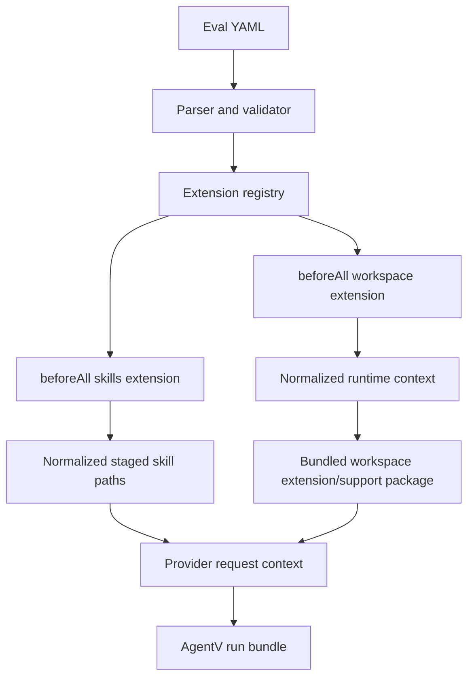

# feat: Add Promptfoo-compatible extensions

## Amendments (agreed — override the sections below where they conflict)

This plan is the **extensions/workspace implementation slice** of the wider promptfoo-superset restructure (`docs/plans/promptfoo-aligned-eval-restructure.md`, PR #1594). The following owner-agreed decisions override the original text:

- **A1. Isolation is hook-derived, not a config field.** Remove the `isolation: per_case` config knob (KTD2/U4/AE). Shared-vs-per-case is selected by **which hook** the workspace extension is registered on: `beforeAll` = shared workspace, `beforeEach` = per-case. The mechanism is a **reset-based workspace pool** (workers share a workspace, or draw from a pool that is reset to original — git clean / snapshot — between uses), not container-per-instance.
- **A2. Per-case workspace spec lives in dataset `vars.workspace`** (not only in an `extensions/workspace.config.yaml`). Workspace "is part of the dataset": the `beforeEach` extension reads `vars.workspace` from the test context; shared/global config in a config file is still allowed for run-wide defaults. Amend U2/U4 to consume `vars.workspace`.
- **A3. Ship a built-in, auto-registered `agentv:workspace` / `agentv:agent_rules` scheme** alongside `file://`. The common case needs no copied script: `extensions: [agentv:workspace:beforeAll]`. `file://path:function` remains for custom extensions. (Original text's `file://`-only model becomes the *custom* path, not the only path.)
- **A4. Grading contract unchanged: reuse `EvaluationScore`.** Extensions never own `grading.json`. The contract originates from agentskills (`assertion_results[{text,passed,evidence}]` + `summary` counts); AgentV keeps that per-assertion shape and adds a top-level string `verdict` (`pass`/`fail`/`skip`) + fractional `score` as a superset. Not a boolean.
- **A5. ADR sequencing.** The proposed ADR 0014 must note that a broader superseding ADR (reversing parts of ADR-0013: `assert`, grader-type names, removal of `tests[].input`) is incoming, so 0014 does not re-entrench `input`/`assertions`.
- **A6. Rename the skills extension → `agent_rules` (U5).** It stages more than skills — **skills, hooks, subagents/agents, and other agent rules** into the workspace. Rename: built-in `agentv:agent_rules`, package `packages/extensions/agent-rules`, provider context `agent_rules_paths` (typed map covering skills/hooks/agents), not `skill_paths`. `skills` becomes one *kind* of agent rule, not the extension name. Update all U5 files/tests accordingly.

The rest of the plan (Promptfoo `file://path:function` refs, four hook names, hard-remove core `workspace`, typed outputs instead of env-var side channels, JS-in-process/Python-subprocess, canonical run bundle, the agent-rules extension) stands as written.

## Goal Capsule

- **Objective:** Adopt a Promptfoo-compatible eval authoring contract for extension hooks, remove `workspace` as an AgentV core primitive, and make the PR 679 parity example reusable through generalized workspace and skills extensions.
- **Authority:** User request, AgentV product boundary, ADR 0013 eval authoring contract, existing workspace and Agent Skills implementation.
- **Execution profile:** Deep, cross-cutting schema/runtime/docs change touching eval parsing, validation, orchestration, examples, and provider-facing skill setup.
- **Stop conditions:** Stop if removing `workspace` from core would break canonical run artifact creation or provider invocation in a way the generalized extension runtime cannot replace.
- **Tail ownership:** AgentV core owns extension loading, provider invocation, normalized run context, and run artifacts; workspace and skills setup live in bundled or local extensions rather than core.

---

## Product Contract

### Summary

AgentV should support Promptfoo-style extension hook references such as `file://scripts/workspace.ts:beforeAll` while preserving AgentV's repo-native execution and artifact model. The PR 679 Promptfoo parity example should become a reusable layout where the suite file stays focused on providers, prompts, tests, assertions, and defaults, while workspace materialization and skill staging live in named extension modules with reusable config.

### Problem Frame

The current AgentV `workspace` field is powerful but makes authoring diverge from Promptfoo and pushes environment setup into core. The Promptfoo PR 679 parity branch demonstrates a cleaner top-level suite shape, but its extension scripts communicate through bespoke environment variables and one-off file names. AgentV needs the compatibility win without keeping workspace as a privileged core concept.

### Requirements

- R1. Eval YAML supports a top-level `extensions` array using Promptfoo-compatible `file://path:function` references.
- R2. Supported hook names are `beforeAll`, `beforeEach`, `afterEach`, and `afterAll`, mapped internally to AgentV's existing snake_case lifecycle stages.
- R3. AgentV core no longer parses or owns top-level `workspace`; workspace setup is expressed through reusable extensions.
- R4. Existing workspace materialization behavior is extracted behind an extension boundary for templates, repositories, hooks, Docker config, static paths, and workspace pooling.
- R5. Skills setup is modeled as a reusable skills extension that stages `SKILL.md` directories into the prepared workspace and exposes normalized skill paths to providers.
- R6. The PR 679 parity example is reorganized so the suite file is Promptfoo-like and the workspace, materialization, skills, providers, fixtures, and rubrics are independently reusable.
- R7. Machine-local paths and secrets stay outside portable suite files; extension configs may reference local overlays or env vars, but portable examples must show placeholders and config-local routing.
- R8. Run bundles continue to expose canonical AgentV result artifacts; Promptfoo compatibility does not create a Promptfoo result format or make Promptfoo the artifact owner.
- R9. Documentation and validation explain the removal of core `workspace` and the replacement extension model without collapsing AgentV `project` and `benchmark` vocabulary.

### Acceptance Examples

- AE1. Given an eval file with `extensions: ["file://extensions/workspace.ts:beforeAll"]`, when `agentv validate` runs, then the extension reference is accepted and resolved relative to the eval file.
- AE2. Given a reusable workspace extension config with pinned repos, when an eval run starts, then the extension prepares the runtime directory and returns generic context consumed by core.
- AE3. Given a skills extension config, when a supported coding-agent target runs, then the staged skill directories are available in the workspace and reflected in provider request metadata without bespoke env var glue.
- AE4. Given a legacy eval that still uses `workspace`, when validation runs, then AgentV fails with a migration message that points to `extensions` and the bundled workspace extension.
- AE5. Given the PR 679 parity suite, when a user swaps only the cases or skill config, then the same workspace and provider extension files can be reused without editing the suite file.

### Scope Boundaries

- **In scope:** Promptfoo-compatible extension reference syntax, hook lifecycle integration, generalized extension runtime context, workspace/skills extension contracts, validation/docs/examples, and PR 679 reusable layout.
- **In scope:** Removing core `workspace` parsing and routing users to extension-based setup.
- **Out of scope:** Importing Promptfoo results, copying Promptfoo's full config schema, adding hosted Promptfoo integration, or changing AgentV run bundle ownership.
- **Deferred to Follow-Up Work:** A deterministic Promptfoo-to-AgentV converter, package-distributed extension registries, remote extension loading, and a generalized plugin marketplace.

---

## Planning Contract

### Key Technical Decisions

- KTD1. Adopt Promptfoo syntax only at the hook reference boundary. AgentV should accept `file://path:function` and the four Promptfoo hook names, but the hook context and returned normalized runtime state remain AgentV-owned.
- KTD2. Remove workspace from core, then reintroduce the behavior as an extension. The existing `packages/core/src/evaluation/workspace/` pipeline should be extracted to a bundled workspace extension or workspace support package; core should only consume normalized runtime context such as `cwd`, cleanup callbacks, environment, artifacts, and metadata.
- KTD3. Use explicit extension outputs instead of env-var side channels. The PR 679 Promptfoo branch uses `PROMPTFOO_PR679_WORKSPACE_DIR` and related env vars; AgentV should instead let hooks return typed runtime data such as prepared working directories, staged skill paths, environment values, and metadata.
- KTD4. Resolve extension paths like Promptfoo, execute them like AgentV. `file://` paths resolve relative to the eval file, support JavaScript/TypeScript first, and may support Python through the same subprocess discipline used for code graders if needed.
- KTD5. Hard-remove `workspace` from the core eval contract. If a short migration window is unavoidable for already-published examples, keep it outside the parser as a conversion helper, not as a runtime compatibility path.
- KTD6. Keep the PR 679 example split by reusable concern. The suite owns prompts/tests/defaults; `extensions/workspace.*` owns repo materialization; `extensions/skills.*` owns skill staging; `providers/` owns targets; `datasets/pr-679/` owns fixtures and cases; `rubrics/` owns grading criteria.

### High-Level Technical Design



The suite file should stay Promptfoo-like at the authoring boundary, but normalized state should enter the AgentV execution path before provider invocation. The `workspace` term remains valid only as a runtime directory or extension capability name; it stops being an AgentV core eval field.

### Suggested Reusable Example Layout

```text
framework-parity/promptfoo/pr-679/
  promptfooconfig.yaml
  datasets/pr-679/cases.yaml
  datasets/pr-679/fixtures/clear-job-consol-transport-vessel-fk-offline.cs
  datasets/pr-679/fixtures/clear-job-consol-transport-vessel-fk-online.cs
  extensions/workspace.ts
  extensions/workspace.config.yaml
  extensions/workspace.local.example.yaml
  extensions/skills.ts
  extensions/skills.config.yaml
  providers/pi-cli-reviewer.yaml
  providers/pi-cli-grader.yaml
  rubrics/fractional-rubric.json
  README.md
```

The same shape can later be mirrored in AgentV examples with non-sensitive fixtures. The private WTG parity repo can keep the CargoWise-specific config and local mirror mapping.

### Assumptions

- The user's "sam syntax" means "same syntax" as Promptfoo extension references.
- `workspace` removal applies to core eval schema and core orchestration ownership, not to runtime paths, run artifacts, or Dashboard wording where "workspace" means an actual prepared directory.
- The WTG PR 679 example should stay in `wtg-ai-prompts-experiment` unless a separate decision approves publishing those artifacts in AgentV.

### Sources And Research

- Promptfoo local clone: `src/evaluatorHelpers.ts` defines hook names, `file://path:function` parsing, and hook-specific calling convention.
- Promptfoo local clone: `src/types/index.ts` validates top-level `extensions` as `file://` Python or JavaScript hook references.
- Promptfoo parity branch: `framework-parity/promptfoo/pr-679/data-transformation-pr50857-e2e.suite.yaml` shows the desired suite shape with `providers`, `extensions`, `prompts`, `defaultTest`, and `tests`.
- AgentV current code: `packages/core/src/evaluation/types.ts`, `packages/core/src/evaluation/yaml-parser.ts`, and `packages/core/src/evaluation/workspace/setup.ts` define the current `workspace` authoring and runtime pipeline.
- AgentV current examples: `examples/features/workspace-shared-config/` demonstrates reusable workspace config files, and `examples/features/agent-skills-evals/` demonstrates Agent Skills eval import and skill-trigger grading.
- ADR source: `docs/adr/0013-stabilize-eval-authoring-contract.md` keeps `tests`, `target`, `experiment`, `default_test`, and `gate` as preferred AgentV vocabulary.

---

## Implementation Units

### U1. Freeze The Contract In Docs And Vocabulary

- **Goal:** Record the Promptfoo-compatible extension contract and the removal of `workspace` from AgentV core before changing runtime behavior.
- **Requirements:** R1, R2, R3, R8, R9
- **Dependencies:** None
- **Files:** `docs/adr/0014-promptfoo-compatible-extensions.md`, `CONCEPTS.md`, `apps/web/src/content/docs/docs/evaluation/eval-files.mdx`, `apps/web/src/content/docs/docs/guides/workspace-architecture.mdx`
- **Approach:** Add an ADR that defines top-level `extensions`, supported hooks, path resolution, trusted local execution posture, and the replacement path for existing `workspace` examples. Update Concepts so `Workspace` distinguishes runtime environment from extension-provided setup.
- **Patterns to follow:** ADR 0013 for preferred authoring contract language; `CONCEPTS.md` for project vocabulary.
- **Test scenarios:** Test expectation: none -- documentation-only unit.
- **Verification:** Reviewers can identify the preferred YAML shape, the hard-removal stance for core `workspace`, and the boundary between extension syntax compatibility and AgentV-owned artifacts.

### U2. Add Extension Reference Parsing And Validation

- **Goal:** Accept Promptfoo-compatible extension references in AgentV eval YAML.
- **Requirements:** R1, R2, AE1
- **Dependencies:** U1
- **Files:** `packages/core/src/evaluation/types.ts`, `packages/core/src/evaluation/yaml-parser.ts`, `packages/core/src/evaluation/validation/eval-file.schema.ts`, `packages/core/src/evaluation/validation/eval-validator.ts`, `packages/core/test/evaluation/validation/eval-file-schema.test.ts`, `packages/core/test/evaluation/validation/eval-validator.test.ts`, `packages/core/test/evaluation/yaml-parser-metadata.test.ts`
- **Approach:** Add an `extensions` field to raw suite parsing and normalized suite metadata. Validate `file://path:function` references, recognize the Promptfoo hook names, reject missing functions for v1 unless a deliberate default-export convention is documented, and resolve relative paths from the eval file directory.
- **Patterns to follow:** Existing `default_test` validation, file-reference validation, and Promptfoo's `getExtensionHookName` behavior as compatibility input.
- **Test scenarios:** 
  - Parse a suite with `extensions: ["file://extensions/workspace.ts:beforeAll"]` and confirm the normalized suite retains the extension reference.
  - Reject an extension not starting with `file://`.
  - Reject a known hook typo such as `before_all` with a message that names `beforeAll`.
  - Resolve relative extension paths from a nested eval file without using `process.cwd()`.
- **Verification:** `agentv validate` accepts the Promptfoo-style reference and reports actionable errors for malformed references.

### U3. Implement The General Extension Runtime

- **Goal:** Execute extension hooks at AgentV lifecycle points and let them provide normalized runtime context to the core runner.
- **Requirements:** R1, R2, R4, R8
- **Dependencies:** U2
- **Files:** `packages/core/src/evaluation/extensions/runner.ts`, `packages/core/src/evaluation/extensions/types.ts`, `packages/core/src/evaluation/orchestrator.ts`, `packages/core/test/evaluation/extensions/runner.test.ts`, `packages/core/test/evaluation/orchestrator.test.ts`
- **Approach:** Add a small extension runner that loads local JavaScript/TypeScript hook modules, invokes only hooks matching the current lifecycle, and merges returned AgentV-normalized runtime fields. Core should understand generic fields such as `cwd`, `env`, `metadata`, `artifacts`, `cleanup`, and provider context; it should not understand workspace repos, templates, Docker, or skill-copy rules.
- **Patterns to follow:** Promptfoo hook filtering semantics, AgentV `executeWorkspaceScript` subprocess discipline, and orchestrator hook execution ordering.
- **Test scenarios:** 
  - Two `beforeAll` extensions run in order and the second sees normalized state returned by the first.
  - A `beforeEach` extension does not run for `beforeAll`.
  - An extension error fails the run at a clear `setup` stage with the extension path in the message.
  - `afterEach` can add result metadata without replacing scores or AgentV artifact paths.
- **Verification:** Provider invocation tests continue to pass with no extensions configured, and runtime context from extensions reaches provider requests without workspace-specific core code.

### U4. Extract Workspace Setup Into A Bundled Extension

- **Goal:** Remove workspace setup from AgentV core and ship it as an extension built on the generalized runtime.
- **Requirements:** R3, R4, R7, AE2, AE4
- **Dependencies:** U3
- **Files:** `packages/extensions/workspace/src/index.ts`, `packages/extensions/workspace/src/types.ts`, `packages/extensions/workspace/test/workspace-extension.test.ts`, `packages/core/src/evaluation/workspace/setup.ts`, `packages/core/src/evaluation/workspace/repo-config-parser.ts`, `packages/core/test/evaluation/workspace-config-parsing.test.ts`, `packages/core/test/evaluation/workspace/resolve.test.ts`, `packages/core/test/evaluation/orchestrator.test.ts`
- **Approach:** Move the current workspace materialization code behind a bundled extension package or equivalent non-core module. The extension reads workspace config, materializes repos/templates/Docker/hooks, then returns generic runtime context to core. Keep machine-local `workspace_path` and mirror paths in `.agentv/config.local.yaml` or extension-local overlay files. Make top-level `workspace` a validation error with migration guidance.
- **Patterns to follow:** `examples/features/workspace-shared-config/workspace.yaml` for reusable config and `packages/core/src/evaluation/workspace/setup.ts` as the extraction source.
- **Test scenarios:** 
  - A workspace extension returns a config with pinned repos and the orchestrator materializes them through the existing repo manager.
  - A workspace extension returns `isolation: per_case` and each test receives a separate workspace.
  - A machine-local mirror path in a local overlay is not serialized into the portable eval suite.
  - A legacy top-level `workspace` eval fails validation with a precise migration message.
- **Verification:** Workspace materialization tests move to the extension package and prove template, repo, hook, Docker, and static directory behavior through the extension path, while core orchestrator tests no longer import workspace-specific config types.

### U5. Add A Skills Extension Contract

- **Goal:** Replace one-off skill setup scripts and metadata side channels with a reusable skills extension.
- **Requirements:** R5, R7, AE3
- **Dependencies:** U3, U4
- **Files:** `packages/extensions/skills/src/index.ts`, `packages/extensions/skills/src/types.ts`, `packages/extensions/skills/test/skills-extension.test.ts`, `packages/core/src/evaluation/loaders/agent-skills-parser.ts`, `packages/core/src/evaluation/providers/claude-cli.ts`, `packages/core/src/evaluation/providers/copilot-sdk.ts`, `packages/core/src/evaluation/providers/codex-cli.ts`, `packages/core/src/evaluation/providers/pi-cli.ts`, `packages/core/test/evaluation/loaders/agent-skills-parser.test.ts`, `packages/core/test/evaluation/providers/copilot-sdk.test.ts`
- **Approach:** Let the skills extension copy or generate skill directories into the prepared runtime directory and return normalized `skill_paths` provider context. Providers that support explicit skill paths should consume those paths from provider request context. Existing `metadata.agent_skills_files` handling can remain as import compatibility but should not be the preferred authoring path.
- **Patterns to follow:** `packages/core/src/evaluation/loaders/agent-skills-parser.ts` for Agent Skills import, `packages/core/src/evaluation/providers/copilot-sdk.ts` for auto-discovered skill directories, and `examples/features/copilot-log-eval/` for skill-trigger evidence.
- **Test scenarios:** 
  - A skills extension stages a `SKILL.md` directory into a prepared workspace and exposes the staged path to a provider request.
  - Multiple skills can be staged without overwriting each other.
  - A missing skill source fails setup with a message naming the source command or path.
  - `skill-trigger` grading still works from normalized provider traces.
- **Verification:** A no-live-provider fixture can prove staging and request metadata; live dogfood later proves a coding-agent provider can actually load the skill.

### U6. Restructure The PR 679 Promptfoo Compatibility Example

- **Goal:** Turn the PR 679 parity example into reusable Promptfoo-compatible layout instead of a one-off script bundle.
- **Requirements:** R6, R7, AE5
- **Dependencies:** U1, U2, U3, U4, U5
- **Files:** `docs/examples/promptfoo-compatible-layout.md`, `examples/features/promptfoo-compatible-extensions/README.md`, `examples/features/promptfoo-compatible-extensions/promptfooconfig.yaml`, `examples/features/promptfoo-compatible-extensions/extensions/workspace.ts`, `examples/features/promptfoo-compatible-extensions/extensions/skills.ts`, `examples/features/promptfoo-compatible-extensions/providers/local-agent.yaml`, `examples/features/promptfoo-compatible-extensions/datasets/sample/cases.yaml`, `examples/features/promptfoo-compatible-extensions/rubrics/fractional-rubric.json`
- **Approach:** Add a non-sensitive AgentV example that mirrors the private PR 679 layout and documents how the private `wtg-ai-prompts-experiment` paths map into it. Keep the WTG-specific CargoWise fixtures and mirror paths in the private repo unless publishing is explicitly approved.
- **Patterns to follow:** Promptfoo parity branch paths under `framework-parity/promptfoo/pr-679/`, AgentV examples under `examples/features/`, and docs guidance in `apps/web/src/content/docs/docs/evaluation/examples.mdx`.
- **Test scenarios:** 
  - The example validates with extension-only workspace and skills setup.
  - Replacing only `datasets/sample/cases.yaml` does not require editing provider or extension files.
  - The README shows how to map the private PR 679 files into the reusable layout without absolute local paths.
- **Verification:** `agentv validate` succeeds for the example, and docs do not expose private WTG local paths.

### U7. Update CLI, Schema, And AI-Facing Guidance

- **Goal:** Make the new contract discoverable through CLI validation, generated schema, docs, and bundled authoring skills.
- **Requirements:** R1, R3, R9
- **Dependencies:** U2, U4, U5, U6
- **Files:** `packages/core/scripts/generate-eval-schema.ts`, `apps/cli/src/commands/eval/commands/run.ts`, `apps/cli/src/commands/eval/shared.ts`, `apps/web/src/content/docs/docs/evaluation/eval-files.mdx`, `apps/web/src/content/docs/docs/guides/agent-eval-layers.mdx`, `plugins/agentv-dev/skills/agentv-eval-builder/SKILL.md`
- **Approach:** Regenerate schema output, update CLI help and validation examples, and revise the AI-facing eval builder guidance so agents author `extensions` rather than top-level `workspace` for new evals.
- **Patterns to follow:** `.agents/workflow.md` note that schema guidance changes update `plugins/agentv-dev/skills/agentv-eval-builder/`.
- **Test scenarios:** 
  - Generated eval schema includes `extensions`.
  - CLI validation output identifies extension errors with file and hook context.
  - Docs examples use `default_test` rather than Promptfoo's camelCase `defaultTest` unless the example is explicitly showing Promptfoo source compatibility.
- **Verification:** Schema sync tests pass and docs examples stay aligned with ADR 0013 field names.

### U8. Dogfood The Contract With A Real Provider And Grader

- **Goal:** Prove extension-authored workspace and skills setup works in a live eval, not only parser tests.
- **Requirements:** R4, R5, R6, R8, AE2, AE3, AE5
- **Dependencies:** U6, U7
- **Files:** `examples/features/promptfoo-compatible-extensions/README.md`, private evidence branch contents outside the public repo
- **Approach:** Run the smallest live coding-agent eval with a real provider and real LLM grader using the extension-only example. Capture the run bundle, validated config, evidence README, and any screenshots or artifact trees on an `agentv-private` evidence branch per `.agents/verification.md`.
- **Patterns to follow:** `.agents/verification.md` live dogfood rules for eval execution, providers, graders, and artifact changes.
- **Test scenarios:** 
  - Live provider loads the staged skill from the skills extension.
  - Workspace extension prepares the expected repo/template state.
  - LLM grader evaluates the result and the run bundle records canonical AgentV artifacts.
  - A failure path, such as missing skill source or missing workspace config, produces a setup error rather than a provider crash.
- **Verification:** Private evidence includes the canonical `.agentv/results/<run_id>/` bundle, command output, artifact tree, and exact blocker if the live provider or grader cannot run.

---

## Verification Contract

| Gate | Applies To | Done Signal |
|---|---|---|
| `bun test packages/core/test/evaluation/validation/eval-file-schema.test.ts packages/core/test/evaluation/validation/eval-validator.test.ts` | U2, U7 | Extension schema and validator behavior is covered. |
| `bun test packages/core/test/evaluation/extensions/runner.test.ts packages/core/test/evaluation/orchestrator.test.ts` | U3, U4 | Hook lifecycle integration works without regressing orchestration. |
| `bun test packages/extensions/workspace/test/workspace-extension.test.ts` | U4 | The bundled workspace extension prepares runtime context without core workspace schema. |
| `bun test packages/core/test/evaluation/loaders/agent-skills-parser.test.ts packages/core/test/evaluation/providers/copilot-sdk.test.ts` | U5 | Skill staging and provider request metadata are covered without live providers. |
| `bun apps/cli/src/cli.ts validate examples/features/promptfoo-compatible-extensions/promptfooconfig.yaml` | U6, U7 | Example validates through the public CLI. |
| Live provider plus live LLM grader dogfood | U8 | Private evidence proves an extension-only eval can run end to end and produce canonical run artifacts. |

---

## Definition of Done

- The preferred eval authoring docs use top-level `extensions` for workspace and skills setup.
- AgentV accepts Promptfoo-compatible `file://path:function` extension references with the four hook names.
- Core orchestration consumes generic extension runtime context and no longer owns workspace setup.
- The former workspace engine is available through a bundled workspace extension and is fed by extension config rather than eval core schema.
- Skills setup has a reusable extension path and provider-facing normalized skill metadata.
- Legacy top-level `workspace` behavior is hard-removed from the core eval contract, with validation errors and migration docs pointing to extensions.
- The PR 679 parity layout is represented as a reusable, non-sensitive AgentV example or documented mapping, with private WTG-specific files kept out of the public repo.
- Validation, unit tests, schema sync, and live provider/grader dogfood pass or record exact blockers.
- Abandoned experimental code, duplicate setup paths, and one-off PR 679 env-var glue are not left in the final diff.
