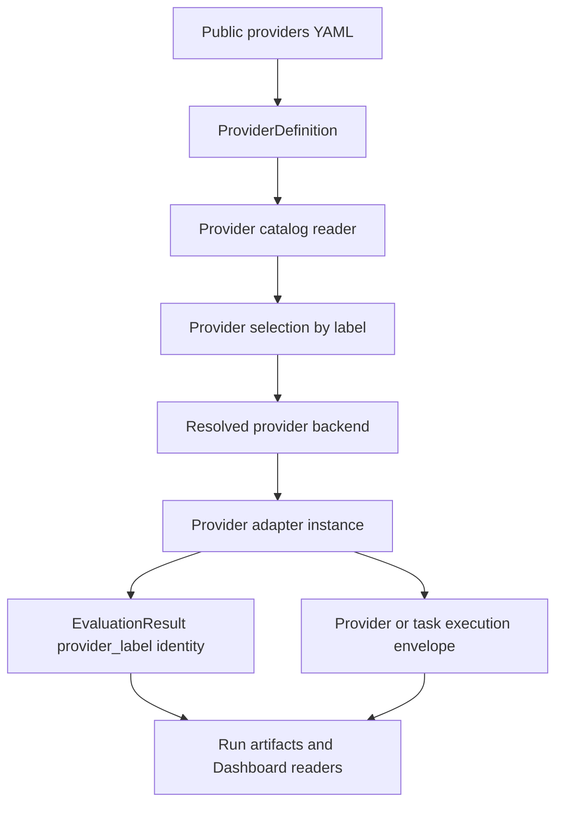

# Provider Internal Naming Migration - Plan

## Goal Capsule

| Field | Value |
|---|---|
| Objective | Hard-migrate AgentV internals from target-era provider configuration names to provider terminology, stripping legacy names unless a concrete current repo/runtime dependency blocks removal. |
| Authority | `AGENTS.md`, `STRATEGY.md`, `ROADMAP.md`, `.agents/conventions.md`, `.agents/workflow.md`, `.agents/publish.md`, `.agents/product-boundary.md`, and Bead `av-kfik.53`. |
| Stop conditions | Stop only when a target-era name cannot be removed because an in-repo runtime path, fixture, or documented import reader still depends on it; document the exception and create a removal follow-up. |
| Execution profile | Hard replacement in provider-config internals first, explicit exception handling for runtime/artifact surfaces, and no top-level `agent` config field. |
| Tail ownership | Follow-up Beads created from this plan own implementation slices. |

---

## Product Contract

### Summary

AgentV has adopted Promptfoo-compatible `providers` as the public matrix field, but internal APIs, CLI plumbing, SDK helpers, result artifacts, tests, and docs still use target-era names.
The migration should make internal naming match the current provider contract and remove target-era names now where the current repo can be migrated in the same slice.
AgentV has no external users yet, so deprecated public aliases are not the default.

### Problem Frame

The current source has a mixed model: public YAML rejects top-level `target`/`targets` in favor of `providers`, but core still exports `TargetDefinition`, `readTargetDefinitions`, `resolveTargetDefinition`, and many `targetName` variables.
Some target terms now mean provider configuration residue; others mean runtime task execution, result identity, script-grader target access, or historical docs.
A blind rename can still break current repo tests, result readers, rerun/export flows, and examples.
Those are migration constraints, not reasons to preserve target-era aliases indefinitely.

### Requirements

**Canonical terminology**

- R1. Public authored matrix config uses `providers`, where each provider entry's `id` names the backend/spec and `label` is the stable AgentV selection and result identity.
- R2. Internal configured-provider types should converge on `ProviderDefinition`, `providerLabel`, `providerId`, and `providerAdapter` or `backend`; `agent provider` is only a category for coding/tool-using backends.
- R3. Public names must avoid `sourceProvider` because `source` already carries file/dataset provenance in results and projections.

**Hard migration and safety**

- R4. Exported `@agentv/core`, `@agentv/sdk`, and `agentv` symbols should be hard-renamed when current repo consumers can be migrated in the same slice.
- R5. Do not keep deprecated public aliases unless a concrete current repo/runtime dependency cannot be migrated in that slice; every exception needs a written reason and a removal follow-up.
- R6. Legacy authored config (`target`, `targets`, `.agentv/targets.yaml`, `--target`, `--targets`, `--grader-target`) should be removed or rejected, not supported.
- R7. Run artifact field fallback defaults to no legacy. Keep a reader fallback only when needed for existing fixtures, tests, or documented import behavior that the same slice cannot migrate.

**Implementation map**

- R8. Every audited target-era term must be classified as hard rename now, reject/remove legacy, keep because it denotes runtime/task execution rather than provider config, or defer with a concrete blocker.
- R9. Follow-up work must be sliced so another worker can execute from Beads plus this plan and the required routing docs.

### Promptfoo Source Evidence

Local Promptfoo clone commit `6bfc5a0c7f16f9c4717ac731d276b578e63d0769` supports the AgentV naming decision.
`src/types/providers.ts` defines `ProviderId`, `ProviderLabel`, `ProviderOptions`, `ApiProvider.label`, and `ApiProvider.id()`.
`src/validators/providers.ts` mirrors `ProviderOptionsSchema`.
`src/evaluator.ts` persists EvaluateResult provider metadata as `id`, `label`, and `config`, uses local `providerId` and `providerLabel` for errors/tracing, and displays `provider.label || provider.id()`.

### Scope Boundaries

- Hard-rename scope includes internal TypeScript names, exported package symbols, CLI eval internals, provider catalog filenames, tests, and current docs when current repo consumers can move in the same slice.
- Reject/remove scope includes legacy authored config, target-named eval CLI flags, and `.agentv/targets.yaml` discovery unless a current test fixture or import workflow forces a temporary exception.
- Runtime/task scope keeps target wording only where it denotes task execution rather than provider config, and only after the implementer verifies a provider term would be less correct.
- Deferred scope covers artifact schema or SDK wire names only when the worker identifies current fixtures, local historical evidence, or documented import behavior that cannot be migrated in the same slice.

---

## Planning Contract

### Key Technical Decisions

- KTD1. Hard-replace target-named configured-provider exports where feasible. `TargetDefinition`, `readTargetDefinitions`, `resolveTargetDefinition`, `resolveDelegatedTargetDefinition`, `ResolvedTarget`, and `listTargetNames` should become `ProviderDefinition`, `readProviderDefinitions`, `resolveProviderDefinition`, `resolveDelegatedProviderDefinition`, `ResolvedProviderBackend` or `ResolvedProviderAdapter`, and `listProviderLabels`; old exports remain only for a concrete blocking dependency.
- KTD2. Treat `label` as the internal selection key. Places currently named `targetName` in provider selection, matrix expansion, CLI `--provider`, `defaults.provider`, and task bundle provider arrays should become `providerLabel` when the value is the stable AgentV identity.
- KTD3. Keep `id` for backend/spec. Do not map it to target identity; names like `providerId` should mean the Promptfoo provider spec such as `openai:gpt-4.1-mini`, `package:...`, or `agentv:codex-cli`.
- KTD4. Use `providerAdapter` or `backend` for resolved executors. Current `ResolvedTarget` is not the configured provider definition; it is the resolved runtime/backend object consumed by `createProvider`.
- KTD5. Artifact field migration is separate from TypeScript cleanup, but the default action is hard rename for newly written bundles. Keep read fallback only for existing fixtures or documented import behavior that must remain readable for local historical evidence.
- KTD6. SDK target proxy naming is an exception candidate, not a protected alias set. `createTargetClient()` and `AGENTV_TARGET_PROXY_*` should be hard-renamed if current examples/docs/tests can migrate; keep old wire names only if runtime environment plumbing cannot be changed in the same slice, then create a removal Bead.

### Audit Classification

| Surface | Current terms | Classification | Migration direction |
|---|---|---|---|
| Core provider definition type | `packages/core/src/evaluation/providers/types.ts` exports `TargetDefinition`; comments say authored YAML uses `id`; `provider_spec` stores original public provider spec. | Hard rename now. | Replace with `ProviderDefinition` and migrate current imports/tests. Keep `TargetDefinition` only if an unmovable current dependency is found; document that exception and create a removal Bead. |
| Core provider catalog reader | `packages/core/src/evaluation/providers/targets-file.ts` exports `readTargetDefinitions()` and `listTargetNames()` but parses `providers:` and rejects removed `targets:`. | Hard rename now. | Replace with `readProviderDefinitions()` and `listProviderLabels()`. Rename the module when feasible, update imports, and remove target-named helpers unless a current dependency blocks it. |
| Core resolver | `packages/core/src/evaluation/providers/targets.ts` exports `normalizeProviderDefinition()`, `normalizeTargetDefinition()`, `resolveDelegatedTargetDefinition()`, `resolveTargetDefinition()`, `ResolvedTarget`, `COMMON_TARGET_SETTINGS`. | Hard rename provider-config concepts now. | Keep `normalizeProviderDefinition`; replace target-named resolver/type/settings symbols with provider-named symbols. Runtime-only names move in later units only if they are not provider config. |
| Provider interface | `Provider.targetName` in `packages/core/src/evaluation/providers/types.ts` and all provider classes. | Hard rename if current repo can migrate. | Rename to `providerLabel` when used as configured provider identity. If a result-artifact path still requires `target`, translate at the artifact boundary. |
| CLI selection plumbing | `apps/cli/src/commands/eval/targets.ts`, `run-eval.ts`, `task-bundle.ts`, `bundle.ts` use `TargetSelection`, `targetName`, `targetSource`, `targetLabel`, `targetsFilePath`, `targetsPath`; public flags now map `--provider`/`--providers` into internal `target`/`targets`. | Hard rename now. | Replace selection types and raw options with provider naming (`ProviderSelection`, `providerLabel`, `providerSource`, `providersFilePath`, `providersPath`). Remove internal target/targets option handoff. |
| CLI catalog discovery | `apps/cli/src/utils/targets.ts` discovers only `targets.yaml` candidates and errors with `--targets`, while public CLI uses `--providers`. | Remove legacy discovery now. | Rename to provider discovery and only discover `providers.yaml`/`.agentv/providers.yaml` unless a current fixture cannot migrate in this slice. |
| Generated test/task bundles | `apps/cli/src/commands/eval/task-bundle.ts` writes `targets.yaml` files containing `providers:` and index fields `targets_path`; rerun/export expect `test/targets.yaml`. | Hard rename unless fixture/import blocker exists. | Write `providers.yaml` and `providers_path` for new bundles. Keep read fallback only for existing tests/fixtures or documented rerun/import behavior that must read old local evidence. |
| Result row identity | `EvaluationResult.target`, `IndexArtifactEntry.target`, compare/trend/inspect grouping, summary metadata `targets`. | Hard rename unless artifact-reader blocker exists. | Prefer `provider_label`/`provider_labels` for new artifacts and translate internally to `providerLabel`. Keep `target` fallback only if old fixture/import behavior is explicitly kept. |
| Target execution envelope | `TargetExecutionEnvelope`, `target_execution_path`, `target-execution.json`, `target_error_kind`, `target_task_failure`, `targetId`, `agentv.target_execution.v1`. | Keep only if runtime/task semantics win. | Audit each field: if it describes provider runtime failure, rename to provider execution; if it describes the task under evaluation, keep target and explain why. Default is hard rename for new artifacts if tests can migrate. |
| SDK target client | `packages/sdk/src/target-client.ts`, `createTargetClient()`, `TargetClient`, `TargetInfo.targetName`, `availableTargets`, `AGENTV_TARGET_PROXY_URL/TOKEN`. | Hard rename unless proxy env/wire blocker exists. | Replace with provider client naming in SDK, docs, examples, and tests. Keep target-named env/wire only if runtime injection cannot move in the same slice; create a removal follow-up. |
| Runtime target proxy | `packages/core/src/runtime/target-proxy.ts`, `TargetResolver`, `TargetProxy*`, `/info.targetName`, request `target`. | Hard rename with SDK slice. | Replace request/response/server naming with provider. Add target read fallback only if needed for old local fixtures or staged SDK migration. |
| Grader provider role | `grader_target` config, `graderTarget`, `defaultGraderTarget`, `GraderResult.target`, LLM grader details `grader_target`. | Hard rename current config/internal names now. | Use `grader_provider`/`graderProviderLabel` for current authored and internal names. Reject legacy `grader_target` unless a migration fixture explicitly needs it. |
| Fallback/delegation config | `use_target`, `fallback_targets`, `source_target` in replay fixtures. | Hard rename unless replay/projection blocker exists. | Prefer `use_provider`, `fallback_providers`, and a non-`sourceProvider` replay identity name. If `source_target` remains for projection identity, document the local-evidence reader reason. |
| Pipeline commands | `apps/cli/src/commands/pipeline/*` use `target` manifest blocks and `--target`/`--targets`. | Hard rename or remove legacy command surface. | Replace pipeline flags/manifests with provider naming, or explicitly classify pipeline as legacy and create a removal Bead. |
| Prepare/grade commands | `agentv prepare --target`, prepared manifest `target`, grade-prepared tests. | Hard rename. | Replace with `--provider` and provider-named prepared manifest fields; reject target flags with no compatibility unless tests require a transition. |
| Migration script | `scripts/migrate-hard-deprecations.ts` and tests migrate `targets`/`target` to `providers`/`provider`. | Keep because it handles legacy migration. | Do not rename target terms that describe the old input being migrated; add provider-file rename behavior only if `providers.yaml` becomes canonical on disk. |
| Public docs and examples | `apps/web/src/content/docs/docs/next/**`, `examples/**`, `packages/sdk/README.md` contain current and stale target wording. | Hard rename current docs/examples. | Update current docs and examples with the code slices. Archived versioned docs may remain historical unless current nav/search surfaces make them misleading. |
| Tests | `packages/core/test/**`, `apps/cli/test/**`, `packages/sdk/test/**` heavily use target names. | Follow code slice, default hard rename. | Rename tests with each implementation unit. Keep legacy artifact fixtures only when they prove a deliberate old-bundle reader. |

### Exported/API Risk Inventory

| Export | Package | Risk | Required action |
|---|---|---|---|
| `TargetDefinition` | `@agentv/core` | Current repo imports and tests. | Replace with `ProviderDefinition` and migrate current repo consumers; no alias unless a concrete current dependency blocks removal. |
| `ResolvedTarget` | `@agentv/core` | Programmatic evaluation and provider factories currently depend on it. | Replace with a provider backend/adapter name and migrate current repo consumers; document any runtime exception. |
| `readTargetDefinitions`, `listTargetNames` | `@agentv/core` | CLI dependencies. | Replace with `readProviderDefinitions` and `listProviderLabels`; remove old exports after current imports migrate. |
| `resolveTargetDefinition`, `resolveDelegatedTargetDefinition` | `@agentv/core` | Core, CLI, and tests depend on them. | Replace with provider-named resolvers and migrate current call sites in the same slice. |
| `createTargetClient`, `TargetClient`, `TargetInfo`, `TargetInvoke*`, `TargetNotAvailableError`, `TargetInvocationError` | `@agentv/sdk` | SDK docs/examples/tests depend on them. | Hard rename to provider client naming if SDK/runtime proxy can move together; otherwise keep the minimum old wire/env compatibility and create a removal Bead. |
| CLI `--target`, `--targets`, `--grader-target` | `agentv` | Some commands still expose these flags. | Replace with provider flags or reject target flags; do not keep support aliases. |
| Result fields `target`, `targets_path`, `target_execution_path`, `target_error_kind` | Run bundle contract | Dashboard, compare, export, rerun, projection, fixtures, and docs read them. | Rename for new artifacts unless old local evidence/import behavior must be preserved. Any fallback must be reader-only and justified. |

### High-Level Technical Design

The provider-config path should move first: public `providers` entries become `ProviderDefinition`, are selected by `providerLabel`, resolve to a backend/adapter, then instantiate a `Provider`.
The run-artifact path is separate because it may need reader-only fallback for local historical evidence, but new writes should prefer provider-named fields unless the field truly denotes task execution.

---

## Implementation Units

### U1. Hard-Rename Core Provider-Definition APIs

- **Goal:** Replace target-named configured-provider APIs with provider-named APIs across current core and CLI consumers.
- **Requirements:** R1, R2, R4.
- **Dependencies:** None.
- **Files:** `packages/core/src/evaluation/providers/types.ts`, `packages/core/src/evaluation/providers/targets.ts`, `packages/core/src/evaluation/providers/targets-file.ts`, `packages/core/src/evaluation/providers/index.ts`, `packages/core/src/index.ts`, `packages/core/test/evaluation/providers/targets.test.ts`, `packages/core/test/evaluation/providers/targets-file.test.ts`.
- **Approach:** Rename `TargetDefinition` to `ProviderDefinition`, `ResolvedTarget` to a provider backend/adapter name, `readTargetDefinitions` to `readProviderDefinitions`, `listTargetNames` to `listProviderLabels`, `resolveTargetDefinition` to `resolveProviderDefinition`, and `resolveDelegatedTargetDefinition` to `resolveDelegatedProviderDefinition`. Remove old exports after current repo imports migrate. If a target-named export cannot be removed, record the concrete blocker in the Bead and create a removal follow-up.
- **Patterns to follow:** Current hard-rejection of removed authored `targets` in `targets-file.ts`; Promptfoo `ProviderOptions`/`ProviderLabel` naming from the local clone.
- **Test scenarios:** Provider catalog with `providers:` parses through provider-named helpers. Removed `targets:` catalog still errors with migration guidance. Current core and CLI imports compile without target-named configured-provider exports.
- **Verification:** Focused core provider tests pass and typecheck covers renamed exports.

### U2. Migrate Eval CLI Selection Internals to Provider Labels

- **Goal:** Rename eval-run selection plumbing from target names to provider labels and remove internal raw option handoff through `target`/`targets`.
- **Requirements:** R1, R2, R4.
- **Dependencies:** U1.
- **Files:** `apps/cli/src/commands/eval/targets.ts`, `apps/cli/src/commands/eval/run-eval.ts`, `apps/cli/src/commands/eval/commands/run.ts`, `apps/cli/src/commands/eval/commands/bundle.ts`, `apps/cli/src/commands/eval/task-bundle.ts`, `apps/cli/test/commands/eval/targets.test.ts`, `apps/cli/test/commands/eval/run-command-options.test.ts`, `apps/cli/test/commands/eval/task-bundle.test.ts`, `apps/cli/test/commands/eval/bundle.test.ts`.
- **Approach:** Rename `TargetSelection` to `ProviderSelection`, `targetName` to `providerLabel` where it is the selected `providers[].label`, `targetsFilePath` to `providersFilePath`, and messages from "Using target" to "Using provider" for `eval run`. Rename `runEvalCommand` raw/effective options from `target`/`targets` to `provider`/`providers` instead of carrying a compatibility handoff.
- **Patterns to follow:** `apps/cli/src/commands/eval/commands/run.ts` already hard-errors removed `--target`/`--targets` and lowers public provider flags into old internal names.
- **Test scenarios:** `--provider` matrix still runs through the same selection list. Removed `--target`/`--targets` still throw guidance. Eval-local provider object labels are used for result identity. No eval-run internal option names use `target` for provider selection after the slice.
- **Verification:** Focused CLI eval option, selection, and task-bundle tests pass.

### U3. Replace Targets File Discovery with Providers File Discovery

- **Goal:** Make `providers.yaml` the only canonical provider catalog filename for current eval flows.
- **Requirements:** R1, R4, R6.
- **Dependencies:** U1.
- **Files:** `apps/cli/src/utils/targets.ts`, `apps/cli/src/commands/eval/interactive.ts`, `apps/cli/src/commands/results/eval-runner.ts`, `apps/cli/src/commands/runs/rerun.ts`, `apps/cli/src/commands/create/commands.ts`, `apps/cli/test/commands/eval/bundle.test.ts`, `apps/cli/test/commands/runs/rerun.test.ts`.
- **Approach:** Rename provider catalog discovery helpers and file candidates to `providers.yaml`, `providers.yml`, `.agentv/providers.yaml`, and `.agentv/providers.yml`. Remove `.agentv/targets.yaml` discovery for current eval flows. If rerun/import must read old generated bundles, isolate that fallback in the rerun/import reader and document the local-evidence reason.
- **Patterns to follow:** `targets-file.ts` already expects a `providers` array even when the file path is target-named.
- **Test scenarios:** A repo with `.agentv/providers.yaml` is discovered. A repo with only `.agentv/targets.yaml` is rejected or ignored in current eval flows with migration guidance. Explicit directory paths find nested provider catalogs. Missing file errors mention `--providers`.
- **Verification:** Focused CLI discovery, eval selection, bundle, rerun, and interactive tests pass.

### U4. Hard-Rename New Run Artifact Provider Fields

- **Goal:** Rename target-era run artifact fields for new writes, keeping reader fallback only when old local evidence/import fixtures require it.
- **Requirements:** R5, R6.
- **Dependencies:** U1, U2.
- **Files:** `packages/core/src/evaluation/run-artifacts.ts`, `packages/core/src/evaluation/result-row-schema.ts`, `apps/cli/src/commands/results/manifest.ts`, `apps/cli/src/commands/results/export.ts`, `apps/cli/src/commands/results/projection-bundle.ts`, `apps/cli/src/commands/results/combine-run.ts`, `apps/cli/src/commands/results/serve.ts`, `apps/cli/src/commands/runs/rerun.ts`, `apps/web/src/content/docs/docs/next/reference/result-artifacts.mdx`, artifact contract tests.
- **Approach:** Rename new write fields such as `target` to `provider_label` and `targets_path` to `providers_path` where they represent provider identity or provider catalog snapshots. Audit `target_execution_path`, `target-execution.json`, and `target_error_kind`; rename them when they describe provider runtime failures, keep them only if the field truly denotes task execution. Any old-field reader must be reader-only and tied to a current fixture/import behavior.
- **Patterns to follow:** Existing legacy readers for pre-v5 repeat sample fields and legacy nested `target_execution` in `manifest.ts` and Dashboard serve tests.
- **Test scenarios:** New bundles write provider-named fields. Current result consumers read provider-named fields. Old target-named fixture fallback exists only for intentionally kept import/local-evidence tests. Projection identity changes are explicit and documented.
- **Verification:** Artifact contract, results export/serve/validate, rerun, compare, and docs examples pass.

### U5. Hard-Rename SDK and Runtime Proxy Provider Client

- **Goal:** Replace script-grader target client/proxy naming with provider client/proxy naming.
- **Requirements:** R2, R4.
- **Dependencies:** U1 and a decision from U4 on wire names if any.
- **Files:** `packages/sdk/src/target-client.ts`, optional `packages/sdk/src/provider-client.ts`, `packages/sdk/src/index.ts`, `packages/sdk/README.md`, `packages/sdk/test/target-client.test.ts`, `packages/core/src/runtime/target-proxy.ts`, `packages/core/test/runtime/target-proxy.test.ts`, `apps/web/src/content/docs/docs/next/graders/script-graders.mdx`, `examples/features/script-grader-with-llm-calls/**`.
- **Approach:** Rename `createTargetClient()`/`TargetClient`/`TargetInfo.targetName`/`availableTargets` and runtime `TargetProxy*` to provider names across SDK, core runtime proxy, docs, and examples. Rename env vars if the core injection path can move in the same slice. Keep old env/wire read fallback only if a current staged runtime dependency blocks removal, then create a removal Bead.
- **Patterns to follow:** SDK re-export pattern in `packages/sdk/src/index.ts`; proxy wire tests in `packages/sdk/test/target-client.test.ts`.
- **Test scenarios:** SDK examples use provider client naming. Provider override request bodies use `provider` or `provider_label`. Runtime proxy `/info` exposes provider-named fields. Any target-named env/wire fallback is explicitly tested as temporary only if retained.
- **Verification:** Focused SDK and runtime proxy tests pass.

### U6. Hard-Rename Remaining CLI, Grader, and Delegation Provider Surfaces

- **Goal:** Remove remaining target-era command/config names outside the main eval selection path.
- **Requirements:** R1, R2, R4, R6.
- **Dependencies:** U1, U2, U4 as applicable.
- **Files:** `apps/cli/src/commands/pipeline/**`, `apps/cli/src/commands/prepare/**`, grader command/config files under `apps/cli/src/commands/**` and `packages/core/src/evaluation/**`, replay/projection fixtures and tests that use `grader_target`, `defaultGraderTarget`, `use_target`, `fallback_targets`, `source_target`, `--target`, or `--targets`.
- **Approach:** Rename current provider-role fields to provider terminology, for example `grader_provider`/`graderProviderLabel`, `use_provider`, and `fallback_providers`. Replace remaining command flags and manifests that expose provider selection as `--target`/`--targets` with provider names or remove the legacy command surface. Avoid public `sourceProvider`; if replay/projection needs a source identity, choose a name that does not collide with dataset/file provenance and document it in the Bead.
- **Patterns to follow:** U2's provider-label selection naming and U4's new-artifact hard rename rules.
- **Test scenarios:** Current grader, prepare, pipeline, replay, and projection tests use provider terminology. Legacy target-authored config and flags are rejected rather than silently accepted. Any old local-evidence fixture fallback is reader-only and justified.
- **Verification:** Focused tests for touched command/config surfaces pass, plus live dogfood if an eval/provider/grader path changes.

### U7. Hard-Rename Current Docs and Examples

- **Goal:** Align current public docs and examples with provider terminology after code slices land.
- **Requirements:** R1, R2, R8.
- **Dependencies:** U2, U3, U5, U6 as applicable.
- **Files:** `apps/web/src/content/docs/docs/next/**`, `examples/**`, `packages/sdk/README.md`, relevant example tests or baselines if examples are validated.
- **Approach:** Update current docs to use `providers`, `--provider`, `providers.yaml`, provider labels, candidate provider, and grader provider. Rename current examples and scripts away from `.agentv/targets.yaml` and `--target`. Archived versioned docs may remain historical unless they are surfaced as current guidance.
- **Patterns to follow:** `apps/web/src/content/docs/docs/next/reference/promptfoo-parity.mdx` already states old `target`/`targets` authoring is hard-rejected.
- **Test scenarios:** Docs snippets for current commands use `--provider`/`--providers`. SDK docs use provider client naming after U5. Current examples use `providers.yaml`.
- **Verification:** Focused docs link/snippet validation if touched; no broad example baseline regeneration unless examples change behavior.

---

## Verification Contract

| Slice | Focused validation |
|---|---|
| U1 | Provider resolver and provider catalog tests under `packages/core/test/evaluation/providers/`. Run typecheck if exported type aliases change. |
| U2 | CLI eval option, target/provider selection, bundle, and task-bundle tests under `apps/cli/test/commands/eval/`. |
| U3 | CLI discovery, interactive, rerun, and results eval-runner tests that load provider catalogs. Include a negative check for `.agentv/targets.yaml` on current eval flows unless a documented old-bundle reader keeps fallback. |
| U4 | Artifact contract tests, results export/serve/validate/combine tests, rerun tests, compare tests, and result-artifact docs review. Live dogfood is required before PR readiness because this touches run artifacts. |
| U5 | SDK provider-client tests, runtime provider-proxy tests, typecheck for `@agentv/sdk`, and docs/examples touched by the rename. |
| U6 | Focused grader, prepare, pipeline, replay, and projection tests for touched surfaces. Live dogfood is required when grader/provider execution behavior changes. |
| U7 | Docs link/snippet validation for touched docs; example validation only for examples whose runnable contracts change. |

Research-only audit work for this plan requires no build or test run.
Implementation slices must run focused tests for their touched surfaces; artifact or eval execution changes also need the live dogfood gate from `.agents/verification.md`.

---

## Definition of Done

- Provider-config internals use canonical provider-named APIs, and target-named configured-provider APIs are removed unless a documented current blocker remains.
- CLI `eval run` internals refer to selected provider labels instead of target names, while removed target flags keep migration guidance.
- Catalog discovery uses `providers.yaml`; `.agentv/targets.yaml` is not supported in current eval flows unless an isolated old-bundle reader documents why.
- SDK and runtime proxy public names use provider terminology, with any temporary target-named env/wire fallback documented and tracked for removal.
- Result artifact fields use provider terminology for new writes unless a field is explicitly kept because it denotes task execution; old-bundle fallback is reader-only and justified by fixtures or documented import behavior.
- Current docs use provider terminology where they describe supported behavior; historical docs and migration scripts keep target language where it describes old inputs.
- Follow-up Beads carry the exact scope, dependencies, validation expectations, and plan link for each implementation slice.
