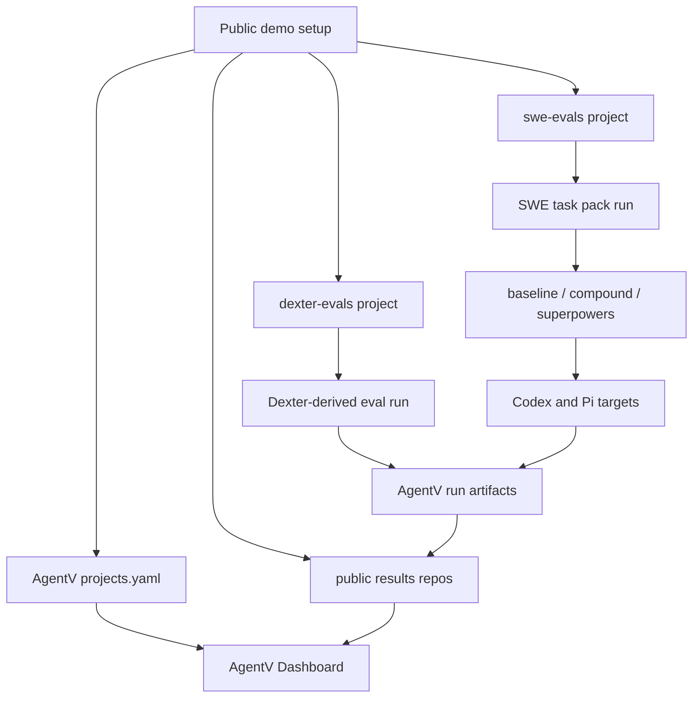

# Public AgentV Demo Projects

## Summary

Build two public companion eval projects, `dexter-evals` and `swe-evals`, their matching public results repositories, and wire them into the public AgentV Dashboard demo path. The work should prove AgentV can show multiple real public projects, run domain and SWE-style eval suites with local-only provider config, sync results remotely, compare Codex vs Pi, and use realistic data to expose Dashboard UX gaps without depending on private WiseTech repositories.

---

## Problem Frame

The current Dashboard demo story is strong internally but weak publicly: private WiseTech projects are the most realistic registered projects, while public AgentV examples remain mostly in-repo. The plan converts the brainstorm scope into a multi-repo implementation path: create public substitute projects, create public result-sync repositories, keep secrets out of git, reuse AgentV's existing workspace and target primitives, and leave a repeatable task pack that can later support quality-drift checks.

The main product goal is not just to create public eval data. The realistic data should pressure-test the Dashboard experience: project switching, result discovery, target comparison, remote-sync visibility, trace/result affordances, and error states. When those UX gaps surface, they should become separate follow-up Beads rather than being hidden inside the eval setup work.

---

## Requirements

**Public Project Shape**

- R1. Create public `dexter-evals` and `swe-evals` repositories with `.agentv/` configuration and runnable eval suites.
- R2. Register AgentV examples, `dexter-evals`, and `swe-evals` as separate Dashboard projects in the public demo setup.
- R3. Keep the companion projects independently cloneable and understandable without private WiseTech repo access.
- R4. Produce enough run artifacts for the Dashboard to show project entries, target names, scores, and comparison-relevant metadata.
- R5. Create and configure matching public results repositories, such as `dexter-evals-results` and `swe-evals-results`, so the demo proves Dashboard remote result sync.

**Dexter Evals**

- R6. Pin and document the Dexter version or commit used by `dexter-evals`.
- R7. Provide a setup path that installs Dexter dependencies and validates the required provider/data environment before attempting a run.
- R8. Adapt Dexter's existing eval pattern into AgentV format instead of inventing a disconnected finance dataset.
- R9. Capture AgentV follow-up issues or notes for friction found while adapting Dexter's dataset, rubric metadata, provider config, or result flow.
- R10. Make clear that `dexter-evals` is an AgentV eval companion for Dexter, not a maintained fork of Dexter.

**SWE Evals**

- R11. Select the initial SWE task pack through documented research against SWE-bench, Multi-SWE-bench, SWE-bench Multilingual, and Marginlab-style drift tracking.
- R12. Demonstrate previous-commit checkout of external public repos using AgentV workspace repo checkout primitives.
- R13. Include baseline, `compound-engineering`, and `superpowers` harness variants.
- R14. Run the same task pack against Codex and Pi first.
- R15. Preserve repeatability: task metadata must include source, repo, previous commit, verification signal, and why the task is suitable for repeated drift checks.

**Provider and Secret Handling**

- R16. Public target templates may reference OpenAI-compatible or Azure provider settings only through environment variables.
- R17. Any Bitwarden Secrets Manager usage must happen in local/deployment scripts and must not write resolved secret values into committed files.
- R18. Public repos must include `.env.example` and target templates with actionable missing-config messages.

**Demo and Verification**

- R19. Local setup should reuse existing clones where safe and avoid unnecessary recloning.
- R20. Docker deployment may exist, but local source-based setup must remain the primary iteration path.
- R21. The final public demo must work without private WiseTech project access.
- R22. The final public demo must demonstrate remote result sync by pushing to or pulling from the public companion results repositories.
- R23. The final public demo must capture Dashboard UX gaps found from realistic public data as follow-up Beads for later implementation.

These R-IDs are plan-local and summarize the origin requirements for implementation. Use the traceability table below when mapping this plan back to the brainstorm document, whose R-IDs have different meanings.

| Plan requirement | Origin requirement(s) |
|---|---|
| R1-R5 | Origin R1-R5 |
| R6-R10 | Origin R6-R10 |
| R11-R15 | Origin R11-R17 |
| R16-R18 | Origin R18-R21 |
| R19-R23 | Origin R22-R26 plus the Dashboard UX-gap clarification from this review |

---

## Key Technical Decisions

- **Use existing AgentV primitives before adding core features.** `workspace.repos[].checkout.base_commit`, target-level hooks, env-var interpolation in `targets.yaml`, and the Dashboard project registry already cover the requested behavior. New AgentV core fields are out of scope for the companion-repo implementation unless implementation proves the existing primitives cannot express the demo.
- **Split task selection from harness construction.** `swe-evals` needs a small documented dataset decision before YAML and scripts are finalized; otherwise the repo risks looking arbitrary and unreproducible.
- **Use public-safe target aliases.** Templates should define provider aliases that resolve through environment variables, matching existing `use_target: ${{ AGENT_TARGET }}` and secret-field interpolation behavior. Real OpenAI-compatible or Azure values stay in `.env`, BWS, or deployment env.
- **Represent plugin variants as harness state, not benchmark claims.** Baseline, compound, and superpowers variants demonstrate configuration and repeatability. V1 should avoid claims that one plugin is statistically better.
- **Keep deployment wiring data-driven.** The private deployment currently hard-codes project specs. The public path should move toward a small project-spec table/list that can swap private and public project sets without duplicating clone/update/register logic.
- **Treat results repos as part of the public product surface.** The demo needs source repos and results repos. Result repositories should be initialized as public, git-backed artifact stores and wired through project-local or global AgentV results config rather than treated as temporary local output.
- **Treat Dashboard UX gaps as downstream findings.** The public data is the forcing function for Dashboard product work. UX gaps discovered during U5 verification should be captured as follow-up Beads, not patched opportunistically in the companion-repo setup unless they block the demo.
- **Treat AgentV core gaps as downstream product work.** If converting Dexter or public SWE-style tasks exposes a missing AgentV primitive, unclear schema, weak result-sync behavior, or Dashboard ingestion limitation, draft a focused follow-up plan and create Beads for that AgentV work instead of widening the companion-repo implementation.

## Repo Topology

| Surface | Intended shape | Owning unit | Write scope |
|---|---|---|---|
| `EntityProcess/agentv` | AgentV monorepo, plan/docs, optional examples/docs updates | U5 and handoff | `docs/`, public demo docs, any minimal setup references |
| `dexter-evals` | New public source repo, independent checkout | U3 | `.agentv/`, `evals/`, `scripts/`, `.env.example`, `README.md` |
| `swe-evals` | New public source repo, independent checkout | U1-U2 | `tasks/`, `.agentv/`, `evals/`, `scripts/`, `.env.example`, `README.md` |
| `dexter-evals-results` | New public results repo for Dashboard-ready Dexter run artifacts | U4 | Public-safe result artifacts only |
| `swe-evals-results` | New public results repo for Dashboard-ready SWE run artifacts | U4 | Public-safe result artifacts only |
| `agentv-deploy` | Deployment/setup repo that registers public source/result repos | U5 | Public project/result spec config and setup scripts |

Companion source repos must be independently cloneable. They may copy patterns from AgentV examples, but their runnable path must start from only the public repo, a supported AgentV install or pinned source checkout, and local environment variables.

---

## High-Level Technical Design

The public demo setup owns project registration, result-repo registration, and local/deployment environment preparation. `dexter-evals` owns the domain-agent eval suite and Dexter prerequisites. `swe-evals` owns task-pack metadata, previous-commit workspace checkout, plugin harness variants, and repeatable provider comparisons. The public results repos own remote-synced artifacts consumed by Dashboard. U5 owns the Dashboard UX-gap capture loop. AgentV core should only change if the companion projects reveal a primitive is missing.

## Execution Handoff

After this review is applied, create Beads from U1-U5 and broadcast one Agent Mail thread before implementation starts. The broadcast should name the repo topology, owner boundaries, result-sync contract, secret-handling rules, and the requirement to create follow-up Beads when real data exposes Dashboard UX gaps or AgentV core gaps.

---

## Implementation Units

### U1. Research and freeze the `swe-evals` task pack

- **Goal:** Choose a v1 task pack that is cheap, public, previous-commit based, and credible for repeat runs.
- **Primary outputs:** `swe-evals/tasks/README.md`, `swe-evals/tasks/*.yaml` or `swe-evals/tasks/*.jsonl`, and a short source-selection note in `swe-evals/README.md`.
- **Patterns to follow:** SWE-bench/Multi-SWE-bench task fields (`repo`, previous commit, issue statement, fail-to-pass/pass-to-pass tests), and Marginlab's small repeated task-pack methodology.
- **Candidate pool:** Start with `iamkun/dayjs`, `expressjs/express`, `axios/axios`, `darkreader/darkreader`; consider `sharkdp/fd` or `tokio-rs/bytes` only if setup remains cheap.
- **Test scenarios:**
  - Each selected task has a public source, repo URL, previous commit, issue/problem statement, and verification command or grader signal.
  - A maintainer can explain why each task was chosen without reading the implementation scripts.
  - At least one candidate is rejected with a documented reason such as install cost, flaky tests, unclear verification, or excessive runtime.
- **Verification:** Dry-run the metadata loader or validation script once task files exist; manually validate one selected repo checkout and test command before building the full harness.
- **Covers:** R11, R12, R15

### U2. Build `swe-evals` harness project

- **Goal:** Create the public coding-agent harness demo that checks out previous commits, applies baseline/plugin variants, and runs Codex-vs-Pi comparisons.
- **Primary outputs:** `swe-evals/.agentv/targets.yaml`, `swe-evals/evals/*.eval.yaml`, `swe-evals/scripts/*`, `swe-evals/.env.example`, `swe-evals/README.md`, and variant setup scripts/config/templates that materialize baseline, compound, and superpowers workspaces at run time.
- **Patterns to follow:** `examples/showcase/bug-fix-benchmark/evals/bug-fixes.eval.yaml`, `examples/showcase/bug-fix-benchmark/scripts/setup-variant.sh`, `examples/features/repo-lifecycle/evals/dataset.eval.yaml`, and `examples/showcase/cross-repo-sync/scripts/setup.ts`.
- **Test scenarios:**
  - Baseline, compound, and superpowers variants all start from the same selected previous commit for a given task.
  - `AGENT_TARGET` or equivalent target selection can switch between Codex and Pi without editing the eval file.
  - Missing provider env fails with a clear message rather than silently selecting a wrong target.
  - Plugin variant setup is visible in captured workspace state or run metadata.
  - External repo install/test commands run from pinned commits with reviewed verification commands and a minimal environment; provider tokens, BWS outputs, and result-repo tokens are not inherited by those subprocesses unless explicitly required.
  - A smoke task can run with `--dry-run` for schema/harness plumbing, then with a real provider for at least one Codex-vs-Pi comparison.
- **Verification:** Run `agentv validate` on all eval YAML files, run one dry-run suite, and run one real eval after provider env is configured. Inspect JSONL output for target name, scores, workspace path, variant metadata, and any AgentV schema/result-format friction that should become a follow-up plan and Bead.
- **Covers:** R12, R13, R14, R15, R16, R18

### U3. Build `dexter-evals` companion project

- **Goal:** Create the public Dexter-oriented AgentV project with a working prerequisite/setup path and a small Dexter-derived eval suite.
- **Primary outputs:** `dexter-evals/.agentv/targets.yaml`, `dexter-evals/evals/*.eval.yaml`, `dexter-evals/scripts/*`, `dexter-evals/.env.example`, `dexter-evals/README.md`.
- **Patterns to follow:** Dexter's README "How to Evaluate" flow, `ai-research-wiki/raw/articles/dexter-evals.md`, and AgentV examples that use `.env`/target templates.
- **Test scenarios:**
  - Setup fails early if Dexter is missing, provider env is missing, or required data env is missing.
  - Setup can pin or record the Dexter commit/version used for the demo.
  - The AgentV eval adapts a real Dexter-style question/dataset/rubric pattern rather than a generic placeholder.
  - No committed file contains real endpoint secrets, API keys, or BWS-resolved values.
  - At least one friction item is recorded for upstream AgentV follow-up if the adaptation exposes a schema, rubric, or provider mismatch.
- **Verification:** Run setup in a clean environment with missing env to confirm actionable failure, then with local env configured to produce one real AgentV result. Inspect output JSONL and record any AgentV schema, provider, rubric, or result-flow friction that should become a follow-up plan and Bead. Leave Dashboard visibility verification to U5.
- **Covers:** R6, R7, R8, R9, R10, R16, R17, R18

### U4. Create public results repositories and result-sync config

- **Goal:** Create `dexter-evals-results` and `swe-evals-results` or the final chosen equivalents, and wire both companion projects so Dashboard can demonstrate remote result sync.
- **Primary outputs:** public results repositories, one authoritative v1 result-sync config location, a remote sync contract, and setup documentation naming the sync behavior.
- **Patterns to follow:** current deployment result config in the `agentv-deploy` repository, AgentV's git-backed result storage conventions, and project registry source configuration in `packages/core/src/projects.ts`.
- **Remote sync contract:** For each companion project, document result repo URL, branch, artifact root, local checkout path, writer identity/auth source, reader mode for clean public Dashboard setups, exact push/export and pull/sync command(s), conflict handling, and Dashboard ingestion path.
- **Test scenarios:**
  - Each companion project has a configured result repo name and local results path.
  - A run can write results locally and then either auto-push or use a named manual export/push command to publish public-safe artifacts to the matching public results repo.
  - A fresh Dashboard setup can clone/pull public result artifacts and display them without rerunning the eval.
  - Result repo configuration uses public-safe values; auth tokens are injected only through local env or deployment env, scoped to the matching result repo, and not inherited by eval subprocesses.
  - Before pushing public results, the exact files are checked against a Dashboard-ready artifact allowlist and scanned for API keys, BWS output, Azure/OpenAI endpoints, auth tokens, private paths, and sensitive Dexter data. This is a leakage preflight, not a requirement to scrub public source-derived task metadata.
  - Results config does not point at private WiseTech result repositories in the public profile.
- **Verification:** Run one small eval for each companion project, verify local artifacts, publish public-safe artifacts to the public results repo, clone or pull the result repo into a clean local setup, and verify Dashboard can show the run artifacts from remote-synced state.
- **Covers:** R5, R22

### U5. Wire public projects into local and deployment demo setup

- **Goal:** Replace or supplement the private-only Dashboard demo configuration with a public project set that registers AgentV examples, `dexter-evals`, and `swe-evals`.
- **Primary outputs:** updates in the deployment/setup repository, project-spec/result-spec configuration, plus any AgentV docs or examples needed to point users at the public setup.
- **Patterns to follow:** current `agentv-deploy` project-spec handling, clone-or-update logic, `~/.agentv/projects.yaml` snake_case wire format, and `packages/core/src/projects.ts` source interpolation behavior.
- **Test scenarios:**
  - Local setup creates or updates the three public project entries and leaves private WiseTech projects out of the public profile.
  - Local setup creates or updates public result-repo mappings for `dexter-evals` and `swe-evals`.
  - Existing clean clones update without recloning; dirty local clones are not destroyed.
  - Missing public companion repos fail with actionable messages or leave source metadata for later sync.
  - Project registry YAML uses `added_at`, `last_opened_at`, and optional `source` with snake_case keys.
  - Docker config, if added, validates without requiring private WiseTech secrets.
- **Verification:** Run the setup script in `--no-serve` or equivalent mode, inspect generated `projects.yaml` and result config, start Dashboard from source, and confirm all public projects and remote-synced results appear. For Dashboard UI verification, rebuild `apps/dashboard/dist/` before browser UAT. Capture Dashboard UX gaps as follow-up Beads with screenshots or run-artifact references.
- **Covers:** R1, R2, R3, R4, R5, R19, R20, R21, R22, R23

---

## Sequencing

1. Create and claim Beads from U1-U5, then broadcast the Agent Mail handoff before implementation workers start.
2. Complete U1 first. The `swe-evals` harness should not be built around unvalidated tasks.
3. U2 and U3 can proceed in parallel after U1 has at least one validated SWE task.
4. U4 should start once final public repo names are chosen; result repo names are part of the public demo contract.
5. U5 should wait until both companion repos have stable names, `.agentv/` directories, results repo names, and setup expectations.

---

## Scope Boundaries

Deferred for later:

- Full SWE-bench, Multi-SWE-bench, or SWE-Bench-Pro parity.
- Public leaderboard, alerting, or statistically rigorous degradation claims.
- Provider matrix beyond Codex and Pi.
- Large multi-language task packs.
- AgentV core feature work for variant systems unless the demo proves current primitives are insufficient.
- AgentV core or Dashboard fixes discovered during conversion/UAT; those should receive separate plans and Beads unless they block the public demo.
- Advanced result retention, pruning, or hosted dashboard features beyond proving remote sync.

Out of scope:

- Committing provider secrets, private endpoints, Azure credentials, or BWS-resolved values.
- Replacing Dexter's own LangSmith runner upstream.
- Making AgentV a hosted benchmark SaaS.

---

## Risks And Dependencies

- **Dexter data/provider dependency:** Dexter may require financial data credentials in addition to model provider credentials. Mitigation: setup preflight must make this explicit before running an eval.
- **SWE task flakiness:** Public repo tasks can be slow or brittle. Mitigation: U1 must validate install/test cost before tasks become part of the demo.
- **Plugin availability drift:** Compound and superpowers installation paths may change. Mitigation: use local workspace configuration templates and document exact plugin versions or install commands where possible.
- **Provider CLI behavior drift:** Codex and Pi provider behavior may change across versions. Mitigation: capture target names, provider versions when available, and run artifacts for comparison.
- **Result sync confusion:** A run can appear local but fail to sync remotely. Mitigation: U4 must verify both directions needed for the demo: push/write to the result repo and Dashboard visibility from a clean setup.
- **Public artifact leakage:** A local run can be safe while a public results repo leaks prompts, endpoint values, private paths, or sensitive Dexter data. Mitigation: U4 must use a Dashboard-ready artifact allowlist and leakage preflight before publishing.
- **AgentV primitive gaps:** Dexter or SWE conversion may expose missing AgentV schema, provider, result-sync, or Dashboard ingestion primitives. Mitigation: record the gap, draft a separate plan, and create follow-up Beads instead of absorbing core work into the companion-repo units.
- **Cross-repo coordination:** Work spans AgentV, new companion repos, and deployment setup. Mitigation: create Beads from implementation units and broadcast Agent Mail ownership before editing shared files.

---

## Acceptance Examples

- AE1. Given a clean public demo setup with local provider env configured, when the setup completes and Dashboard starts, then `agentv`, `dexter-evals`, and `swe-evals` appear as separate projects.
- AE2. Given provider env is missing, when `dexter-evals` or `swe-evals` setup runs, then it fails with an actionable message and does not write secret placeholders into committed config.
- AE3. Given a selected SWE task, when baseline, compound, and superpowers variants run, then each variant uses the same previous external repo commit and records the selected provider target.
- AE4. Given Codex and Pi are configured, when the same smoke task is run for both targets, then result artifacts make the target comparison visible.
- AE5. Given a future maintainer reviews the task pack, then each task has enough source and rationale metadata to rerun it later for quality-drift checks.
- AE6. Given one run has completed in `dexter-evals` and one in `swe-evals`, when result sync runs, then `dexter-evals-results` and `swe-evals-results` contain the artifacts needed for Dashboard display.
- AE7. Given Dashboard is exercised with realistic public run data, when UX gaps are found, then each gap is captured as a follow-up Bead with evidence and is not silently folded into eval setup scope.
- AE8. Given an AgentV core gap is found while converting Dexter or SWE tasks, when the current unit finishes, then the gap has a focused plan or follow-up Bead rather than an implicit scope expansion.

---

## Documentation And Operational Notes

- Public docs should name the local-only secret boundary explicitly: `.env.example` and templates are committed; `.env`, BWS outputs, resolved endpoints, API keys, and result-repo auth tokens are not.
- Setup scripts should print variable names and missing-config guidance only. They should not print resolved secret values, private endpoints, or token-like strings in failure output, Agent Mail handoffs, JSONL artifacts, or Dashboard-visible logs.
- Results repos are public demo artifacts, not scratch output. Their naming, initialization, and sync commands should be documented alongside the source repos.
- The public demo setup should have a local source-based path first. Docker can be added for repeatability, but local iteration should not require image rebuilds.
- Dashboard UAT requires rebuilding the Dashboard frontend bundle before browser verification when Dashboard source may have changed.
- After this plan is accepted, create Beads from U1-U5 and send one Agent Mail broadcast with links to the requirements doc and this plan.

---

## Sources And Research

- Origin requirements: `docs/brainstorms/2026-06-04-public-agentv-demo-projects-requirements.md`
- Existing plugin-variant pattern: `examples/showcase/bug-fix-benchmark/evals/bug-fixes.eval.yaml`, `examples/showcase/bug-fix-benchmark/scripts/setup-variant.sh`
- Existing previous-commit workspace pattern: `examples/features/repo-lifecycle/evals/dataset.eval.yaml`, `examples/showcase/cross-repo-sync/evals/dataset.eval.yaml`, `examples/showcase/cross-repo-sync/scripts/setup.ts`
- Existing multi-provider skill eval pattern: `examples/features/agent-skills-evals/multi-provider-skill-trigger.EVAL.yaml`
- Project registry and wire format: `packages/core/src/projects.ts`, `packages/core/test/projects.test.ts`
- Existing private results-repo wiring: `agentv-deploy` repository setup scripts and result config blocks
- Git checkout behavior: `packages/core/src/evaluation/workspace/repo-manager.ts`, `packages/core/test/evaluation/workspace/repo-manager.test.ts`
- Target env interpolation and `use_target` behavior: `packages/core/src/evaluation/providers/targets.ts`
- Docker workspace reference: `examples/features/docker-workspace/README.md`
- Private deployment shape to adapt publicly: `agentv-deploy` repository scripts and README
