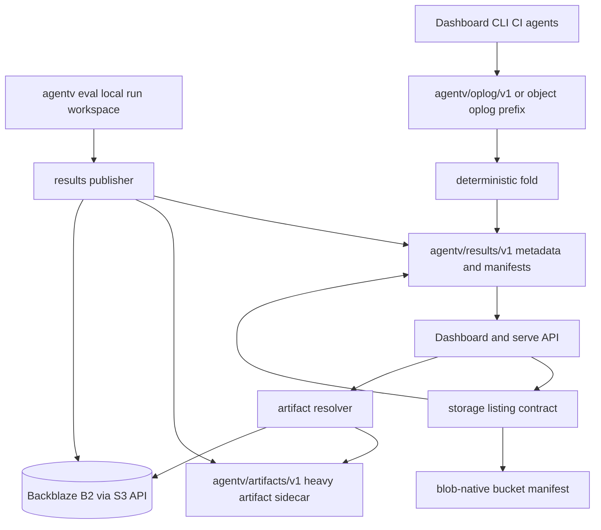

# feat: Design results storage, retention, and oplog

## Summary

This spec turns `av-quf` into the implementation contract for AgentV results storage. It keeps `git-native` as the default, adds explicit `hybrid` and `blob-native` modes, pins the canonical sibling refs, defines retention and object-store migration rules, and keeps mutable run operations in an append-only oplog with materialized read state.

This is a design/spec artifact only. It does not implement source changes.

---

## Source Inputs

- `tsoyang-org-wiki/ai-research-wiki/concepts/agentv-results-storage-publishing-and-retention.md`
- `tsoyang-org-wiki/ai-research-wiki/concepts/beads-dolt-storage-modes-and-federation.md`
- `av-quf`, `av-kxa`, `av-dcs`, `av-dsc`, `av-thr`, `av-8un`, `av-vwa.16.9`, `av-7uu`, and `av-kve.5` Beads context.
- Current AgentV code surfaces listed in the implementation plan below.

The first research doc is load-bearing for the single-ref git model, compact derived publication, S3-compatible object tier, Backblaze B2 preference, and rejection of windowed or per-run branches. The second research doc is load-bearing for treating git-backed data refs as high-churn side stores, keeping tracker/runtime data out of the code repo, and using compaction plus git replication instead of branch-per-worker partitioning.

---

## Problem Frame

AgentV already has the beginning of a git-native results store. `packages/core/src/evaluation/results-repo.ts` defaults to `agentv/results/v1`, creates a deterministic orphan genesis commit, lists remote runs with `git ls-tree`, reads `index.jsonl` blobs through `git cat-file --batch`, reads sibling `summary.json` blobs for metadata when present, publishes run trees without checking out the storage branch, and has support for the heavy artifact sidecar ref `agentv/artifacts/v1`.

The next storage beads need one reviewed contract before implementation splits across retention, object storage, publication export, path-sharding assessment, and mutable operations. Without that contract, each bead could accidentally create its own branch layout, backend abstraction, transcript boundary, or dashboard read model.

The product boundary stays unchanged: AgentV remains the repo-native and workspace-native source of truth for run artifacts. Object storage, SQLite, and publication exports are storage tiers, caches, or derived projections over AgentV artifacts. Phoenix is link-out correlation only when safe `external_trace` metadata points at independently emitted spans; it is not an AgentV artifact projection or storage tier. A `project` holds runs, traces, and experiments; a `benchmark` is a curated eval suite, and the per-run `summary.json` artifact keeps that artifact name.

---

## Requirements

### Storage Modes

- R1. `git-native` remains the default storage mode and preserves current git-backed behavior when no new mode is configured.
- R2. `hybrid` keeps git as the metadata, index, benchmark, synopsis, and materialized state store while storing selected heavy payloads in object storage.
- R3. `blob-native` removes the git results dependency and stores run index, metadata, artifacts, and raw oplog data in object storage.
- R4. Each mode must define listing strategy, detail materialization strategy, artifact resolution, retention behavior, and sync limits.

### Git Layout

- R5. The primary git results ref is `agentv/results/v1`.
- R6. The heavy artifact sidecar git ref is `agentv/artifacts/v1`.
- R7. The mutable run/result operation log git ref is `agentv/oplog/v1`.
- R8. Git refs are path-like, so implementation must not design or create child refs under `agentv/results/v1/*`.
- R9. Git-native mode uses one results branch with deterministic orphan genesis already delivered by PR #1448.
- R10. Git-native mode must not introduce windowed branches, per-run branches, or branch-per-artifact-type refs.
- R11. Run path sharding is measurement-driven. Do not change the current `runs/<experiment>/<timestamp>/` layout until av-thr proves the need.

### Artifact Boundary

- R12. `outputs/transcript.jsonl` remains the canonical AgentV transcript/timeline artifact, aligned with av-vwa.16.9.
- R13. Optional raw provider logs are raw, provider-native evidence and are not canonical transcript sources.
- R14. No canonical `transcript.json` source of truth is introduced.
- R15. The primary results branch stores pointers to sidecar or object-store payloads, and Dashboard/serve reads those payloads lazily through the same results storage abstraction.

### Retention, Export, And Oplog

- R16. av-dcs implements prune/compact for git and hybrid modes, including migration of existing git-sidecar transcript payloads before compaction when hybrid object storage is configured.
- R17. av-kxa implements compact publication as a regenerable derived export from `summary.json`, `index.jsonl`, and run artifacts, with no required `eval.txt`.
- R18. av-8un implements raw mutable operations as per-actor append-only segments, folds tags with add-wins semantics first, and later supports `run.delete` and `run.restore` tombstones.
- R19. Dashboard reads materialized final state stored with run/result data, not raw oplog segments.

### Object Tier

- R20. The object-storage target is the existing Backblaze B2 account through the S3-compatible API.
- R21. Implementation uses a standard S3 SDK/client, not B2-native APIs.
- R22. Credentials are sourced from BWS, environment, or config references and are never persisted as secret values in config, artifacts, logs, docs, or tests.
- R23. Object pointers are content-addressed and verify `sha256` plus `size` before reads are trusted.

---

## Key Technical Decisions

- KTD1. Use `git-native`, `hybrid`, and `blob-native` as storage backend modes. The current `results.mode: github` is transport-era naming and should not become the long-term storage-mode field.
- KTD2. Add new wire fields in snake_case, such as `storage_mode` and `object_store`, while keeping TypeScript internals in camelCase, such as `storageMode` and `objectStore`.
- KTD3. Keep the git-backed listing contract centered on `index.jsonl` as the discovery anchor and sibling `summary.json` as run aggregate metadata. Do not add a new canonical SQL, JSON index, or `eval.txt` authoring surface.
- KTD4. Keep `agentv/results/v1`, `agentv/artifacts/v1`, and `agentv/oplog/v1` as sibling refs. Do not use refs like `agentv/results/v1/artifacts`.
- KTD5. Use one artifact sidecar ref with typed path prefixes. Start with prefixes such as `transcripts/`, `traces/`, `raw-logs/`, `outputs/`, and `screenshots/`; do not use one branch per artifact type unless measurement later proves it is needed.
- KTD6. Do not shard `runs/` in this spec. The lightweight measurement below shows current realistic scale is acceptable, and av-thr owns deeper profiling before any layout change.
- KTD7. Hybrid mode offloads heavy artifacts at publish time. Existing git-stored payloads need an explicit av-dcs migration and compaction pass to reclaim git history.
- KTD8. Blob-native mode uses object storage as the store of record, including run manifests and oplog segments. It should share logical pointer and manifest shapes with git-backed modes, but it should not emulate git refs.
- KTD9. Backblaze B2 is used through a standard S3-compatible client with endpoint, region, bucket, prefix, and env/config credential sourcing.
- KTD10. SQLite is a local rebuildable projection only. av-7uu may consume the storage listing contract, but SQLite must stay deletable and non-canonical.
- KTD11. Phoenix/KVE work remains link-out/read-model-only when safe external trace metadata exists. Dashboard list routes should consume storage listing or manifest contracts, not duplicate backend storage implementation.

---

## Current Surface Findings

- `packages/core/src/evaluation/result-artifact-contract.ts` already defines `AGENTV_RESULTS_PRIMARY_REF`, `AGENTV_RESULTS_ARTIFACTS_REF`, and `AGENTV_RESULTS_OPLOG_REF` with the required values.
- `packages/core/src/evaluation/results-repo.ts` already has deterministic orphan genesis, direct run-tree publishing, sidecar pointer collection, sidecar publish, `listGitRuns()`, `materializeGitRun()`, and `readGitResultArtifact()`.
- `packages/core/src/evaluation/run-artifacts.ts` already emits canonical `outputs/transcript.jsonl` and `outputs/trace.json` pointers through `artifact_pointers`.
- Existing sidecar key behavior needs alignment with KTD5. `buildArtifactPointer()` starts with typed families, while `rewritePublishedIndexLine()` currently rewrites pointer keys toward `runs/<run-path>/<pointer.path>`. av-vwa.16.9 or av-dsc should settle and test the typed-prefix key shape before more artifact families are added.
- `apps/cli/src/commands/results/run-oplog.ts` currently centralizes final-state and watermark shapes, but explicitly does not implement raw oplog storage. av-8un owns that implementation.
- `apps/cli/src/commands/results/remote-metadata.ts` currently writes tag overlays under `metadata/runs/**/tags.json`. av-8un should treat this as compatibility materialized state and migration input, not as the raw operation store.
- `apps/cli/src/commands/results/serve.ts` already resolves sidecar artifacts lazily for transcript/file detail endpoints through `readSidecarArtifactText()`, but list and aggregate routes still materialize remote runs before reading lightweight data. av-kve.5 and av-7uu own making list views depend on manifests or projections without duplicating storage backends.

---

## Lightweight Path-Sharding Measurement

I ran a temp-only Git measurement on 2026-06-21 using the current `runs/<experiment>/<timestamp>/` shape. Each synthetic run had a small `summary.json` and `index.jsonl`; the measurement approximates `listGitRuns()` by listing tree paths and batch-reading all manifest blobs.

| Runs | `git ls-tree` | `git cat-file --batch` for benchmarks | Benchmark paths |
| ---: | ---: | ---: | ---: |
| 50 | 11 ms | 34 ms | 50 |
| 200 | 17 ms | 76 ms | 200 |
| 1,000 | 40 ms | 469 ms | 1,000 |
| 3,000 | 107 ms | 2,090 ms | 3,000 |

This is a single warm local sample, not a final benchmark. It is enough to reject a speculative layout change for expected AgentV dogfood volume, which av-thr estimates at tens to low hundreds of runs per year. av-thr should repeat with real artifact shapes, cold and warm clones, partial clone behavior, dashboard pagination, and low-thousands stress cases before proposing any `runs/` sharding.

Acceptance for av-thr: close as no-op if realistic 50-200 run volumes stay within Dashboard and CLI latency budgets; only introduce sharding if measured list or materialization cost becomes user-visible at realistic scale. No windowed or per-run branches are allowed either way.

---

## High-Level Technical Design

| Mode | Listing/index strategy | Heavy artifact strategy | Raw oplog location | Retention strategy |
| --- | --- | --- | --- | --- |
| `git-native` | `git ls-tree` over `agentv/results/v1:runs/**`, batch-read `summary.json`, read `index.jsonl` for detail | `agentv/artifacts/v1` sidecar ref with typed prefixes | `agentv/oplog/v1` | av-dcs prune/compact refs plus eventual GitHub GC |
| `hybrid` | Same git listing for metadata, benchmark, index, synopsis, and materialized state | Content-addressed B2 objects, with git pointers | `agentv/oplog/v1` unless explicitly moved later | av-dcs git compaction plus B2 lifecycle rules |
| `blob-native` | Bucket manifest is the fast path; `ListObjectsV2` over stable prefixes is fallback/rebuild | All artifacts are B2 objects | Object-store oplog prefix | Bucket lifecycle, manifest compaction, and delete tombstones |

---

## 1. Storage Backend Abstraction And Modes

**Decision:** Introduce a narrow results storage abstraction while preserving the existing git code as the `git-native` adapter. The abstraction should cover publish, list, materialize/read run detail, resolve artifact bytes, sync/status, retention hooks, and raw oplog segment IO. It should not make Dashboard or SQLite own backend-specific storage logic, and it must not make Phoenix a storage backend or AgentV artifact projection target.

**File and function-level implementation plan:**

- `packages/core/src/evaluation/loaders/config-loader.ts`
  - Extend `ResultsConfig` and `parseResultsConfig()` with `storage_mode?: 'git-native' | 'hybrid' | 'blob-native'`.
  - Add `object_store` with snake_case wire fields such as `endpoint`, `region`, `bucket`, `prefix`, `credentials`, and optional `force_path_style`.
  - Preserve current `repo_url`, `repo_path`, `branch`, `remote`, `path`, `sync`, and `branch_prefix` semantics for missing `storage_mode`.
- `packages/core/src/evaluation/validation/config-validator.ts`
  - Validate `storage_mode` values.
  - Validate `object_store` only when `storage_mode` is `hybrid` or `blob-native`.
  - Keep `project` config rules aligned with top-level `results`.
- `packages/core/src/projects.ts`
  - Add project-registry YAML support for `results.storage_mode` and `results.object_store`.
  - Translate snake_case YAML to camelCase internals in `fromYaml()` and `toYaml()`.
- New core module, suggested name `packages/core/src/evaluation/results-storage.ts`
  - Define `ResultsStorageBackend`, `ResultsRunListing`, `ResultsArtifactLocator`, and `ResultsBackendMode`.
  - Keep interface methods small: list runs, get run manifest, materialize run if needed, read artifact, write run, write oplog segment, compact/prune when supported.
- `packages/core/src/evaluation/results-repo.ts`
  - Keep existing git helpers as the `git-native` adapter implementation.
  - Do not rename `listGitRuns()`, `materializeGitRun()`, or `directPushResults()` in the first slice unless a wrapper can preserve imports.
- `apps/cli/src/commands/results/remote.ts`
  - Replace direct `config.mode === 'github'` branching with backend-mode dispatch.
  - Keep `git-native` behavior byte-compatible.
- `apps/cli/src/commands/results/serve.ts`
  - Resolve a backend reader once per project/data context and pass it to list/detail/artifact helpers.
  - Do not move Dashboard route logic into storage adapters.
- Tests:
  - `packages/core/test/evaluation/validation/config-validator.test.ts`
  - `packages/core/test/projects.test.ts`
  - `packages/core/test/evaluation/results-repo.test.ts`
  - `apps/cli/test/commands/results/remote-auto-export.test.ts`
  - `apps/cli/test/commands/results/serve.test.ts`

**Listing/index strategy by mode:**

- `git-native`: `listGitRuns()` remains the fast path. It lists `runs/**/index.jsonl` on `agentv/results/v1`, batch-reads those JSONL blobs, and reads sibling `summary.json` blobs for run-level metadata when present.
- `hybrid`: same listing as `git-native`; heavy payloads are not required for list views. Pointer records in `index.jsonl` decide whether detail reads use git sidecar or S3.
- `blob-native`: maintain a bucket manifest, for example a compact run listing object under a stable prefix, as the fast path. Use paginated `ListObjectsV2` over `runs/` or manifest prefixes as a rebuild/fallback path. Manifest reads are cheaper for Dashboard; ListObjectsV2 is simpler but can become expensive and pagination-sensitive.

**Acceptance criteria:**

- Existing git-backed configs work without adding `storage_mode`.
- `git-native` mode uses current git behavior.
- `hybrid` and `blob-native` can be configured without adding implementation-specific code to Dashboard components.
- Config surfaces keep wire fields snake_case and TypeScript internals camelCase.

**Downstream beads:** av-dsc consumes the object-store fields and adapter, av-7uu consumes listing/index contracts, av-kve.5 consumes lightweight list behavior.

---

## 2. Git-Native Branch Layout

**Decision:** Keep one primary results branch with deterministic orphan genesis. Do not add windowed branches, per-run branches, child refs under the primary ref, or branch-per-artifact-type refs. The primary results ref is `agentv/results/v1`; the sidecar and oplog are sibling refs.

**File and function-level implementation plan:**

- `packages/core/src/evaluation/result-artifact-contract.ts`
  - Keep `AGENTV_RESULTS_PRIMARY_REF = 'agentv/results/v1'`.
  - Keep `AGENTV_RESULTS_ARTIFACTS_REF = 'agentv/artifacts/v1'`.
  - Keep `AGENTV_RESULTS_OPLOG_REF = 'agentv/oplog/v1'`.
  - Add any future pointer fields additively and in snake_case wire conversions.
- `packages/core/src/evaluation/results-repo.ts`
  - Keep `DEFAULT_RESULTS_BRANCH = AGENTV_RESULTS_PRIMARY_REF`.
  - Keep `RESULTS_REPO_RUNS_DIR = 'runs'` and `RESULTS_REPO_METADATA_DIR = 'metadata'`.
  - Keep `createOrphanResultsBranch()` and `createResultsGenesisCommit()` behavior from PR #1448.
  - Keep `commitResultsRunWithTemporaryIndex()` and `directPushResults()` writing to one storage branch.
  - If future sharding is approved by av-thr, isolate path construction behind a helper so `listGitRuns()` and `materializeGitRun()` can read both old and new layouts.
- `apps/cli/src/commands/results/remote.ts`
  - Keep `getResultsStorageRef()` resolving to the configured primary ref for git-backed modes.
  - Preserve `encodeRemoteRunId()` and `decodeRemoteRunId()` behavior.
- Tests:
  - `packages/core/test/evaluation/results-repo.test.ts` for deterministic genesis, single-branch publish, existing unsharded layout, sidecar sibling ref use, and no child refs.
  - `apps/cli/test/commands/results/remote-auto-export.test.ts` for publish behavior through CLI paths.

**Path-sharding decision:**

The current `runs/<experiment>/<timestamp>/` shape remains. The temp measurement above supports this for realistic scale. av-thr owns deeper measurement and any future compatibility design. If av-thr later proves sharding is needed, prefer a minimal time or ID prefix inside `runs/` on the same results branch, with legacy unsharded read support.

**Acceptance criteria:**

- Git-backed implementations publish to `agentv/results/v1`, `agentv/artifacts/v1`, and `agentv/oplog/v1` only.
- No implementation creates `agentv/results/v1/*` child refs.
- No implementation creates windowed, per-run, or branch-per-artifact-type refs.
- av-thr records measurement before any `runs/` layout change.

**Downstream beads:** av-thr owns measurement and optional sharding; av-dcs relies on one branch for compaction; av-8un relies on sibling oplog ref.

---

## 3. Artifact Sidecar And Transcript Boundary

**Decision:** Keep `outputs/transcript.jsonl` as the canonical AgentV transcript/timeline artifact. The primary results branch stores pointers. Heavy payload bytes live either on `agentv/artifacts/v1` with typed path prefixes or in B2 object storage. Optional raw provider logs stay raw/non-canonical.

**File and function-level implementation plan:**

- `packages/core/src/evaluation/run-artifacts.ts`
  - Keep `CANONICAL_TRANSCRIPT_ARTIFACT_PATH = 'outputs/transcript.jsonl'`.
  - Keep `buildTranscriptPointer()` and `buildArtifactPointers()` emitting transcript pointers when canonical transcript JSONL exists.
  - Keep optional raw provider log paths under raw output paths and do not promote them to canonical timeline data.
  - Align `buildSidecarArtifactKey()` with the typed-prefix sidecar decision.
- `packages/core/src/evaluation/result-artifact-contract.ts`
  - Keep `TRANSCRIPT_JSONL_MEDIA_TYPE = 'application/x-ndjson'`.
  - Keep transcript and trace pointer wire fields as snake_case: `object_version`, `schema_version`, and `media_type`.
  - Add object-store locator fields additively if av-dsc needs them.
- `packages/core/src/evaluation/results-repo.ts`
  - Update `artifactSidecarKey()` and `rewritePublishedIndexLine()` to preserve typed sidecar prefixes.
  - Keep `prepareArtifactSidecar()` verifying checksums before publishing payloads.
  - Keep `preparePublishedResultsSource()` omitting moved payloads from the primary results commit.
- `apps/cli/src/commands/results/serve.ts`
  - Keep `resolveRecordArtifactPointer()` resolving `artifact_pointers.transcript` before direct `transcript_path`.
  - Keep `readSidecarArtifactText()` lazy and route it through the storage backend resolver for hybrid/blob-native.
  - Do not fetch transcript payloads in run list endpoints.
- `apps/dashboard/src/components/TranscriptTimeline.tsx`
  - Keep parsing only canonical `outputs/transcript.jsonl`.
  - Keep raw provider logs accessible through file/detail routes, not as timeline source.
- Tests:
  - `apps/cli/test/commands/eval/artifact-writer.test.ts`
  - `apps/cli/test/commands/results/serve.test.ts`
  - `apps/dashboard/src/components/transcript-timeline.test.tsx`
  - `packages/core/test/evaluation/results-repo.test.ts`

**Implementation issue to record for av-vwa.16.9/av-dsc:**

Current pointer construction and publish-time key rewrite are not fully aligned. The typed-prefix decision requires a single key convention before more families are added. The preferred shape is `transcripts/<run-path>/<test-or-artifact-path>` and equivalent family prefixes on `agentv/artifacts/v1`, then content-addressed keys in object storage. If compatibility with existing `runs/<run-path>/<pointer.path>` sidecar keys is needed, implement a fallback reader and migrate during av-dcs compaction.

**Acceptance criteria:**

- `outputs/transcript.jsonl` stays canonical.
- No canonical `transcript.json` is introduced.
- Sidecar payloads are read lazily through the same results repo clone/backend path.
- Primary results records contain pointers, checksums, sizes, schema versions, media types, and logical paths rather than duplicating heavy bytes.

**Downstream beads:** av-vwa.16.9 owns transcript schema language; av-dsc owns object pointer storage; av-dcs owns sidecar migration.

---

## 4. Retention And Compaction

**Decision:** Git and hybrid modes use explicit prune/compact commands over dedicated data refs. Hybrid migration uploads existing heavy sidecar payloads to B2 before rewriting pointers and compacting refs. Blob-native retention relies on bucket lifecycle plus manifest compaction. GitHub object reclamation remains eventual after history rewrites.

**File and function-level implementation plan:**

- New CLI command, suggested file `apps/cli/src/commands/results/prune.ts` or `apps/cli/src/commands/results/compact.ts`
  - Add command registration in `apps/cli/src/commands/results/index.ts`.
  - Support retention selectors such as keep last N runs and keep N days.
  - Keep command wording explicit about logical prune versus history compaction.
- `packages/core/src/evaluation/results-repo.ts`
  - Add helpers to enumerate run directories from `agentv/results/v1`.
  - Add a temp-index rewrite helper that builds a new tree containing only retained `runs/**`, retained `metadata/runs/**`, and updated materialized state.
  - Re-root compacted refs on deterministic genesis, then force-update only the dedicated results/artifacts/oplog refs.
  - Never switch the source worktree off its current branch.
- `packages/core/src/evaluation/result-artifact-contract.ts`
  - Keep pointer shape stable so migrated object pointers can be validated by old and new readers when possible.
- S3 helper from av-dsc, suggested file `packages/core/src/evaluation/results-object-store.ts`
  - Upload referenced sidecar payloads.
  - Verify `sha256` and `size` before rewriting pointers.
  - Use content-addressed object keys.
- `apps/cli/src/commands/results/remote.ts`
  - Reuse backend configuration and status handling for prune/compact operations.
- Tests:
  - `packages/core/test/evaluation/results-repo.test.ts` with tmp-git integration coverage for prune, compact, retained runs, removed runs, sidecar migration, idempotence, and no source-worktree checkout.
  - `apps/cli/test/commands/results/serve.test.ts` for retained runs listing after compaction.
  - MinIO-compatible tests under the av-dsc object-store test harness for migration pointer rewrite.

**Git/hybrid prune/compact flow for av-dcs:**

1. Resolve the backend and retention selector.
2. List runs through the backend listing contract.
3. Compute retained run paths and pruned run paths.
4. In `git-native`, rewrite `agentv/results/v1` to contain retained data and compact the ref history.
5. In `hybrid`, first upload referenced `agentv/artifacts/v1` payloads for pruned or migrated runs to B2 through the S3-compatible client, verify `sha256` and `size`, rewrite retained run pointers as needed, then compact `agentv/results/v1` and `agentv/artifacts/v1`.
6. Retain raw oplog segments needed to rebuild materialized state for retained runs. Future delete/restore tombstones should remain until their materialized state is compacted and watermarked.
7. Document that GitHub may keep unreachable objects until server-side GC runs.

**Bucket lifecycle policy shape for hybrid/blob-native:**

- Hybrid: lifecycle applies to heavy payload prefixes, not git metadata. Use object tags or prefix classes to expire unreferenced raw logs earlier than canonical transcripts if product policy allows.
- Blob-native: lifecycle can expire complete run prefixes only after manifests and materialized state reflect deletion or archival. Keep manifest compaction separate from lifecycle expiration.
- B2: use B2 lifecycle rules through the bucket configuration. CI can validate rule-generation shape without requiring real expiration.
- AWS-compatible docs can mention IA/Glacier/expiration as optional behavior, but B2 is the dogfood target.

**Acceptance criteria:**

- av-dcs can prune old runs and keep retained runs readable in Dashboard.
- Sidecar migration is resumable and verifies payload integrity before pointer rewrite.
- GitHub eventual-GC caveat is documented.
- Bucket lifecycle examples do not include secret values and do not delete metadata before payload references are removed.

**Downstream beads:** av-dcs owns prune/compact; av-dsc supplies object-store client and B2 dogfood; av-8un supplies oplog retention semantics.

---

## 5. Compact Derived Publication Export

**Decision:** Public/compact publication is a regenerable derived export over AgentV run artifacts. It is not a new source of truth and does not require `eval.txt`.

**File and function-level implementation plan:**

- `apps/cli/src/commands/results/export.ts`
  - Keep `buildProjectionBundleFromExportedIndex()` as a pattern for derived exports.
  - Add av-kxa export entry points for rollup/synopsis output, either as flags on `results export` or a new subcommand if the UX is clearer.
  - Read from `summary.json`, `index.jsonl`, and selected run artifacts.
- New helper, suggested file `apps/cli/src/commands/results/publication-export.ts`
  - Build per-eval rollup JSON from `summary.json` plus `index.jsonl`.
  - Build per-test/run synopsis records with status, duration, pass/fail, score, target, and artifact pointers.
  - Keep output compact enough for static sites and leaderboard-like views.
- `apps/cli/src/commands/eval/artifact-writer.ts`
  - Remains the source of artifact schemas; do not duplicate schema generation in export code.
- `apps/cli/src/commands/results/manifest.ts`
  - Reuse manifest parsing rather than ad hoc JSONL parsing.
- `apps/dashboard/src/*`
  - Dashboard/leaderboard consumers may read the compact derived artifact, but detail routes must keep lazy access to canonical run artifacts.
- Tests:
  - `apps/cli/test/commands/results/export.test.ts` if added, or the closest existing results export test location.
  - `apps/cli/test/commands/eval/artifact-writer.test.ts` for schema compatibility.
  - Dashboard tests only if av-kxa adds a UI consumer.

**No required `eval.txt`:**

`summary.json` already carries eval/run metadata, and `index.jsonl` is the durable per-test contract. If a human-readable label is useful, derive it in the export from existing metadata. Do not require an authored or generated `eval.txt` file.

**Acceptance criteria:**

- av-kxa produces compact per-eval rollup and per-test/run synopsis JSON.
- The export is deterministic and regenerable from canonical artifacts.
- Raw bundles remain unchanged.
- Public viewers can read compact artifacts without loading every raw run bundle.

**Downstream beads:** av-kxa owns this implementation; av-kve.5 may consume the compact artifact for dashboard/public list views only if it stays derived.

---

## 6. Oplog And Materialized State

**Decision:** Raw mutable operations are append-only per actor and separate from the primary results ref. Materialized final state is stored with run/result data on `agentv/results/v1` and read by Dashboard. Tags are implemented first as an add-wins set. Later `run.delete` and `run.restore` operations are tombstones/restores, not physical artifact deletion.

**File and function-level implementation plan:**

- `apps/cli/src/commands/results/run-oplog.ts`
  - Replace the current `run.tags.set`-only envelope with additive operation types: `tag.add`, `tag.remove`, later `run.delete`, and `run.restore`.
  - Keep wire fields snake_case: `schema_version`, `op_id`, `authored_at`, `actor`, `actor_kind`, `target_kind`, `target_id`, `target_path`, `op_type`, `value`, and optional `reason`.
  - Add fold helpers that produce `RunFinalState` and `RunOplogWatermark`.
- New raw storage helper, suggested file `apps/cli/src/commands/results/run-oplog-storage.ts` or core equivalent
  - In git-backed modes, write per-actor segments under `agentv/oplog/v1`, for example `actors/<actor_id>/<segment>.jsonl`.
  - In blob-native mode, write equivalent object-store prefix segments.
  - Avoid multiple actors appending to the same file.
- `apps/cli/src/commands/results/remote-metadata.ts`
  - Treat existing `metadata/runs/**/tags.json` as materialized compatibility state.
  - Add migration that converts existing overlays into seed `tag.add` operations plus materialized final state.
  - Stop writing raw tag changes directly as final state once raw oplog storage lands.
- `packages/core/src/evaluation/results-repo.ts`
  - Add git-backed raw oplog publish/read helpers if owned in core.
  - Keep raw oplog commits off `agentv/results/v1`.
- `apps/cli/src/commands/results/serve.ts`
  - Keep `readRunTagFields()` and route responses reading final materialized state.
  - Do not fold raw oplog in Dashboard list/detail request paths.
  - Add stale-watermark response fields if materialized state lags raw oplog.
- `apps/dashboard/src/lib/types.ts`
  - Keep `final_state` and `oplog_watermark` as the Dashboard wire read model.
- Tests:
  - `apps/cli/test/commands/results/run-oplog.test.ts`
  - `apps/cli/test/commands/results/run-tags.test.ts`
  - `apps/cli/test/commands/results/remote-metadata.test.ts`
  - `apps/cli/test/commands/results/serve.test.ts`
  - `packages/core/test/evaluation/results-repo.test.ts` if raw git ref IO lives in core.

**Fold semantics for av-8un:**

- Operation segments are append-only and immutable.
- Each actor writes only its own segment path, avoiding git content conflicts.
- Tags fold per tag value.
- Sequential add then remove resolves to absent.
- Sequential remove then add resolves to present.
- Truly concurrent same-tag add/remove resolves add-wins with deterministic ordering/tie-break.
- `run.delete` marks materialized lifecycle as `deleted`; `run.restore` returns it to `active` unless a later delete wins.
- Physical pruning remains av-dcs retention work, not ordinary mutable-state editing.

**Watermark semantics:**

Materialized state stored with run/result data includes an oplog watermark. For git-backed modes the watermark should include the `agentv/oplog/v1` ref identity plus per-actor segment offsets or last op IDs. For blob-native mode it should include object versions, etags, or manifest sequence values. Dashboard treats stale materialized state as a sync/reconcile status, not as a reason to fold raw oplog on every render.

**Acceptance criteria:**

- Raw operations live on `agentv/oplog/v1` or the blob-native equivalent prefix.
- Final tags and lifecycle state live with run/result data on `agentv/results/v1` or blob-native run manifests.
- Dashboard reads materialized state.
- Concurrent actors can publish without writing the same raw segment file.
- Existing tag overlays migrate to seed operations plus materialized final state.

**Downstream beads:** av-8un owns raw oplog, fold, migration, and materialized read model. av-dcs later consumes oplog retention rules.

---

## 7. S3-Compatible Object Tier

**Decision:** Use the existing Backblaze B2 account through the S3-compatible API with a standard S3 SDK/client. The object tier is optional and off by default. It powers `hybrid` heavy payload offload and `blob-native` full storage.

**File and function-level implementation plan:**

- New core object-store module, suggested file `packages/core/src/evaluation/results-object-store.ts`
  - Create a standard S3 client from endpoint, region, bucket, prefix, and credentials.
  - Implement put, get, head, list, delete, and presign operations.
  - Use SDK commands such as put/get/head/list/delete and presigner equivalents through a standard S3-compatible SDK/client.
  - Do not call Backblaze B2 native APIs.
- `packages/core/src/evaluation/loaders/config-loader.ts`
  - Parse `results.object_store` without resolving secrets into persisted config.
  - Support env/config references for endpoint, region, bucket, prefix, access key ID, and secret key.
- `packages/core/src/evaluation/result-artifact-contract.ts`
  - Extend pointer shape additively for object storage if needed.
  - Preserve `sha256`, `size`, `object_version`, `schema_version`, `media_type`, `family`, and logical `path`.
- `packages/core/src/evaluation/results-repo.ts`
  - In `hybrid`, upload heavy payloads before primary results commit so large bytes never enter git history.
  - Keep primary git commit containing only metadata, index, benchmark, synopsis, and object pointers.
- `apps/cli/src/commands/results/serve.ts`
  - Resolve object pointers lazily on detail/file/transcript endpoints.
  - Use presigned URLs only when callers need direct browser/download access; otherwise stream through the local server to keep auth centralized.
- Tests:
  - MinIO or S3-compatible CI tests for put/get/head/list/presign and pointer verification.
  - Real B2 dogfood manual or gated integration test before av-dsc is considered complete.
  - `apps/cli/test/commands/results/serve.test.ts` for lazy object reads and checksum failures.

**Credential sourcing:**

Use BWS to populate environment variables or runtime config before launching AgentV. Suggested env names can follow S3 conventions and AgentV-specific names, for example `AWS_ACCESS_KEY_ID`, `AWS_SECRET_ACCESS_KEY`, `AWS_REGION`, `AGENTV_RESULTS_S3_ENDPOINT`, `AGENTV_RESULTS_S3_BUCKET`, and `AGENTV_RESULTS_S3_PREFIX`. AgentV should read env/config values, not invoke BWS as a required runtime dependency unless a later user-facing workflow explicitly needs that convenience.

**Pointer and verification shape:**

Object keys should be content-addressed, such as `sha256/<hash>` under an AgentV prefix, with optional logical aliases in manifests if needed. A read is trusted only after `sha256` and `size` match the pointer. `object_version` may be `sha256:<hash>` for immutable content or the object-store version/etag where the provider makes that useful.

**Dogfood and CI strategy:**

- av-dsc must dogfood against the real existing Backblaze B2 account through the S3-compatible endpoint.
- CI should use MinIO or another S3-compatible test target.
- Tests must not require persisted secrets and must skip or gate real B2 integration unless credentials are explicitly present.

**Acceptance criteria:**

- Hybrid offloads heavy artifacts at publish time and never commits those bytes to git.
- Blob-native can write, list, read, and serve a full run without a git results branch.
- The implementation uses a standard S3-compatible SDK/client.
- Secrets are not committed, logged, or embedded in artifacts.
- Checksums and sizes are verified on upload/read/migration.

**Downstream beads:** av-dsc owns this implementation; av-dcs uses it for migration; av-kxa can export object pointers without owning object storage.

---

## 8. SQLite Index, Dashboard, And Phoenix Boundaries

**Decision:** av-7uu may build a local rebuildable SQLite projection over canonical storage listings and manifests, but SQLite is not canonical. av-kve.5 Dashboard work should consume manifest/listing contracts and stay out of storage backend implementation. Phoenix work is limited to safe link-out correlation from external trace metadata; it must not consume AgentV storage as a projection/export target.

**File and function-level implementation plan:**

- av-7uu likely files:
  - New index adapter under `packages/core/src/evaluation/results-index*` or `apps/cli/src/commands/results/*` as selected by that bead.
  - Dashboard server integration in `apps/cli/src/commands/results/serve.ts`.
  - Dashboard type and API updates in `apps/dashboard/src/lib/types.ts` and `apps/dashboard/src/lib/api.ts`.
- av-kve.5 likely files:
  - `apps/cli/src/commands/results/serve.ts` list/aggregate handlers.
  - `apps/dashboard/src/components/RunList.tsx`, `AnalyticsTab.tsx`, and related list/compare views only when UI behavior changes.
- Phoenix boundary:
  - Phoenix-specific link helpers remain outside this spec's ownership.
  - Any Dashboard trace/session read model stays a projection over AgentV run artifacts and may only link out to Phoenix through safe `external_trace` UI URLs.

**Contract for av-7uu:**

- SQLite can cache run summaries, fingerprints, manifest facts, tag final state, and aggregate fields.
- SQLite can be deleted and rebuilt from `agentv/results/v1`, object-store manifests, local run workspaces, and materialized state.
- SQLite must not be pushed as the canonical result store.
- SQLite must not parse full transcripts in foreground list paths.

**Contract for av-kve.5 and Phoenix link-out correlation:**

- Dashboard list views should stay on benchmark/index manifests, compact derived exports, storage listing contracts, or the rebuildable SQLite projection.
- Detail routes can lazily resolve transcript, trace, and arbitrary artifact payloads.
- Phoenix link-out code should reference safe external trace links only. It must not reimplement storage backends or export AgentV artifacts into Phoenix.

**Acceptance criteria:**

- av-7uu can consume this spec without changing canonical storage.
- av-kve.5 can improve Dashboard list routes without creating a second backend.
- Phoenix work remains link-out correlation only and does not alter the AgentV storage contract.

**Downstream beads:** av-7uu and av-kve.5.

---

## Alternatives Rejected

- **Windowed branches or per-run branches:** Rejected because the research docs found no useful precedent, Beads retired branch-per-worker style partitioning, and one branch with path organization keeps listing, compaction, and sync simpler.
- **Child refs under `agentv/results/v1/*`:** Rejected because Git refs are path-like and a ref cannot safely coexist with child refs beneath the same path.
- **Branch-per-artifact-type sidecars:** Rejected until measurement proves a need. One `agentv/artifacts/v1` ref with typed prefixes is simpler to validate, fetch, compact, and migrate.
- **Canonical `transcript.json`:** Rejected because it duplicates `outputs/transcript.jsonl` and creates drift risk. JSON object summaries should be derived indexes or synopses with different names.
- **Required `eval.txt`:** Rejected because `summary.json` and `index.jsonl` already carry the durable machine-readable contract, and publication is derived.
- **B2-native APIs:** Rejected because Backblaze B2's S3-compatible endpoint lets AgentV use standard S3 clients, MinIO CI, and portable user configuration.
- **Vercel Blob as a dependency:** Rejected because it is provider-specific and weaker than the desired content-addressed private bucket model.
- **SQLite as canonical storage:** Rejected because it would move AgentV away from portable run artifacts. SQLite is a rebuildable projection only.
- **Dashboard or Phoenix owning storage backends:** Rejected because it duplicates core storage behavior and blurs adapter boundaries. Phoenix is additionally excluded from AgentV artifact projection by the read-only correlation boundary.

---

## Risks And Mitigations

- **Pointer key drift between existing sidecar code and typed prefixes:** Add compatibility fallback reads and migrate during compaction if existing published data uses `runs/<run-path>/<pointer.path>`.
- **Git history rewrite surprises during compaction:** Restrict rewrites to dedicated AgentV refs, require explicit command naming, and document GitHub eventual-GC behavior.
- **Hybrid secrets leakage:** Read credentials only from env/config references and redact object-store config in status/log output.
- **Blob-native listing scalability:** Use bucket manifests for fast Dashboard reads and keep paginated `ListObjectsV2` as rebuild/fallback.
- **Oplog fold ambiguity:** Start with tags and deterministic add-wins semantics; defer richer CRDTs until a concrete mutable field needs them.
- **Stale materialized state:** Store oplog watermarks and surface stale state as sync/reconcile status.
- **Overloading project/benchmark terms:** Keep project registry language separate from per-run `summary.json` artifacts.

---

## Verification Plan

For this docs-only PR:

- Run `git diff --check`.
- Confirm the diff only changes `docs/plans/results-storage-retention-oplog-plan.md`.

For downstream implementation beads:

- av-dsc: run unit tests for config parsing, object-store client, pointer verification, MinIO integration, and real B2 dogfood when credentials are present.
- av-dcs: run tmp-git integration tests proving pruned runs disappear, retained runs list and open in Dashboard, migration verifies checksums, compaction is idempotent, and source worktrees are not switched.
- av-kxa: test compact export determinism from `summary.json`, `index.jsonl`, and run artifacts; prove no required `eval.txt`.
- av-8un: test per-actor append, no-conflict publishing, tag fold ordering, add-wins concurrent add/remove, `run.delete`/`run.restore` tombstones, materialized watermark staleness, and migration from existing tag overlays.
- av-thr: repeat the path-sharding measurement with realistic artifacts, cold/warm partial clone cases, list/detail Dashboard routes, 50-200 run realistic volumes, and low-thousands stress cases.
- av-7uu and av-kve.5: test that list/aggregate paths do not read transcript bodies or trace sidecars and that SQLite can be deleted/rebuilt.

---

## Acceptance Criteria For av-quf

- This spec cites the two required research docs as source inputs.
- The storage backend taxonomy is defined as `git-native`, `hybrid`, and `blob-native`.
- The canonical refs are pinned as `agentv/results/v1`, `agentv/artifacts/v1`, and `agentv/oplog/v1`.
- The spec states that refs are path-like and rejects child refs under `agentv/results/v1/*`.
- The spec rejects windowed branches, per-run branches, and branch-per-artifact-type sidecars.
- The spec records a measurement-backed no-sharding decision for now and delegates deeper profiling to av-thr.
- The spec preserves `outputs/transcript.jsonl` as canonical and rejects canonical `transcript.json`.
- The spec defines retention/compaction and sidecar migration for av-dcs.
- The spec defines compact derived publication export for av-kxa without required `eval.txt`.
- The spec defines per-actor append-only oplog, add-wins tags, tombstones/restores, materialized state, and watermark semantics for av-8un.
- The spec defines Backblaze B2 through S3-compatible API, standard S3 SDK/client, BWS/env/config credentials, content-addressed pointers, checksum/size verification, presigned/lazy reads, real B2 dogfood, and MinIO-compatible CI for av-dsc.
- The spec keeps SQLite non-canonical for av-7uu, keeps Dashboard on manifest/listing/projection boundaries, and keeps Phoenix limited to safe external-trace link-out correlation.
- No TypeScript source, CLI implementation, Dashboard implementation, tests, package files, generated artifacts, tracker runtime state, or evidence files are changed by this PR.
