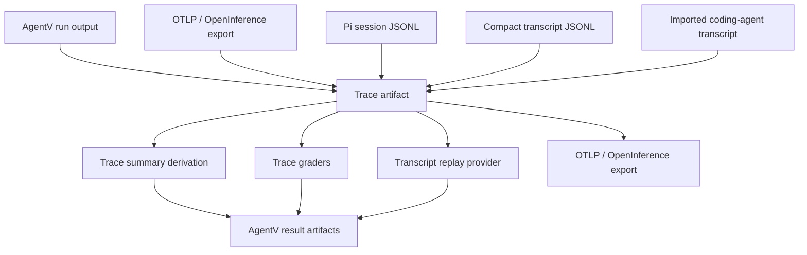

# Trace Evaluation Architecture

## Summary

Build AgentV's trace evaluation architecture around a versioned, provider-neutral trace artifact contract. AgentV should ingest traces from AgentV runs, OTLP/OpenInference exports, Pi sessions, and transcript-style agent logs; normalize them into one trace artifact model; and run existing and future graders against that model without becoming a hosted observability platform.

Update, 2026-06-18: `agentv.trace.v1` is the only AgentV trace artifact
namespace for persisted trace sidecars. The trace read-model contract in
this older plan is a derived internal projection over that artifact, not a
separate versioned document that users produce.

Update, 2026-06-21: This plan is no longer active. Phoenix-specific parts are superseded by
the read-only Phoenix correlation boundary in
[docs/adr/0005-keep-phoenix-read-only-at-agentv-artifact-boundary.md](../adr/0005-keep-phoenix-read-only-at-agentv-artifact-boundary.md).
Do not use this plan as current Phoenix product scope. AgentV does not export,
import, or project completed runs, traces, transcripts, datasets, experiments,
or indexes into Phoenix. Phoenix is optional link-out correlation only when
safe `external_trace` metadata points to
spans already emitted independently by Codex, Arize, or another hook.

---

## Problem Frame

AgentV already captures tool calls in provider `Message.toolCalls`, persists compact `TraceSummary` data, exports AgentV OTLP spans, and has early post-hoc trace commands. That is enough for local AgentV result inspection, but it is not enough to evaluate production traces or third-party agent sessions with the same grader contract.

The best-practice direction is clear: larger players own trace stores, dashboards, datasets, and experiment UIs. AgentV's niche is the repo-local, declarative evaluation harness for coding agents and tool-using agents. To connect those worlds, AgentV needs a durable trace artifact contract between raw trace sources and graders.

---

## Requirements

**Canonical Trace Artifact Contract**

- R1. AgentV must define a versioned trace artifact that preserves ordered tool calls, model turns, tool inputs, tool outputs, IDs, timing, status, errors, source metadata, and optional raw evidence.
- R2. The trace artifact contract must be provider-neutral and must not require OpenTelemetry as the source format.
- R3. The contract must support branchable session sources by selecting an evaluation path before grading.
- R4. The contract must retain enough metadata to explain grader evidence without requiring graders to parse provider-native payloads.
- R5. All persisted trace artifacts must use `snake_case`; TypeScript internals must use `camelCase`.

**Standards and Integrations**

- R6. AgentV OTLP export must continue to emit standards-aligned GenAI spans, especially `invoke_agent`, `chat`, and `execute_tool` operations.
- R7. AgentV must map trace artifacts to and from OTLP/OpenInference-style traces without making Phoenix-specific assumptions in core.
- R8. Phoenix integration, if present, must be link-out correlation for externally emitted traces; Phoenix must not become the AgentV trace, dataset, experiment, transcript, or index backend.
- R9. Unsupported or lossy mappings must be explicit in conversion reports instead of silently approximated.

**Post-Hoc Trace And Transcript Evaluation**

- R10. Existing deterministic trace graders, including `tool-trajectory` and `execution-metrics`, must run against trace artifacts, not only live provider output messages or compact summaries.
- R11. Post-hoc evaluation must accept AgentV run artifacts, AgentV OTLP files, Langfuse/OTLP exports, imported coding-agent transcripts, Pi session JSONL, and compact transcript JSONL through source-specific adapters.
- R12. Grader output must cite trace artifact evidence, such as matched tool call IDs, positions, timing, or source event IDs.
- R13. Trace evaluation must preserve current lightweight result output by deriving compact summaries from trace artifacts.

**Replay**

- R14. Trace artifacts and transcripts must support replay as well as grading: AgentV should be able to replay recorded model/tool messages as provider output for eval suites without invoking a live agent.
- R15. Replay must preserve source provider metadata, ordered messages, tool calls, tool outputs, token usage, duration, cost, and redaction state where present.
- R16. Replay and grading must share the same trace artifact so users do not maintain separate transcript and trace formats for the same session.
- R17. Replay must be configurable as a normal target substitute, such as a replay target alias replacing a live coding-agent target without changing eval YAML or grader configuration.
- R18. Replay lookup must use strict test/run identity, including at least suite or eval identity, test ID, target identity, and attempt or variant when present; missing or ambiguous records must fail loudly.
- R19. AgentV must support recording live target responses into replayable JSONL fixtures so a later replay run can execute the same graders without live LLM calls.

**Cache Configuration DX**

- R20. Existing LLM response cache support must be audited and made consistent before new replay/cache surfaces are added.
- R21. Project TS config, eval YAML, and CLI flags must expose cache enablement and cache path with clear precedence and equivalent capability.
- R22. LLM response caching must remain distinct from replay fixtures: cache stores exact provider responses to save cost during iteration; replay fixtures are curated target-output artifacts used for deterministic target substitution.

**Privacy and Operations**

- R23. Content capture must remain opt-in. Tool arguments, tool results, message text, screenshots, and thinking blocks must be gated by a single redaction/capture policy.
- R24. Local offline trace persistence must be supported for CI artifacts and PR review.
- R25. Trace import must not require live access to Hugging Face, VS Code, or provider services when a local exported artifact is available.

---

## Key Technical Decisions

- **Start from realistic characterization evals:** The first implementation phase should collect a small set of real trace fixtures and write evals that answer useful agent-quality questions. The trace artifact contract should be pressure-tested by those evals before broad schema or adapter work expands.
- **Normalize first, grade second:** Graders should consume AgentV's trace artifact contract. Importers translate raw sources into the contract; exporters translate the contract into backend-neutral OTLP/OpenInference shapes. This avoids coupling graders to Pi, VS Code, or provider-specific logs.
- **OTel is an interchange layer, not the canonical model:** VS Code and industry tooling make OTLP/HTTP and GenAI span semantics important, but entireio-style logs and Pi sessions prove valuable traces are often transcript or lifecycle JSON. AgentV should support OTel strongly without making it mandatory.
- **Tool sequence grading is turn-centric, not span-centric:** The trace artifact should model sessions, turns, messages, tool calls, tool results, and selected branches as a projection over the canonical trace artifact.
- **Coding-agent transcripts are trace sources:** `agentv import claude`, `agentv import codex`, `agentv import copilot`, and `agentv eval --transcript` already establish transcript import as offline grading infrastructure. The architecture should extend that path into trace artifact normalization instead of creating a separate trace-only mechanism.
- **Replay fixtures are not cached grader results:** AgentV replay should return previously recorded target output and then run graders fresh. This is closer to curated transcript replay than result-cache reuse, and it preserves realistic partial or failed behavior for evaluator development.
- **Replay is target substitution, not only eval mode:** `agentv eval --transcript` is useful, but the showcase should prove a replay target can replace a live target in the same eval configuration. That keeps replay aligned with AgentV's target composition model.
- **Strict lookup over fuzzy cache matching:** A replay database should fail on missing or ambiguous records rather than silently falling back to similar prompts. Smooth demo fallback can come later if real use demands it.
- **Fix cache DX before expanding cache concepts:** AgentV already has response caching through `--cache`, `--no-cache`, YAML `execution.cache`, YAML `execution.cache_path`, and TS config `cache.enabled` / `cache.path`. The plan should first make that surface coherent, including wiring TS `cache.path`, before adding any new cache-related behavior.
- **Branch selection is explicit:** Pi sessions are tree-structured. Import must choose a leaf/path or deterministic default before grading so a grader does not accidentally evaluate omitted branches.
- **Raw provider evidence stays adapter-owned:** Provider-native payloads may be stored as optional evidence for debugging, but built-in graders should use derived AgentV fields.
- **Lossiness is reportable:** Conversion should emit warnings when timing is inferred, tool outputs are unavailable, content is redacted, or source semantics cannot map cleanly.
- **Privacy policy sits at the boundary:** Import/export should apply one content capture and redaction policy before data reaches persisted artifacts or remote backends.

---

## High-Level Technical Design

AgentV should introduce a trace artifact layer between raw sources and evaluation.



The trace artifact model should stay a projection over the canonical
`agentv.trace.v1` sidecar plus derived read models:

- The trace artifact is the derived artifact for grading, replay, and explanation: ordered model turns, tool calls/results, branch metadata, source event IDs, content redaction state, and raw evidence handles.
- The compact summary is a derived compatibility/read model for cheap result storage and dashboard aggregation: counts, durations, token usage, cost, error count, and tool-call counts. It must be recomputable from a trace artifact and should not be authored as separate trace state when the artifact is available.

Directional internal projection shape:

```yaml
source:
  kind: pi_session | agentv_run | otlp | langfuse | imported_transcript | compact_transcript
  path: traces/session.jsonl
  url: https://...
session:
  session_id: ...
  conversation_id: ...
  cwd: ...
  started_at: ...
branch:
  selected_leaf_id: ...
  included_event_ids: [...]
events:
  - event_id: ...
    parent_event_id: ...
    ordinal: 12
    type: tool_call
    timestamp: ...
    duration_ms: 123
    duration_inferred: false
    turn_index: 3
    tool:
      name: read_file
      call_id: call_abc
      input: { path: src/app.ts }
      output: ...
      status: ok
      error: null
    model:
      provider: openai
      name: gpt-5
    source_ref:
      event_id: ...
      span_id: ...
      raw_kind: pi.message
```

The exact schema belongs in implementation, but these concepts should be stable: version, source, session, branch, ordered events, tool call identity, timing provenance, content capture state, and source references.

---

## Implementation Units

### U0. Realistic Characterization Evals

- **Goal:** Create the initial trace fixture set and eval questions that prove which external patterns are worth adopting.
- **Files:** `examples/showcase/trace-evaluation/`, fixture files under that showcase, focused tests under `packages/core/test/evaluation/` or `apps/cli/test/` depending on the importer surface.
- **First Milestone:** Start with a replay showcase: one live coding-agent target, one recorded replay fixture set, one replay target alias, the same graders, and proof that the replay run makes no live LLM call.
- **Patterns:** Use real shapes before generalizing. After the replay showcase works, add one AgentV native run with tool calls, one Pi session-style JSONL fixture, one VS Code/OTel-style `invoke_agent` -> `chat` -> `execute_tool` fixture, and optionally one entireio compact transcript fixture when file-change evidence is in scope.
- **Existing Surface:** Include one fixture produced by the existing transcript import pipeline (`agentv import claude`, `agentv import codex`, or `agentv import copilot`) so the showcase proves imported coding-agent transcripts are first-class trace sources.
- **Test Scenarios:** The initial evals should ask whether the agent called the right tools in order, avoided unnecessary tools, edited expected files when file-change evidence exists, recovered from a tool error, stayed inside cost/latency bounds when metrics exist, and produced grader evidence tied back to source events.
- **Verification:** If the proposed trace artifact contract cannot express these fixtures cleanly, revise the contract before expanding adapters. If a field is unused by these evals, keep it optional or defer it.

### U1. Trace Artifact Model

- **Goal:** Introduce the core TypeScript model, Zod validation, and snake_case boundary conversion for trace artifacts.
- **Files:** `packages/core/src/evaluation/trace.ts`, `packages/core/src/evaluation/types.ts`, `packages/sdk/src/schemas.ts`, new focused files under `packages/core/src/evaluation/trace/` if the existing file becomes too large.
- **Patterns:** Follow the existing `TraceSummary`, `TokenUsage`, and project boundary conversion conventions. Keep internal fields camelCase and persisted fields snake_case.
- **Test Scenarios:** Add tests that validate round-trip conversion, missing optional content, inferred duration flags, branch metadata, and raw evidence handles.
- **Verification:** Unit tests should prove summaries can be derived from trace artifacts without changing current summary behavior, and that trace artifacts do not embed a separate summary payload.

### U2. Trace Artifact Extraction From AgentV Runs

- **Goal:** Convert live provider `Message[]` output and existing AgentV result artifacts into trace artifacts.
- **Files:** `packages/core/src/evaluation/orchestrator.ts`, `packages/core/src/evaluation/providers/types.ts`, `packages/core/src/evaluation/trace.ts`, `apps/cli/src/commands/inspect/utils.ts`.
- **Patterns:** Preserve `Message.toolCalls` as the primary high-fidelity source. Keep `TraceSummary` as derived output, not the only trace representation.
- **Test Scenarios:** Cover assistant tool calls with IDs, calls without IDs, tool outputs, token usage, model metadata, errors, missing timing, and no-tool-call runs.
- **Verification:** Existing eval result baselines should continue to include compact trace summaries while full trace artifacts are available where configured.

### U3. OTLP and OpenInference Import/Export Mapping

- **Goal:** Map trace artifacts to and from OTLP JSON/HTTP-compatible spans using GenAI and OpenInference-compatible semantics where available.
- **Files:** `packages/core/src/observability/otel-exporter.ts`, `packages/core/src/observability/otlp-json-file-exporter.ts`, `apps/cli/src/commands/inspect/utils.ts`, tests under `packages/core/test/observability/` and `apps/cli/test/`.
- **Patterns:** Continue human-readable span names (`invoke_agent <agent>`, `chat <model>`, `execute_tool <tool>`) plus machine-stable attributes. Use `gen_ai.operation.name`, `gen_ai.tool.name`, `gen_ai.tool.call.id`, token usage attributes, and `agentv.*` only where standards do not cover the concept.
- **Test Scenarios:** Import an AgentV OTLP file into a trace artifact, export it back, and verify tool call order, call IDs, token usage, durations, redaction state, and grader score events survive when representable.
- **Verification:** `agentv trace show` and `agentv trace score` should work from OTLP artifacts without requiring an `agentv.score` attribute for trace-only evaluation.

### U4. Phoenix Read-Only Correlation Path

- **Goal:** Superseded for this plan by the 2026-06-21 Phoenix boundary ADR. Phoenix can be an external trace reference when spans were emitted independently, but it is not an AgentV trace, dataset, experiment, transcript, or index backend.
- **Files:** Phoenix links belong outside core and should use safe `external_trace` metadata.
- **Patterns:** Keep AgentV artifacts canonical. Do not add AgentV-to-Phoenix export/projection, direct Phoenix database access, `px` runtime requirements, or Phoenix-owned indexes.
- **Test Scenarios:** Phoenix link-out should prove missing metadata degrades cleanly and that secrets are not surfaced from `external_trace` metadata.
- **Verification:** Dashboard and AgentV result inspection must continue to work without Phoenix installed or running.

### U5. Pi Session Importer

- **Goal:** Import Pi session JSONL, including Hugging Face `pi-mono` style files, into trace artifacts.
- **Files:** `packages/core/src/evaluation/providers/pi-cli.ts`, `packages/core/src/evaluation/providers/pi-coding-agent.ts`, likely new importer files under `packages/core/src/import/` or `packages/core/src/evaluation/trace/importers/`.
- **Patterns:** Reuse existing Pi parsing where possible, but add branch/path selection. Fold `toolResult` messages into matching assistant tool calls by ID. Treat `bashExecution` mapping as explicit policy.
- **Test Scenarios:** Cover session header parsing, branch selection, assistant `toolCall` blocks, separate `toolResult` entries, `bashExecution`, inline images, thinking blocks, token usage, cost, and inferred timing.
- **Verification:** A small fixture derived from Pi's public session format should produce a deterministic ordered trace artifact and compact summary.

### U6. Compact Transcript and Lifecycle Log Importer

- **Goal:** Support transcript-style sources such as entireio compact JSONL without depending on their internal telemetry or PostHog analytics.
- **Files:** `packages/core/src/import/`, new importer files under `packages/core/src/evaluation/trace/importers/` if needed, CLI wiring under `apps/cli/src/commands/inspect/`.
- **Patterns:** Treat lifecycle and compact transcript events as source adapters. Include file mutation classification as evidence when present, not as a new built-in core grader primitive.
- **Test Scenarios:** Cover assistant content with `tool_use` blocks, tool result payloads, mutating tool file metadata, token counts, and missing OTel spans.
- **Verification:** A compact transcript fixture should score with `tool-trajectory` and `execution-metrics`.

### U6b. Existing Agent Transcript Import Integration

- **Goal:** Upgrade the current transcript import and replay path so imported Claude, Codex, and Copilot sessions can be normalized and graded as trajectories.
- **Files:** `apps/cli/src/commands/import/`, `packages/core/src/import/`, `packages/core/src/import/transcript-provider.ts`, `apps/cli/src/commands/eval/run-eval.ts`.
- **Patterns:** Reuse `TranscriptEntry`, `TranscriptJsonLine`, and `TranscriptProvider` instead of inventing a parallel transcript format. Preserve `agentv eval --transcript` compatibility while adding trace artifact derivation.
- **Test Scenarios:** Import one Claude, Codex, and Copilot fixture; replay each through `--transcript`; derive trace artifacts; run `tool-trajectory`; verify tool IDs, order, tool outputs, source provider metadata, duration, cost, token usage, and redaction state where available.
- **Verification:** Existing transcript-provider tests keep passing, and new trace-evaluation tests prove imported transcripts and OTLP exports feed the same grader path.

### U6c. Replay From Trace Artifact

- **Goal:** Let trace artifacts act as replay sources, not only grader inputs.
- **Files:** `packages/core/src/import/transcript-provider.ts`, `packages/core/src/import/types.ts`, trace artifact model files from U1, `apps/cli/src/commands/eval/run-eval.ts`.
- **Patterns:** Treat replay as a projection from a trace artifact to provider `Message[]`. Do not duplicate storage by keeping one trace file for graders and a separate transcript file for replay when the trace artifact can serve both.
- **Test Scenarios:** Replay a trace artifact generated from AgentV output, an imported transcript, and an OTLP-style trace. Verify each produces the expected provider output messages and identical compact summaries where data is representable.
- **Verification:** Existing `agentv eval --transcript` behavior remains compatible, with a migration path to replay trace artifacts directly.

### U6d. Replay Target Database Loop

- **Goal:** Make the replay database workflow first-class: record live target output, store keyed JSONL, configure a replay target, and rerun the same eval without live LLM calls.
- **Files:** `apps/cli/src/commands/eval/`, `packages/core/src/import/`, provider registry or CLI target integration files as needed, `examples/showcase/trace-evaluation/`.
- **Patterns:** Prefer a replay target or CLI/custom target adapter before adding core cache machinery. The replay fixture database should be explicit, committed, and reviewable.
- **Test Scenarios:** Run a fixture eval with a live target and record replay JSONL. Rerun with a replay target alias against shuffled fixture records containing multiple targets. Verify exact lookup by eval/test/target/attempt, equivalent provider output, fresh grader execution, and hard failure on missing or ambiguous records.
- **Verification:** The showcase demonstrates target substitution through normal target configuration, not only `--transcript` positional replay.

### U6e. Response Cache Config DX Cleanup

- **Goal:** Make existing LLM response cache configuration predictable and consistent before adding replay or new cache surfaces.
- **Files:** `packages/core/src/evaluation/config.ts`, `apps/cli/src/commands/eval/run-eval.ts`, `apps/cli/src/commands/eval/commands/run.ts`, `packages/core/src/evaluation/loaders/config-loader.ts`, tests under `packages/core/test/evaluation/` and `apps/cli/test/`.
- **Patterns:** Preserve current behavior by default: cache remains opt-in, `--no-cache` wins, temperature > 0 skips cache, and multi-trial evals disable cache. Align path handling across TS config, YAML, and CLI rather than introducing another cache mode.
- **Test Scenarios:** TS config `cache.path` is honored; YAML `execution.cache_path` is honored; CLI can override or at least clearly report the active path; `--no-cache` disables all config-driven cache; cache and replay terminology stays distinct in help/docs.
- **Verification:** Existing response-cache tests keep passing, and new CLI/config tests prove equivalent cache capability across supported config surfaces.

### U7. Grader Context Upgrade

- **Goal:** Let built-in and code graders receive trace artifacts in addition to compact summaries and output messages.
- **Files:** `packages/core/src/evaluation/graders/types.ts`, `packages/core/src/evaluation/graders/tool-trajectory.ts`, `packages/core/src/evaluation/graders/execution-metrics.ts`, `packages/core/src/evaluation/graders/code-grader.ts`, `packages/sdk/src/index.ts`, `packages/sdk/src/schemas.ts`.
- **Patterns:** Keep existing graders that only read `trace` or `output` working. Trace-aware graders use the richer object.
- **Test Scenarios:** Existing `tool-trajectory` modes should pass from live output and from trace artifact input. Argument matching, ordering, latency, status/error matching, and evidence text should be covered.
- **Verification:** `trace score` should run `tool-trajectory` against imported traces, not only metrics-only graders.

### U8. CLI and Artifact Workflow

- **Goal:** Make trace import, inspection, scoring, and export usable from the CLI without forcing users into one backend.
- **Files:** `apps/cli/src/commands/inspect/`, `apps/cli/src/commands/eval/`, result layout files under `apps/cli/src/commands/eval/`, docs/examples as needed.
- **Patterns:** Extend existing `agentv trace show`, `trace stats`, and `trace score` commands rather than creating parallel command families.
- **Test Scenarios:** CLI should accept run workspaces, `index.jsonl`, AgentV OTLP JSON, generic OTLP JSON, imported transcript JSONL, Pi JSONL, and compact transcript JSONL. It should report source kind, conversion warnings, and grader results.
- **Verification:** Functional CLI tests should use `bun apps/cli/src/cli.ts ...`; core changes require `bun run build` before CLI testing.

### U9. Documentation and Best-Practice Recipes

- **Goal:** Document the contract and the integration posture so AgentV's scope stays clear.
- **Files:** `apps/web/src/content/docs/` if public docs exist for this area, package READMEs, boundary ADRs, showcase material under `examples/showcase/trace-evaluation/`.
- **Patterns:** Document patterns instead of adding core primitives when composition is enough.
- **Test Scenarios:** Validate example eval YAML and include at least one trace-import fixture for post-hoc scoring.
- **Verification:** Docs should show recipes for local trace scoring, read-only Phoenix correlation boundaries, Pi session scoring, and OTLP export.

---

## Acceptance Examples

- AE1. **Covers R1, R10, R13.** Given an AgentV run with ordered tool calls, when the run is converted to a trace artifact, then `tool-trajectory` can grade the order and the result still has the same compact summary counts.
- AE2. **Covers R2, R7, R11.** Given an OTLP trace export with `execute_tool` spans, when `agentv trace score` runs, then AgentV imports the spans into a trace artifact and grades tool usage without requiring a Phoenix server.
- AE3. **Covers R3, R11.** Given a branchable Pi session, when a selected leaf is provided or inferred, then only the selected branch path is graded and omitted branch IDs are recorded.
- AE4. **Covers R8, R9.** Given an AgentV artifact has safe `external_trace` metadata for an independently emitted Phoenix session, when AgentV surfaces that reference, then it treats Phoenix as read-only external context and keeps AgentV artifacts canonical.
- AE5. **Covers R23.** Given content capture is disabled, when a trace with tool arguments and results is exported, then the trace artifact preserves IDs, names, timing, and redaction state but does not persist raw content.
- AE6. **Covers R12.** Given a failed tool sequence expectation, when AgentV reports the grader result, then the assertion cites the actual matched or missing tool call positions and source event IDs.
- AE7. **Covers R10, R11.** Given a transcript imported with `agentv import codex`, `agentv import claude`, or `agentv import copilot`, when the transcript is evaluated post-hoc, then the same trace graders used for OTLP traces can score it.
- AE8. **Covers R14, R15, R16.** Given the same derived artifact, when AgentV uses it for replay and for grading, then replayed provider output and grader evidence come from the same ordered messages and tool calls.
- AE9. **Covers R17, R18, R19.** Given a live target run has been recorded into replay JSONL, when the same eval runs with a replay target alias and shuffled fixture records, then AgentV selects the exact matching record, makes no live LLM call, and runs graders fresh.
- AE10. **Covers R18.** Given a replay database has no matching record or has multiple matching records for the current test and target, when replay runs, then AgentV fails with an actionable error instead of falling back to a near match.
- AE11. **Covers R20, R21, R22.** Given cache is enabled through TS config with a custom path, when an eval runs, then AgentV stores provider responses in that configured path and reports cache usage without confusing it with replay fixtures.
- AE12. **Covers R21.** Given cache is enabled in config but `--no-cache` is passed, when the eval runs, then no response cache is read or written.

---

## Scope Boundaries

Deferred for later:

- Hosted trace storage or a managed observability service.
- Any Phoenix-owned AgentV storage, transcript, index, export, projection, dataset, or experiment path.
- Langfuse or Braintrust prompt registry replacement.
- Broad RAGAS metric reimplementation inside core.
- Automatic trace mining into new eval cases, beyond import and post-hoc scoring.
- Semantic or fuzzy replay-cache matching.
- Replaying cached grader judgments as the primary replay path.
- Public leaderboard or benchmark marketplace features.

Outside this product's identity:

- Treating AgentV's custom attributes as an industry standard others must adopt.
- Requiring all trace sources to emit OpenTelemetry before AgentV can evaluate them.
- Capturing raw prompts, tool arguments, tool results, screenshots, or thinking content by default.

---

## System-Wide Impact

- **Core data model:** `TraceSummary` becomes a derived compact view of trace artifacts, not the highest-fidelity trace contract.
- **Graders:** Trace-aware graders move from output-message parsing toward trace artifact parsing while keeping compatibility with current eval results.
- **CLI:** Post-hoc trace commands become a real evaluation path, not just inspection of AgentV-generated artifacts.
- **Observability:** OTel export remains standards-aligned and becomes round-trippable enough for offline scoring.
- **Adapters:** Pi and transcript importers stay outside primitive grader logic, preserving AgentV's lightweight core. Phoenix remains read-only external correlation when safe `external_trace` metadata exists.
- **Privacy:** Redaction and content capture become an explicit boundary concern across import, persistence, export, and grading.

---

## Risks And Dependencies

- **Standards churn:** GenAI and OpenInference semantic conventions continue to evolve. Mitigation: keep the AgentV trace artifact contract stable and isolate standards mapping in adapters.
- **Lossy imports:** Some sources lack tool timing, outputs, status, or branch data. Mitigation: record provenance and warning metadata instead of fabricating precision.
- **Artifact size:** Full trace artifacts can be large. Mitigation: keep compact summaries as default result metadata and store full trace artifacts as optional sidecar artifacts.
- **Privacy mistakes:** Tool args/results may contain secrets or PII. Mitigation: default to redacted content and centralize capture policy.
- **Phoenix scope creep:** It is tempting to mirror Phoenix concepts in core. Mitigation: keep Phoenix link-out outside core and driven by safe `external_trace` metadata; do not add Phoenix dataset or experiment projection.

---

## Sources And Research

- `packages/core/src/evaluation/trace.ts` defines current `TraceSummary`, tool trajectory config, and execution metric helpers.
- `packages/core/src/evaluation/providers/types.ts` defines provider `Message` and `ToolCall`, the current richest AgentV trace source.
- `packages/core/src/evaluation/graders/tool-trajectory.ts` currently grades from output messages first, then compact trace summaries.
- `apps/cli/src/commands/inspect/utils.ts` currently imports AgentV OTLP JSON into raw results but mostly reconstructs summaries and requires AgentV result metadata for full support.
- `apps/cli/src/commands/import/` already exposes `claude`, `codex`, and `copilot` transcript import subcommands for offline grading.
- `packages/core/src/import/transcript-provider.ts` and `packages/core/src/import/types.ts` define the current transcript replay path used by `agentv eval --transcript`.
- `packages/core/src/evaluation/cache/response-cache.ts` implements the existing opt-in response cache and safety behavior.
- `packages/core/src/evaluation/config.ts` exposes TS config `cache.enabled` and `cache.path`, while `apps/cli/src/commands/eval/run-eval.ts` currently uses CLI flags and YAML cache config when constructing `ResponseCache`.
- `packages/core/src/observability/otel-exporter.ts` already emits `agentv.eval`, `chat`, and `execute_tool` spans with GenAI attributes and optional content capture.
- Microsoft VS Code at `ebb335fad028ca0f3582e822d14a1bb9109725e7` uses OTLP/HTTP, optional local JSONL/SQLite persistence, `invoke_agent`, `chat`, and `execute_tool` spans, W3C trace context propagation, and privacy-gated content capture.
- entireio/cli at `b98014a60b474ddf139a91231cdc4640eac62e5f` does not expose agent traces through OTel; its useful trace sources are compact transcript JSONL and lifecycle events with tool-use/file metadata.
- Pi public session format and `badlogicgames/pi-mono` show branchable JSONL sessions with session headers, message entries, embedded assistant tool calls, separate tool results, model metadata, token usage, and optional inline images/thinking blocks.
- DeepEval's cache and tracing features are adjacent but distinct: AgentV replay should cache target output/transcripts for fresh grader runs, not primarily replay cached metric judgments.
- OpenTelemetry GenAI semantic conventions document `execute_tool` spans and tool attributes such as `gen_ai.tool.name` and `gen_ai.tool.call.id`.
