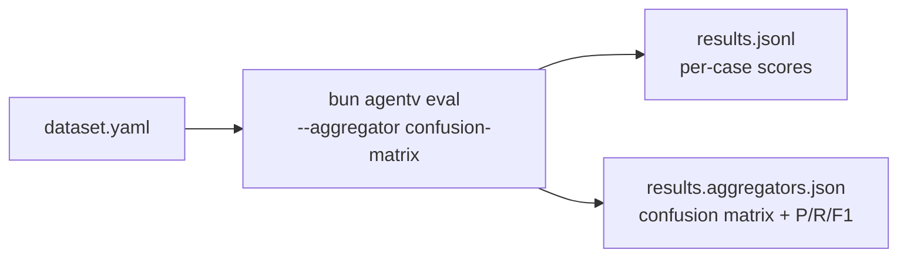
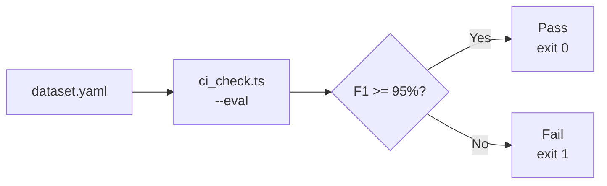

# Export Risk Screening Showcase

Demonstrates evaluation of AI-powered export control risk classification with confusion matrix metrics.

## Use Case

Trade compliance teams screen shipments to identify potential dual-use goods requiring export licenses. This showcase evaluates an AI system that classifies shipments into three risk levels:

- **High**: Likely controlled, requires license or further investigation
- **Medium**: Potentially controlled, requires specification review
- **Low**: Standard commercial goods, routine processing

## Key Features

1. **Multi-class classification** (Low/Medium/High)
2. **Structured JSON output** with reasoning
3. **Code evaluator** for format validation and accuracy checking
4. **Built-in aggregator** for confusion matrix and precision/recall/F1 metrics

## Files

```
export-screening/
├── README.md                           # This file
├── skills/
│   └── export-risk-assessment.md       # Classification guidelines
├── evals/
│   ├── dataset.yaml                    # Eval cases with expert assessments
│   ├── validate_risk_output.ts         # JSON validator + accuracy checker
│   └── ci_check.ts                     # CI/CD threshold checker
└── .agentv/
    └── targets.yaml                    # (optional) target configuration
```

## Running the Evaluation

From the repository root:

```bash
cd examples/showcase/export-screening

# Run evaluation with confusion matrix metrics
bun agentv eval ./evals/dataset.yaml --out results.jsonl --aggregator confusion-matrix
```

### Example Output

```
==================================================
EVALUATION SUMMARY
==================================================
Total eval cases: 22
Mean score: 0.864
...

==================================================
CONFUSION MATRIX
==================================================
Total samples: 22
Parsed samples: 22
Accuracy: 86.4%

Confusion Matrix (rows=actual, cols=predicted):
                 High        Low     Medium
      High          10          0          2
       Low          0          5          1
    Medium          1          0          3

Per-class Metrics:
     Class |  Precision     Recall         F1
------------------------------------------------
      High |      90.9%     83.3%      87.0%
       Low |     100.0%     83.3%      90.9%
    Medium |      50.0%     75.0%      60.0%
------------------------------------------------
 Macro Avg |      80.3%     80.6%      79.3%

Results written to: results.jsonl
Aggregator results written to: results.aggregators.json
```

### JSON Output Format

The `results.aggregators.json` file contains:

```json
[
  {
    "type": "confusion-matrix",
    "summary": {
      "totalSamples": 22,
      "parsedSamples": 22,
      "unparsedSamples": 0,
      "samplesPerClass": {"High": 12, "Medium": 4, "Low": 6},
      "accuracy": 0.8182
    },
    "confusionMatrix": {
      "classes": ["High", "Low", "Medium"],
      "matrix": {
        "High": {"High": 10, "Low": 0, "Medium": 2},
        "Low": {"High": 0, "Low": 5, "Medium": 1},
        "Medium": {"High": 1, "Low": 0, "Medium": 3}
      },
      "description": "matrix[actual][predicted] = count"
    },
    "metricsPerClass": {
      "High": {"precision": 0.909, "recall": 0.833, "f1": 0.870, ...},
      "Low": {"precision": 1.0, "recall": 0.833, "f1": 0.909, ...},
      "Medium": {"precision": 0.5, "recall": 0.75, "f1": 0.6, ...}
    },
    "overallMetrics": {
      "precision": 0.803,
      "recall": 0.806,
      "f1": 0.793
    }
  }
]
```

## Evaluation Flow



## How It Works

### 1. Eval Cases (`dataset.yaml`)

Each case contains:
- **Input**: Shipment details (origin, destination, product, HS code)
- **Expected output**: Expert risk assessment (`riskLevel: High|Medium|Low`)
- **Outcome description**: Explanation for human reviewers

### 2. Code Evaluator (`validate_risk_output.ts`)

The evaluator:
1. Validates JSON format and required fields
2. Extracts AI's `riskLevel` prediction
3. Compares to expected `riskLevel` from `expected_messages`
4. Outputs structured hits/misses for the aggregator:
   - Hit: `"Correct: AI=High, Expected=High"`
   - Miss: `"Mismatch: AI=Low, Expected=High"`

### 3. Built-in Aggregator (`--aggregator confusion-matrix`)

The confusion-matrix aggregator:
1. Parses predicted vs actual classifications from hits/misses
2. Builds confusion matrix
3. Computes per-class precision, recall, F1
4. Computes macro-averaged overall metrics

## Customization

### Adding eval cases

Add cases to `dataset.yaml` following the existing pattern:

```yaml
- id: exp-custom-001
  conversation_id: export-screening
  outcome: |
    Description of expected behavior for reviewers.
  expected_messages:
    - role: assistant
      content:
        riskLevel: High  # Expert assessment (ground truth)
  input_messages:
    - role: user
      content:
        - type: file
          value: ../skills/export-risk-assessment.md
        - type: text
          value: |
            Assess export risk for this shipment:

            Origin: XX
            Destination: YY
            Product: Description here
            HS Code: 0000
```

### Modifying risk levels

To change classification categories (e.g., add "Critical"):

1. Update `VALID_RISK_LEVELS` in `validate_risk_output.ts`
2. Update the skill prompt in `export-risk-assessment.md`

## CI/CD Integration

The `ci_check.ts` script provides threshold-based quality gates for CI/CD pipelines.

### Usage

```bash
# Full flow: run eval and check threshold in one command
bun run ./evals/ci_check.ts --eval ./evals/dataset.yaml --threshold 0.95

# Or check existing aggregator results file
bun run ./evals/ci_check.ts results.aggregators.json --threshold 0.95
```

### Options

| Option | Default | Description |
|--------|---------|-------------|
| `--eval` | - | Run agentv eval on this dataset first |
| `--threshold` | `0.95` | F1 score threshold (0.0-1.0) |
| `--check-class` | `High` | Risk class to validate (`Low`, `Medium`, `High`) |
| `--output` | stdout | Optional JSON output file |

### Exit Codes

- **0**: Pass (F1 ≥ threshold)
- **1**: Fail (F1 < threshold)

### Output Format

```json
{
  "result": "pass",
  "checkedClass": "High",
  "threshold": 0.95,
  "actualF1": 0.9625,
  "margin": 0.0125,
  "message": "PASS: High F1 score 96.2% >= 95.0% threshold",
  "metrics": { ... }
}
```

### CI/CD Pipeline Flow



### Example: GitHub Actions

```yaml
jobs:
  eval:
    runs-on: ubuntu-latest
    steps:
      - uses: actions/checkout@v4
      - uses: oven-sh/setup-bun@v2
      - name: Run eval and check quality gate
        run: |
          bun run ./evals/ci_check.ts \
            --eval ./evals/dataset.yaml \
            --threshold 0.95 \
            --check-class High
```

## Purpose

This showcase is useful for:

- **Prompt optimization**: Measure classification accuracy across prompt variations
- **Model comparison**: Compare different LLMs on the same eval set
- **Regression testing**: Ensure prompt changes don't degrade accuracy
- **Stakeholder reporting**: Generate metrics for compliance team review
- **CI/CD quality gates**: Automated pass/fail checks in deployment pipelines
