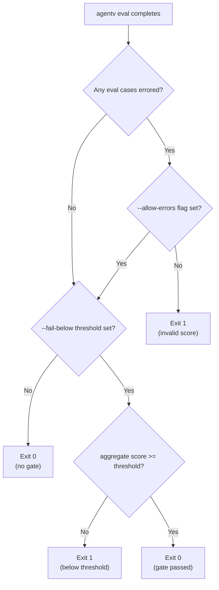

# Change: Add Native CI Gate Support

## Why

AgentV is an evaluation framework that scores AI agent outputs. For CI/CD integration, pipelines need to:
1. **Gate merges** on quality thresholds (e.g., "fail if score < 0.8")
2. **Detect invalid runs** where errors occurred during evaluation

Currently, `agentv eval` always exits with code 0 regardless of results. Users must write wrapper scripts to parse JSONL output, compute aggregate scores, and return appropriate exit codes. This friction prevents seamless CI integration.

### The Error Problem

When eval cases error (provider timeout, malformed response, etc.), the aggregate score is computed from fewer cases than expected. For example:
- 10 eval cases planned, 2 error → score computed from 8 cases
- This is **not** the score you intended to measure
- CI should fail because the evaluation is incomplete/invalid

## What Changes

### New CLI Flags

| Flag | Type | Description |
|------|------|-------------|
| `--fail-below <score>` | number (0.0-1.0) | Exit 1 if aggregate score < threshold |
| `--allow-errors` | boolean | Continue despite errors (dangerous) |

### Exit Code Semantics

| Condition | Exit Code | Reason |
|-----------|-----------|--------|
| Any eval case errors (default) | 1 | Score is incomplete/invalid |
| Score < `--fail-below` threshold | 1 | Quality gate failed |
| All pass, score >= threshold | 0 | Safe to merge |
| No `--fail-below`, no errors | 0 | Current behavior preserved |

### Aggregate Score Definition

The aggregate score is the **mean of all non-errored eval case scores** (already computed by `statistics.ts`). This is the same value shown in the summary output.

## Example Usage

```bash
# CI pipeline: fail if any errors OR score < 0.8
agentv eval evals/*.yaml --fail-below 0.8

# Output on failure:
# CI GATE FAILED: Score 0.72 < threshold 0.80
# Exit code: 1

# Output on success:
# CI GATE PASSED: Score 0.85 >= threshold 0.80
# Exit code: 0

# Lenient mode (not recommended - ignores errors):
agentv eval evals/*.yaml --fail-below 0.8 --allow-errors
```

## Decision Flow



## Impact

- Affected specs: `eval-cli`
- Affected code: `apps/cli/src/commands/eval/index.ts`, `apps/cli/src/commands/eval/run-eval.ts`
- **Not a breaking change**: Current behavior (exit 0) preserved when no flags provided
