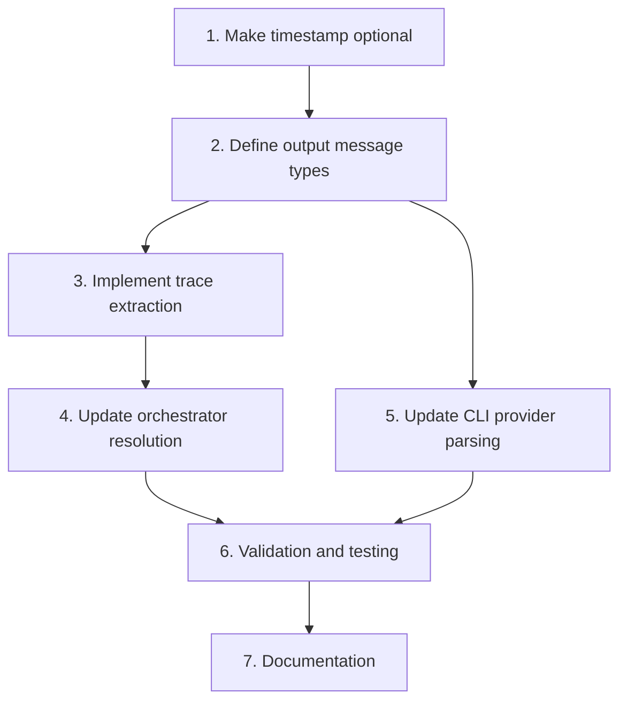

# Tasks: Support Output Messages Traces

## Implementation Order

### 1. Make TraceEvent.timestamp optional
- [x] Update `TraceEvent` interface in `trace.ts` to make `timestamp` optional
- [x] Update `isTraceEvent` type guard to not require timestamp
- [x] Update test that asserts missing timestamp returns false
- [x] Validate types compile without errors

### 2. Define output message types
- [x] Add `OutputMessage` interface to `types.ts` (with `toolCalls` camelCase)
- [x] Add `ToolCall` interface to `types.ts`
- [x] Add `outputMessages` field to `ProviderResponse`
- [x] Validate types compile without errors

### 3. Implement trace extraction from output messages
- [x] Create `extractTraceFromMessages()` function in trace.ts
- [x] Map `outputMessages[].toolCalls[]` to `TraceEvent[]` format
- [x] Handle missing/optional fields gracefully (including optional timestamp)
- [x] Add unit tests for extraction logic with various message formats

### 4. Update orchestrator trace resolution
- [x] Modify trace extraction to check `outputMessages` after `trace`/`traceRef`
- [x] `computeTraceSummary()` works unchanged with extracted traces
- [x] Ensure `candidateTrace` and `candidateTraceSummary` populate correctly

### 5. Update CLI provider JSONL parsing
- [x] Add `parseOutputMessages()` method to CLI provider
- [x] Convert snake_case (`output_messages`, `tool_calls`) to camelCase (`outputMessages`, `toolCalls`)
- [x] Update `parseJsonlBatchOutput()` to extract and convert `output_messages` field
- [x] Pass `outputMessages` through to `ProviderResponse`
- [x] Update single-case parsing (`parseOutputContent()`) to support `output_messages`
- [x] Add tests for JSONL with `output_messages` format

### 6. Validation and testing
- [x] Run existing test suite to ensure backward compatibility
- [x] All 118 tests pass
- [x] Lint passes

### 7. Documentation
- [x] CLI provider spec updated with `output_messages` support (in proposal review phase)
- [x] Evaluation spec updated with trace extraction scenarios

## Dependencies

- Step 2 depends on Step 1 (timestamp must be optional first)
- Step 3 depends on Step 2 (type definitions)
- Step 4 depends on Step 3 (extraction function)
- Step 5 depends on Step 2 (can parallelize with Steps 3-4)
- Step 6 depends on Steps 4 and 5
- Step 7 is final (documents completed work)

## Validation Checkpoints

After Step 1:
- [x] `TraceEvent` compiles with optional timestamp
- [x] Existing tests pass (one test updated)

After Step 4:
- [x] Orchestrator extracts traces from `outputMessages` correctly
- [x] Trace summary includes correct tool call counts

After Step 5:
- [x] CLI provider parses JSONL with `output_messages` (snake_case)
- [x] Converts to `outputMessages` (camelCase) internally
- [x] Both batch and single-case modes work

After Step 6:
- [x] All existing tests pass (118 tests)
- [x] Tool trajectory evaluation works with new format
- [x] Build and lint pass
