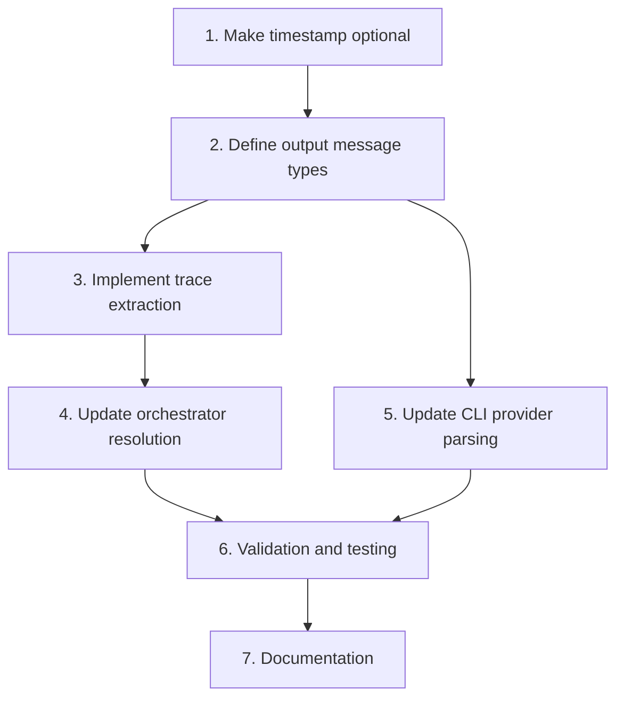

# Tasks: Support Output Messages Traces

## Implementation Order

### 1. Make TraceEvent.timestamp optional
- [ ] Update `TraceEvent` interface in `trace.ts` to make `timestamp` optional
- [ ] Update `isTraceEvent` type guard to not require timestamp
- [ ] Update test that asserts missing timestamp returns false
- [ ] Validate types compile without errors

### 2. Define output message types
- [ ] Add `OutputMessage` interface to `types.ts` (with `toolCalls` camelCase)
- [ ] Add `ToolCall` interface to `types.ts`
- [ ] Add `outputMessages` field to `ProviderResponse`
- [ ] Validate types compile without errors

### 3. Implement trace extraction from output messages
- [ ] Create `extractTraceFromMessages()` function in orchestrator
- [ ] Map `outputMessages[].toolCalls[]` to `TraceEvent[]` format
- [ ] Handle missing/optional fields gracefully (including optional timestamp)
- [ ] Add unit tests for extraction logic with various message formats

### 4. Update orchestrator trace resolution
- [ ] Modify trace extraction to check `outputMessages` after `trace`/`traceRef`
- [ ] Update `computeTraceSummary()` to work with extracted traces
- [ ] Ensure `candidateTrace` and `candidateTraceSummary` populate correctly
- [ ] Add integration test with mock provider using `outputMessages`

### 5. Update CLI provider JSONL parsing
- [ ] Add `parseOutputMessages()` method to CLI provider
- [ ] Convert snake_case (`output_messages`, `tool_calls`) to camelCase (`outputMessages`, `toolCalls`)
- [ ] Update `parseJsonlBatchOutput()` to extract and convert `output_messages` field
- [ ] Pass `outputMessages` through to `ProviderResponse`
- [ ] Update single-case parsing (`parseOutputContent()`) to support `output_messages`
- [ ] Add tests for JSONL with `output_messages` format

### 6. Validation and testing
- [ ] Run existing test suite to ensure backward compatibility
- [ ] Test tool_trajectory evaluator with `outputMessages`-derived traces
- [ ] Test all three modes: any_order, in_order, exact
- [ ] Verify GoldenCsvChecker JSONL works with new extraction
- [ ] Document new `output_messages` format in provider docs

### 7. Documentation
- [ ] Update CLI provider spec with `output_messages` support
- [ ] Add examples showing `output_messages` format (snake_case wire format)
- [ ] Document that `trace` field is now optional
- [ ] Add migration notes for providers currently using `trace`

## Dependencies

- Step 2 depends on Step 1 (timestamp must be optional first)
- Step 3 depends on Step 2 (type definitions)
- Step 4 depends on Step 3 (extraction function)
- Step 5 depends on Step 2 (can parallelize with Steps 3-4)
- Step 6 depends on Steps 4 and 5
- Step 7 is final (documents completed work)

## Validation Checkpoints

After Step 1:
- [ ] `TraceEvent` compiles with optional timestamp
- [ ] Existing tests pass (one test updated)

After Step 4:
- [ ] Orchestrator extracts traces from `outputMessages` correctly
- [ ] Trace summary includes correct tool call counts

After Step 5:
- [ ] CLI provider parses JSONL with `output_messages` (snake_case)
- [ ] Converts to `outputMessages` (camelCase) internally
- [ ] Both batch and single-case modes work

After Step 6:
- [ ] All existing tests pass
- [ ] Tool trajectory evaluation works with new format
- [ ] GoldenCsvChecker integration verified
